# Survey

Our survey was conducted among research assistants and students with advanced SQL experience. 

The survey tool utilized for this purpose was [LamaPoll](https://www.lamapoll.de/).

The survey results are located in the `results` folder. This includes a file with the pure results as exported by LamaPoll (`raw-results.csv`), as well as a file containing all the transformations required to arrive at the results as we have published them in the paper (`transformed-and-visualized-results.xlsx`).

The original survey was saved as an HTML file in the `snapshots` folder.

Since the survey was conducted in German, we will translate each page of the survey into English in the following sections (translated using ChatGPT and manually verified for accuracy). Additionally, the results of each individual scenario (from page 3 onwards) will be presented in a more readable format:

## Page 1

<table>
  <tr>
    <th width="50%">German (original)</th>
    <th width="50%">English (translated)</th>
  </tr>
  <tr>
    <td width="50%">
<h3>Vergleich von SQL Bewertungs-Verfahren</h3>
In dieser Umfrage sollen <strong>3 Bewertungs-Verfahren</strong> für SQL Übungsaufgaben bezüglich ihrer <strong>Fairness</strong> und <strong>Nachvollziehbarkeit</strong> verglichen werden.

Die <strong>Umfrage</strong> ist folgendermaßen strukturiert:

Zunächst werden auf der nächsten Seite die <strong>Bewertungs-Verfahren</strong> vorgestellt. Bitte nehmen Sie sich die Zeit, die Erklärungen sorgfältig zu lesen, um auf den darauf folgenden Seiten eine fundierte Bewertung der <strong>Fairness</strong> und <strong>Nachvollziehbarkeit</strong> der einzelnen Korrekturen vornehmen zu können.

Danach folgen 11 Szenarien, welche jeweils folgendermaßen aufgebaut sind:
- Zu Beginn finden Sie jeweils die <strong>Aufgabenstellung</strong>, die ein <strong>Datenbankschema</strong> beinhaltet (es handelt sich dabei stets um dieselbe Datenbank), sowie eine <strong>Beschreibung der gesuchten Daten</strong> (es handelt sich oft mehrmals hintereinander um dieselbe Aufgabenstellung, gekennzeichnet durch eine Kennzahl).
- Dazu gibt es jeweils die <strong>Musterlösung</strong> (ändert sich nur dann, wenn sich auch die Aufgabenstellung ändert),
- Sowie eine tatsächliche <strong>Antwort von</strong> (anonymen) <strong>Studierenden</strong>, die die Aufgabe im Zuge ihrer Prüfungsvorbereitung bearbeitet haben (hier handelt es sich in jedem Szenario um eine andere, ebenfalls gekennzeichnet durch eine Kennzahl).
- Und schließlich folgen für die <strong>drei Bewertungs-Verfahren</strong> jeweils die Interpretation der <strong>Musterlösung</strong>, die Korrektur der <strong>studentischen Antwort</strong> und die resultierende <strong>Bewertung</strong>.

Ihre Aufgabe ist es, diese <strong>Bewertungen</strong> jeweils bezüglich ihrer <strong>Fairness</strong> und <strong>Nachvollziehbarkeit</strong> zu vergleichen.

Beachten Sie, dass die <strong>Reihenfolge der Bewertungsverfahren</strong> <strong>stets zufällig</strong> ist, um die Umfrage unparteiisch zu halten.

Die Bearbeitung wird ca. 30 min dauern.

Wir bedanken uns bereits im Voraus herzlich für Ihre Teilnahme!

<h4>Datenschutzerklärung</h4>

Die ​gesammelten Daten werden anonym gespeichert. Es sind keine Rückschlüsse auf Ihre Person möglich.
Die Daten dienen zu Forschungszwecken und können anonym im Rahmen einer wissenschaftlichen Publikation veröffentlicht werden.

x Ich bestätige hiermit, dass ich mit der Datenschutzerklärung einverstanden bin.

<h4>Einverständniserklärung</h4>

Indem Sie an der Umfrage teilnehmen bestätigen Sie, dass Sie mindestens 18 Jahre alt sind, an dieser Studie freiwillig teilnehmen und dass Sie diese Studie jederzeit abbrechen können, ohne dass Ihnen dadurch ein Nachteil entsteht.

x Ich bestätige hiermit, dass ich mit der Einverständniserklärung einverstanden bin.
    </td>
    <td width="50%">
<h3>Comparison of SQL Grading Methods</h3>
In this survey, we aim to compare <strong>3 grading methods</strong> for SQL exercises in terms of their <strong>fairness</strong> and <strong>comprehensibility</strong>.
      
The <strong>survey</strong> is structured as follows:

Initially, on the next page, the <strong>grading methods</strong> will be introduced. Please take the time to read the explanations carefully to be able to make an informed assessment of the <strong>fairness</strong> and <strong>comprehensibility</strong> of each correction on the subsequent pages.

This is followed by 11 scenarios, each structured as follows:
- Firstly, you will find the <strong>task description</strong>, which includes a <strong>database schema</strong> (always the same database), and a <strong>description of the data sought</strong> (often the same task description repeated, indicated by an ID).
- Then, there is the <strong>reference solution</strong> (which changes only if the task description changes),
- Along with an actual <strong>response from</strong> (anonymous) <strong>students</strong> who have worked on the task as part of their exam preparation (each scenario features a different response, indicated by a second ID).
- Finally, there are interpretations of the <strong>reference solution</strong>, corrections of the <strong>student response</strong>, and the resulting <strong>grading</strong> for each of the <strong>three grading methods</strong>.

Your task is to compare these <strong>gradings</strong> in terms of their <strong>fairness</strong> and <strong>comprehensibility</strong>.

Note that the <strong>order of the grading methods</strong> is <strong>always random</strong> to maintain impartiality in the survey.

The survey will take approximately 30 minutes to complete.

We thank you in advance for your participation!

<h4>Privacy Policy</h4>

The collected data will be stored anonymously. It is not possible to deduce your personal information from this data.
The data is used for research purposes and may be published anonymously in a scientific publication.

x I hereby confirm that I agree with the Privacy Policy.

<h4>Consent Form</h4>

By participating in the survey, you confirm that you are at least 18 years old, that you are participating in this study voluntarily, and that you can withdraw from this study at any time without incurring any disadvantage.

x I hereby confirm that I agree with the Consent Form.
    </td>
  </tr>
</table>

## Page 2

In the survey tool, the order of the three descriptions is randomized to avoid bias due to their odering.

<table>
  <tr>
    <th width="50%">German (original)</th>
    <th width="50%">English (translated)</th>
  </tr>
  <tr>
    <td width="50%">
<h3>Die drei Bewertungs-Verfahren</h3>
<h4>Ergebnisbasierte Bewertung</h4>
Um eine <strong>studentische Antwort </strong>zu bewerten, werden sowohl die <strong>Musterlösung</strong>, als auch die <strong>studentische Antwort </strong>auf einer Testdatenbank ausgeführt und anschließend die <strong>Ergebnisrelationen </strong>bezüglich folgender Werte verglichen. Für jede <strong>Aufgabenstellung</strong> werden jedem dieser Werte einzelne maximale Punkte zugewiesen; die Bewertung berechnet sich schlicht als Summe der Teilpunktzahlen:
<ul><li><strong>Anzahl der Tupel</strong>: Wenn die <strong>studentische Antwort </strong>dieselbe Anzahl an Tupeln liefert wie die <strong>Musterlösung</strong>, werden<strong> </strong>maximale Punkte vergeben, andernfalls 0.</li>
<li><strong>Namen der Attribute</strong>: Die Attributnamen in der <strong>Ergebnisrelation</strong> der <strong>studentischen Antwort</strong> werden mit denen der <strong>Musterlösung</strong> über die Jaccard-Distanz verglichen (Punkte = Maximale Punkte * (1 - Jaccard Distanz)). Die Reihenfolge und Groß-/Kleinschreibweise der Attributnamen ist dabei irrelevant. </li>
<li><strong>Funktionale Abhängigkeiten</strong>: Die funktionalen Abhängigkeiten in der <strong>Ergebnisrelation </strong>der <strong>studentischen Antwort</strong> werden mit denen in der <strong>Musterlösung</strong> verglichen, ebenfalls über die Jaccard-Distanz (Punkte = Maximale Punkte * (1 - Jaccard Distanz)). Die Reihenfolge und Bezeichnung der Attribute ist auch hier irrelevant. </li></ul>

<h4>Manuelle Bewertung</h4>
Um eine <strong>studentische Antwort</strong> zu bewerten, wird diese händisch auf Unterschiede zur <strong>Musterlösung </strong>untersucht. 

Hierfür wird zunächst ein <strong>Bewertungsschema </strong>für die <strong>Musterlösung </strong>festgelegt. Dieses orientiert sich generell an den natürlichen Blöcken, aus denen die Anfrage aufgebaut ist. 

Eine <strong>studentische Antwort</strong> wird bewertet, indem jedes Kriterium des <strong>Bewertungsschemas </strong>einzeln darauf geprüft wird, ob die studentische Antwort mit diesem übereinstimmt. Dabei werden für Ungenauigkeiten nicht unbedingt volle Punkte abgezogen/nicht gegeben, sondern je nach Schwere des Fehlers unter Umständen auch nur halbe oder gar keine.

<h4>Distanzbasierte Bewertung</h4>
Um eine <strong>studentische Antwort</strong> zu bewerten, werden ihre <strong>semantischen Unterschiede</strong> zur <strong>Musterlösung </strong>untersucht. Diese Unterschiede werden durch <strong>Transformationen </strong>verkörpert, welche jeweils spezifische Änderungen an einer SQL-Anfrage durchführen und sie dadurch in eine andere verwandeln. Durch das Verketten von <strong>Transformationen </strong>kann so jede SQL-Anfrage in jede andere umgewandelt werden. Alle <strong>Transformationen </strong>haben individuelle <strong>Kosten</strong>, die die Größe des <strong>semantischen Unterschieds</strong> beziffern, welcher durch sie verkörpert wird. (Äquivalenzumformungen haben dementsprechend Kosten von 0.) Die <strong>semantische Distanz</strong> zwischen zwei gegebenen SQL-Anfragen ist definiert als die geringstmögliche <strong>Summe an </strong><strong>Kosten </strong>für eine <strong>Verkettung von Transformationen</strong>, welche die eine Anfrage in die andere verwandelt.

Je größer die <strong>semantische Distanz</strong> zwischen <strong>studentischer Antwort</strong> und <strong>Musterlöung</strong>, desto weniger Punkte bekommt die <strong>studentische Antwort</strong>. Dafür wird vorher die <strong>Schwierigkeit</strong> der <strong>Musterlösung </strong>beziffert. Von dieser <strong>Schwierigkeit</strong> wird die <strong>semantische Distanz</strong> abgezogen (und nach unten auf 0 begrenzt), was einen Wert zwischen 0 und <strong>Distanz</strong> liefert. Dieser Wert wird schließlich auf den Bereich zwischen 0 und <strong>Maximale Punkte</strong> der Aufgabe skaliert.

Es ergibt sich folgende <strong>Formel</strong>:

<strong>Punkte </strong>= (<strong>Schwierigkeit </strong>- <strong>Distanz</strong>) / <strong>Schwierigkeit </strong>* <strong>Maximale Punkte</strong>
    </td>
    <td width="50%">
<h3>The three grading methods</h3>
<h4>Result-Based Grading</h4>
To evaluate a <strong>student response</strong>, both the <strong>reference solution</strong> and the <strong>student response</strong> are executed on a test database, and then the <strong>result relations</strong> are compared in terms of the following values. For each <strong>task</strong>, individual maximum points are assigned to each of these values; the grading is simply calculated as the sum of the partial point scores:
<ul><li><strong>Number of tuples</strong>: If the <strong>student response</strong> yields the same number of tuples as the <strong>reference solution</strong>, maximum points are awarded, otherwise 0.</li>
<li><strong>Names of attributes</strong>: The attribute names in the <strong>result relation</strong> of the <strong>student response</strong> are compared with those of the <strong>reference solution</strong> using the Jaccard distance (Points = Maximum points * (1 - Jaccard Distance)). The order and case (upper/lower) of the attribute names are irrelevant.</li>
<li><strong>Functional dependencies</strong>: The functional dependencies in the <strong>result relation</strong> of the <strong>student response</strong> are compared with those in the <strong>reference solution</strong>, also using the Jaccard distance (Points = Maximum points * (1 - Jaccard Distance)). The order and naming of the attributes are also irrelevant here. </li></ul>

<h4>Manual Grading</h4>
To evaluate a <strong>student response</strong>, it is manually examined for differences from the <strong>reference solution</strong>.

For this purpose, a <strong>grading scheme</strong> is first established for the <strong>reference solution</strong>. This generally follows the natural blocks that make up the query.

A <strong>student response</strong> is evaluated by individually checking each criterion of the <strong>grading scheme</strong> to see if the student's response matches it. In the case of inaccuracies, full points are not necessarily deducted/not awarded; depending on the severity of the error, only half points or none at all may be deducted.

<h4>Distance-Based Grading</h4>
To evaluate a <strong>student response</strong>, its <strong>semantic differences</strong> from the <strong>reference solution</strong> are examined. These differences are represented by <strong>transformations</strong> that make specific changes to an SQL query, thereby converting it into another form. By chaining <strong>transformations</strong>, any SQL query can be transformed into any other. Each <strong>transformation</strong> has individual <strong>costs</strong>, which quantify the size of the <strong>semantic difference</strong> embodied by it. (Equivalence transformations, accordingly, have costs of 0.) The <strong>semantic distance</strong> between two given SQL queries is defined as the smallest possible <strong>sum of costs</strong> for a <strong>chain of transformations</strong> that converts one query into the other.

The greater the <strong>semantic distance</strong> between the <strong>student response</strong> and the <strong>reference solution</strong>, the fewer points the <strong>student response</strong> receives. To determine this, the <strong>difficulty</strong> of the <strong>reference solution</strong> is first quantified. The <strong>semantic distance</strong> is subtracted from this <strong>difficulty</strong> (and limited to a minimum of 0), resulting in a value between 0 and the <strong>difficulty</strong>. This value is then scaled to the range between 0 and the <strong>maximum points</strong> for the task.

The following <strong>formula</strong> is derived:

<strong>Points</strong> = (<strong>Difficulty</strong> - <strong>Distance</strong>) / <strong>Difficulty</strong> * <strong>Maximum Points</strong>
    </td>
  </tr>
</table>

## Page 3 

<table>
  <tr>
    <th width="50%">German (original)</th>
    <th width="50%">English (translated)</th>
  </tr>
  <tr>
    <td width="50%">
<h3>Szenario 1-1</h3>
<h4>Aufgabenstellung 1</h4>
Diese Datenbank ist an den Musterstudienplan im Informatik Bachelorstudiengang angelehnt. Sie ist auf dem Stand von Wintersemester 2019/20 und besteht aus vier Relationen:
  
<ol><li>themengebiet ( _id_, bezeichnung )</li>
<li>modul ( _id_, bezeichnung, gop, themengebiet [themengebiet] )</li>
<li>semester ( _nummer_ )</li>
<li>modul_semester ( _modul [modul], semester [semester]_, ects )</li></ol>

Geben Sie für jedes Modul die Bezeichnung des Moduls, das dazugehörige Semester und ECTS aus.

Die Maximale Punktzahl beträgt 3.
<h4>Musterlösung</h4>
<code>SELECT m.bezeichnung, ms.semester, ms.ects
FROM modul m
JOIN modul_semester ms ON m.id = ms.modul;</code>
<h4>Studentische Antwort 1</h4>
<code>SELECT modul, semester, ects
FROM modul_semester;</code>
<h4><b>Manuelle Bewertung: 1,5 / 3</b></h4>
<h5>Musterlösung:</h5>

<h5>Studentische Antwort:</h5>

<h5>Bewertung:</h5>
Punkte = 1,5
<h4><b>Distanzbasierte Bewertung: 1,5 / 3</b></h4>
<h5>Musterlösung:</h5>
Difficulty: 14
<h5>Studentische Antwort:</h5>
<strong>Total Distance: 7</strong>

SELECT modul, semester, ects FROM modul_semester;

&gt;&gt;&gt; <strong>Cost 1</strong>: Change (incorrect) column-reference column in a select-element expression.

SELECT bezeichnung, semester, ects FROM modul_semester;

&gt;&gt;&gt; <strong>Cost 2</strong>: Add (missing) element in from-clause.

SELECT bezeichnung, semester, ects FROM modul, modul_semester;

&gt;&gt;&gt; <strong>Cost 1</strong>: Set complex join-type on a from-element (change cross join to a complex join).

SELECT bezeichnung, semester, ects FROM modul INNER JOIN modul_semester;

&gt;&gt;&gt; <strong>Cost 1</strong>: Add (missing) binary-expression to a from-element join-condition.

SELECT bezeichnung, semester, ects FROM modul INNER JOIN modul_semester ON (    =    );

&gt;&gt;&gt; <strong>Cost 1</strong>: Add (missing) column-reference to a from-element join-condition.

SELECT bezeichnung, semester, ects FROM modul INNER JOIN modul_semester ON (id =    );

&gt;&gt;&gt; <strong>Cost 1</strong>: Add (missing) column-reference to a from-element join-condition.
SELECT bezeichnung, semester, ects FROM modul INNER JOIN modul_semester ON (id = modul);
<h5>Bewertung:</h5>
Punkte = (14 - 7) / 14 * 3 = 1,5
<h4><b>Ergebnisbasierte Bewertung: 2,7 / 3</b></h4>
<h5>Musterlösung:</h5>
<table>
    <thead>
        <tr>
            <th>Bepunktungsmetrik </th>
            <th>Erwarteter Wert </th>
            <th>Maximale Punkte </th>
        </tr>
    </thead>
    <tbody>
        <tr>
            <td>Anzahl der Tupel </td>
            <td>26 </td>
            <td>1 </td>
        </tr>
        <tr>
            <td>Namen der Attribute </td>
            <td>["bezeichnung", "semester", "ects"] </td>
            <td>1 </td>
        </tr>
        <tr>
            <td>Funktionale Abhängigkeiten </td>
            <td>["{\"determinateAtt.\": [\"bezeichnung\", \"semester\"], \"dependentAtt.\": [\"ects\"]}"]</td>
            <td>1 </td>
        </tr>
    </tbody>
</table>

<h5>Studentische Antwort:</h5>
<table>
    <thead>
        <tr>
            <th>Bepunktungsmetrik </th>
            <th>Erwarteter Wert </th>
            <th>Punkte </th>
        </tr>
    </thead>
    <tbody>
        <tr>
            <td>Anzahl der Tupel </td>
            <td>26 </td>
            <td>1 </td>
        </tr>
        <tr>
            <td>Namen der Attribute </td>
            <td>["modul", "semester", "ects"] </td>
            <td>0.667 </td>
        </tr>
        <tr>
            <td>Funktionale Abhängigkeiten </td>
            <td>["{\"determinateAtt.\": [\"modul\", \"semester\"], \"dependentAtt.\": \"ects\"]}"]</td>
            <td>1 </td>
        </tr>
    </tbody>
</table>

<h5>Bewertung:</h5>
Punkte = 1 + 0.66666666666667 + 1 = 2,7

<h4>Fairness:</h4> Geben Sie an, wie <b>fair</b> ​Sie die jeweilige Bewertung finden
  
<b>Achtung:</b> Die Bewertungen hier befinden sich möglicherweise in einer andereren Reihenfolge als weiter oben auf der Seite!
<b>Hinweis:</b> Es ist möglich, mehrere Bewertungen gleich einzustufen.
  
<table>
<thead>
  <tr>
    <th></th>
    <th>Fair</th>
    <th>Mittel</th>
    <th>Unfair</th>
  </tr>
</thead>
<tbody>
  <tr>
    <td>Ergebnisbasierte Bewertung</td>
    <td>o</td>
    <td>o</td>
    <td>o</td>
  </tr>
  <tr>
    <td>Distanzbasierte Bewertung</td>
    <td>o</td>
    <td>o</td>
    <td>o</td>
  </tr>
  <tr>
    <td>Manuelle Bewertung</td>
    <td>o</td>
    <td>o</td>
    <td>o</td>
  </tr>
</tbody>
</table>

<h4>Nachvollziehbarkeit:</h4> Geben Sie an, wie <b>nachvollziehbar</b> ​Sie die jeweilige Bewertung finden
  
<b>Achtung:</b> Die Bewertungen hier befinden sich möglicherweise in einer andereren Reihenfolge als weiter oben auf der Seite!
<b>Hinweis:</b> Es ist möglich, mehrere Bewertungen gleich einzustufen.
  
<table>
<thead>
  <tr>
    <th></th>
    <th>Gut nachvoll- ziehbar</th>
    <th>Mittel</th>
    <th>Schlecht nachvoll- ziehbar</th>
  </tr>
</thead>
<tbody>
  <tr>
    <td>Ergebnisbasierte Bewertung</td>
    <td>o</td>
    <td>o</td>
    <td>o</td>
  </tr>
  <tr>
    <td>Distanzbasierte Bewertung</td>
    <td>o</td>
    <td>o</td>
    <td>o</td>
  </tr>
  <tr>
    <td>Manuelle Bewertung</td>
    <td>o</td>
    <td>o</td>
    <td>o</td>
  </tr>
</tbody>
</table>
    </td>
    <td width="50%">
<h3>Scenario 1-1</h3>
<h4>Task 1</h4>
This database is modeled after the standard curriculum of the Bachelor's program in Computer Science. It reflects the status as of the winter semester 2019/20 and comprises four relations:
  
<ol><li>themengebiet ( _id_, bezeichnung )</li>
<li>modul ( _id_, bezeichnung, gop, themengebiet [themengebiet] )</li>
<li>semester ( _nummer_ )</li>
<li>modul_semester ( _modul [modul], semester [semester]_, ects )</li></ol>

Provide the name of each module, the corresponding semester, and ECTS credits.

The maximum score is 3.
<h4>Reference Solution</h4>
<code>SELECT m.bezeichnung, ms.semester, ms.ects
FROM modul m
JOIN modul_semester ms ON m.id = ms.modul;</code>
<h4>Student Response 1</h4>
<code>SELECT modul, semester, ects
FROM modul_semester;</code>
<h4><b>Manual Grading: 1,5 / 3</b></h4>
<h5>Reference Solution:</h5>

<h5>Student Reponse:</h5>

<h5>Grading:</h5>
Points = 1.5
<h4><b>Distance-Based Grading: 1,5 / 3</b></h4>
<h5>Reference Solution:</h5>
Difficulty: 14
<h5>Student Reponse:</h5>
<strong>Total Distance: 7</strong>

SELECT modul, semester, ects FROM modul_semester;

&gt;&gt;&gt; <strong>Cost 1</strong>: Change (incorrect) column-reference column in a select-element expression.

SELECT bezeichnung, semester, ects FROM modul_semester;

&gt;&gt;&gt; <strong>Cost 2</strong>: Add (missing) element in from-clause.

SELECT bezeichnung, semester, ects FROM modul, modul_semester;

&gt;&gt;&gt; <strong>Cost 1</strong>: Set complex join-type on a from-element (change cross join to a complex join).

SELECT bezeichnung, semester, ects FROM modul INNER JOIN modul_semester;

&gt;&gt;&gt; <strong>Cost 1</strong>: Add (missing) binary-expression to a from-element join-condition.

SELECT bezeichnung, semester, ects FROM modul INNER JOIN modul_semester ON (    =    );

&gt;&gt;&gt; <strong>Cost 1</strong>: Add (missing) column-reference to a from-element join-condition.

SELECT bezeichnung, semester, ects FROM modul INNER JOIN modul_semester ON (id =    );

&gt;&gt;&gt; <strong>Cost 1</strong>: Add (missing) column-reference to a from-element join-condition.
SELECT bezeichnung, semester, ects FROM modul INNER JOIN modul_semester ON (id = modul);
<h5>Grading:</h5>
Points = (14 - 7) / 14 * 3 = 1,5
<h4><b>Result-Based Grading: 2,7 / 3</b></h4>
<h5>Reference Solution:</h5>
<table>
    <thead>
        <tr>
            <th>Scoring Metric</th>
            <th>Expected Value</th>
            <th>Maximum Points</th>
        </tr>
    </thead>
    <tbody>
        <tr>
            <td>Number of Tuples</td>
            <td>26</td>
            <td>1</td>
        </tr>
        <tr>
            <td>Attribute Names</td>
            <td>["bezeichnung", "semester", "ects"] </td>
            <td>1 </td>
        </tr>
        <tr>
            <td>Functional Dependencies</td>
            <td>["{\"determinateAtt.\": [\"bezeichnung\", \"semester\"], \"dependentAtt.\": [\"ects\"]}"]</td>
            <td>1 </td>
        </tr>
    </tbody>
</table>
<h5>Student Reponse:</h5>
<table>
    <thead>
        <tr>
            <th>Scoring Metric</th>
            <th>Expected Value</th>
            <th>Points</th>
        </tr>
    </thead>
    <tbody>
        <tr>
            <td>Number of Tuples</td>
            <td>26</td>
            <td>1</td>
        </tr>
        <tr>
            <td>Attribute Names</td>
            <td>["modul", "semester", "ects"] </td>
            <td>0.667 </td>
        </tr>
        <tr>
            <td>Functional Dependencies</td>
            <td>["{\"determinateAtt.\": [\"modul\", \"semester\"], \"dependentAtt.\": \"ects\"]}"]</td>
            <td>1 </td>
        </tr>
    </tbody>
</table>
<h5>Grading:</h5>
Points = 1 + 0.66666666666667 + 1 = 2,7

<h4>Fairness:</h4> Indicate how <b>fair</b> you find each grading.
  
<b>Attention:</b> The gradings here may be in a different order than those found earlier on the page. 
<b>Note:</b> It is possible to rate multiple gradings as being equally fair.
  
<table>
<thead>
  <tr>
    <th></th>
    <th>Fair</th>
    <th>Moderate</th>
    <th>Unfair</th>
  </tr>
</thead>
<tbody>
  <tr>
    <td>Result-Based Grading</td>
    <td>o</td>
    <td>o</td>
    <td>o</td>
  </tr>
  <tr>
    <td>Distance-Based Grading</td>
    <td>o</td>
    <td>o</td>
    <td>o</td>
  </tr>
  <tr>
    <td>Manual Grading</td>
    <td>o</td>
    <td>o</td>
    <td>o</td>
  </tr>
</tbody>
</table>

<h4>Comprehensibility:</h4> Indicate how <b>comprehensible</b> you find each grading.
  
<b>Attention:</b> The gradings here may be in a different order than those found earlier on the page. 
<b>Note:</b> It is possible to rate multiple gradings as being equally comprehensible.
  
<table>
<thead>
  <tr>
    <th></th>
    <th>Easy to comprehend</th>
    <th>Moderate</th>
    <th>Difficult to comprehend</th>
  </tr>
</thead>
<tbody>
  <tr>
    <td>Result-Based Grading</td>
    <td>o</td>
    <td>o</td>
    <td>o</td>
  </tr>
  <tr>
    <td>Distance-Based Grading</td>
    <td>o</td>
    <td>o</td>
    <td>o</td>
  </tr>
  <tr>
    <td>Manual Grading</td>
    <td>o</td>
    <td>o</td>
    <td>o</td>
  </tr>
</tbody>
</table>
    </td>
  </tr>
</table>

### Results

The survey results for this scenario are as follows:

| ID | DATE     | Fairness Result-Based | Fairness Distance-Based | Fairness Manual | Comprehensibility Result-Based | Comprehensibility Distance-Based | Comprehensibility Manual |
| -- | -------- | --------------- | --------------------- | --------------------- | ---------------------- | --------------------- | --------------------- |
| 1  | 12.07.23 | \-2             | \-2                   | \-2                   | \-2                    | \-2                   | \-2                   |
| 2  | 13.07.23 | \-2             | \-2                   | \-2                   | \-2                    | \-2                   | \-2                   |
| 3  | 17.07.23 | \-2             | \-2                   | \-2                   | \-2                    | \-2                   | \-2                   |
| 4  | 21.07.23 | \-2             | \-2                   | \-2                   | \-2                    | \-2                   | \-2                   |
| 5  | 24.07.23 | \-2             | \-2                   | \-2                   | \-2                    | \-2                   | \-2                   |
| 6  | 24.07.23 | \-2             | \-2                   | \-2                   | \-2                    | \-2                   | \-2                   |
| 7  | 26.07.23 | \-2             | \-2                   | \-2                   | \-2                    | \-2                   | \-2                   |
| 8  | 02.08.23 | \-2             | \-2                   | \-2                   | \-2                    | \-2                   | \-2                   |
| 9  | 02.08.23 | \-2             | \-2                   | \-2                   | \-2                    | \-2                   | \-2                   |
| 10 | 04.08.23 | 3               | 2                     | 1                     | 1                      | 2                     | 3                     |
| 11 | 04.08.23 | \-2             | \-2                   | \-2                   | \-2                    | \-2                   | \-2                   |
| 12 | 07.08.23 | 1               | 1                     | 1                     | 2                      | 2                     | 2                     |
| 13 | 07.08.23 | \-1             | \-1                   | \-1                   | \-1                    | \-1                   | \-1                   |
| 14 | 07.08.23 | 3               | 1                     | 1                     | 1                      | 1                     | 2                     |
| 15 | 07.08.23 | 3               | 1                     | 1                     | 2                      | 1                     | 1                     |
| 16 | 07.08.23 | 1               | 2                     | 1                     | 1                      | 1                     | 1                     |
| 17 | 07.08.23 | 1               | 1                     | 1                     | 1                      | 1                     | 1                     |
| 18 | 07.08.23 | 3               | 1                     | 1                     | 1                      | 3                     | 1                     |
| 19 | 08.08.23 | 2               | 1                     | 1                     | 1                      | 2                     | 1                     |
| 20 | 08.08.23 | 3               | 1                     | 1                     | 2                      | 3                     | 1                     |
| 21 | 08.08.23 | 1               | 1                     | 1                     | 3                      | 2                     | 1                     |
| 22 | 09.08.23 | 2               | 1                     | 2                     | 3                      | 1                     | 2                     |
| 23 | 18.08.23 | 1               | 2                     | 2                     | 1                      | 2                     | 1                     |
| 24 | 15.08.23 | 3               | 1                     | 1                     | 2                      | 1                     | 1                     |
| 25 | 17.08.23 | 2               | 1                     | 1                     | 1                      | 1                     | 2                     |
| 26 | 18.08.23 | \-1             | \-1                   | \-1                   | \-1                    | \-1                   | \-1                   |
| 27 | 23.08.23 | 3               | 2                     | 2                     | 2                      | 3                     | 1                     |
| 28 | 28.08.23 | 2               | 1                     | 1                     | 1                      | 1                     | 1                     |
| 29 | 29.08.23 | 2               | 2                     | 2                     | 2                      | 2                     | 2                     |
| 30 | 29.08.23 | 2               | 1                     | 1                     | 2                      | 2                     | 1                     |
| 31 | 31.08.23 | \-2             | \-2                   | \-2                   | \-2                    | \-2                   | \-2                   |
| 32 | 01.09.23 | 3               | 1                     | 1                     | 3                      | 1                     | 1                     |
| 33 | 01.09.23 | 3               | 1                     | 1                     | 2                      | 2                     | 1                     |
| 34 | 01.09.23 | \-1             | \-1                   | \-1                   | \-1                    | \-1                   | \-1                   |
| 35 | 04.09.23 | \-1             | \-1                   | \-1                   | \-1                    | \-1                   | \-1                   |

#### Legend:
- "1" represents the selection of the best option
- "2" indicates the selection of the moderate option
- "3" signifies the selection of the worst option
- "-1"/"-2" stand for "no response" or "not seen"

## Page 4 

<table>
  <tr>
    <th width="50%">German (original)</th>
    <th width="50%">English (translated)</th>
  </tr>
  <tr>
    <td width="50%">
<h3>Szenario 1-2</h3>
<h4>Aufgabenstellung 1</h4>
Diese Datenbank ist an den Musterstudienplan im Informatik Bachelorstudiengang angelehnt. Sie ist auf dem Stand von Wintersemester 2019/20 und besteht aus vier Relationen:
  
<ol><li>themengebiet ( _id_, bezeichnung )</li>
<li>modul ( _id_, bezeichnung, gop, themengebiet [themengebiet] )</li>
<li>semester ( _nummer_ )</li>
<li>modul_semester ( _modul [modul], semester [semester]_, ects )</li></ol>

Geben Sie für jedes Modul die Bezeichnung des Moduls, das dazugehörige Semester und ECTS aus.

Die Maximale Punktzahl beträgt 3.
<h4>Musterlösung</h4>
<code>SELECT m.bezeichnung, ms.semester, ms.ects
FROM modul m
JOIN modul_semester ms ON m.id = ms.modul;</code>
<h4>Studentische Antwort 2</h4>
<code>SELECT m.bezeichnung, ms.semester, ms.ects 
FROM modul m 
JOIN modul_semester ms ON m.id = ms.modul 
GROUP BY m.bezeichnung;</code>

<h4><b>Manuelle Bewertung: 2 / 3</b></h4>
<h5>Musterlösung:</h5>
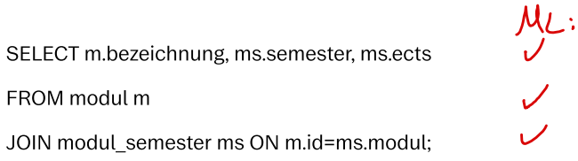
<h5>Studentische Antwort:</h5>
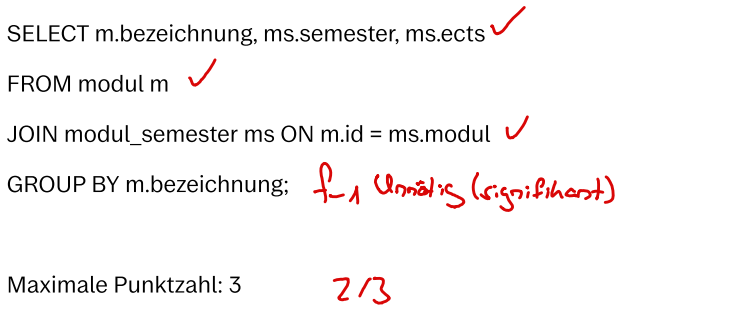
<h5>Bewertung:</h5>
Punkte = 2

<h4><b>Distanzbasierte Bewertung: 2,6 / 3</b></h4>
<h5>Musterlösung:</h5>
Difficulty: 14
<h5>Studentische Antwort:</h5>
<strong>Total Distance: 2</strong>

SELECT bezeichnung, semester, ects FROM modul INNER JOIN modul_semester ON (id = modul) GROUP BY bezeichnung;

&gt;&gt;&gt; <strong>Cost 2</strong>: Remove (excess) element in group-by-clause.

SELECT bezeichnung, semester, ects FROM modul INNER JOIN modul_semester ON (id = modul);

<h5>Bewertung:</h5>
Punkte = (14 - 2) / 14 * 3 = 2,5714285714

<h4><b>Ergebnisbasierte Bewertung: 1 / 3</b></h4>
<h5>Musterlösung:</h5>
<table>
    <thead>
        <tr>
            <th>Bepunktungsmetrik </th>
            <th>Erwarteter Wert </th>
            <th>Maximale Punkte </th>
        </tr>
    </thead>
    <tbody>
        <tr>
            <td>Anzahl der Tupel </td>
            <td>26 </td>
            <td>1 </td>
        </tr>
        <tr>
            <td>Namen der Attribute </td>
            <td>["bezeichnung", "semester", "ects"] </td>
            <td>1 </td>
        </tr>
        <tr>
            <td>Funktionale Abhängigkeiten </td>
            <td>["{\"determinateAtt.\": [\"bezeichnung\", \"semester\"], \"dependentAtt.\": [\"ects\"]}"]</td>
            <td>1 </td>
        </tr>
    </tbody>
</table>

<h5>Studentische Antwort:</h5>
<table>
    <thead>
        <tr>
            <th>Bepunktungsmetrik </th>
            <th>Erwarteter Wert </th>
            <th>Punkte </th>
        </tr>
    </thead>
    <tbody>
        <tr>
            <td>Anzahl der Tupel </td>
            <td>23 </td>
            <td>0 </td>
        </tr>
        <tr>
            <td>Namen der Attribute </td>
            <td>["bezeichnung", "semester", "ects"] </td>
            <td>1 </td>
        </tr>
        <tr>
            <td>Funktionale Abhängigkeiten </td>
            <td>["{\"determinateAtt.\": [\"bezeichnung\"], \"dependentAtt.\": [\"semester\"]}", "{\"determinateAtt.\": [\"bezeichnung\"], \"dependentAtt.\": [\"ects\"]}"]</td>
            <td>0 </td>
        </tr>
    </tbody>
</table>

<h5>Bewertung:</h5>
Punkte = 0 + 1 + 0 = 1

<h4>Fairness:</h4> Geben Sie an, wie <b>fair</b> ​Sie die jeweilige Bewertung finden
  
<b>Achtung:</b> Die Bewertungen hier befinden sich möglicherweise in einer andereren Reihenfolge als weiter oben auf der Seite! 
<b>Hinweis:</b> Es ist möglich, mehrere Bewertungen gleich einzustufen.
  
<table>
<thead>
  <tr>
    <th></th>
    <th>Fair</th>
    <th>Mittel</th>
    <th>Unfair</th>
  </tr>
</thead>
<tbody>
  <tr>
    <td>Ergebnisbasierte Bewertung</td>
    <td>o</td>
    <td>o</td>
    <td>o</td>
  </tr>
  <tr>
    <td>Distanzbasierte Bewertung</td>
    <td>o</td>
    <td>o</td>
    <td>o</td>
  </tr>
  <tr>
    <td>Manuelle Bewertung</td>
    <td>o</td>
    <td>o</td>
    <td>o</td>
  </tr>
</tbody>
</table>

<h4>Nachvollziehbarkeit:</h4> Geben Sie an, wie <b>nachvollziehbar</b> ​Sie die jeweilige Bewertung finden
  
<b>Achtung:</b> Die Bewertungen hier befinden sich möglicherweise in einer andereren Reihenfolge als weiter oben auf der Seite! 
<b>Hinweis:</b> Es ist möglich, mehrere Bewertungen gleich einzustufen.
  
<table>
<thead>
  <tr>
    <th></th>
    <th>Gut nachvoll- ziehbar</th>
    <th>Mittel</th>
    <th>Schlecht nachvoll- ziehbar</th>
  </tr>
</thead>
<tbody>
  <tr>
    <td>Ergebnisbasierte Bewertung</td>
    <td>o</td>
    <td>o</td>
    <td>o</td>
  </tr>
  <tr>
    <td>Distanzbasierte Bewertung</td>
    <td>o</td>
    <td>o</td>
    <td>o</td>
  </tr>
  <tr>
    <td>Manuelle Bewertung</td>
    <td>o</td>
    <td>o</td>
    <td>o</td>
  </tr>
</tbody>
</table>
    </td>
    <td width="50%">
<h3>Scenario 1-2</h3>
<h4>Task 1</h4>
This database is modeled after the standard curriculum of the Bachelor's program in Computer Science. It reflects the status as of the winter semester 2019/20 and comprises four relations:
  
<ol><li>themengebiet ( _id_, bezeichnung )</li>
<li>modul ( _id_, bezeichnung, gop, themengebiet [themengebiet] )</li>
<li>semester ( _nummer_ )</li>
<li>modul_semester ( _modul [modul], semester [semester]_, ects )</li></ol>

Provide the name of each module, the corresponding semester, and ECTS credits.

The maximum score is 3.
<h4>Sample Solution</h4>
<code>SELECT m.bezeichnung, ms.semester, ms.ects
FROM modul m
JOIN modul_semester ms ON m.id = ms.modul;</code>
<h4>Student Response 2</h4>
<code>SELECT m.bezeichnung, ms.semester, ms.ects 
FROM modul m 
JOIN modul_semester ms ON m.id = ms.modul 
GROUP BY m.bezeichnung;</code>

<h4><b>Manual Grading: 2 / 3</b></h4>
<h5>Sample Solution:</h5>

<h5>Student Reponse:</h5>

<h5>Grading:</h5>
Points = 2

<h4><b>Distance-Based Grading: 2,6 / 3</b></h4>
<h5>Sample Solution:</h5>
Difficulty: 14
<h5>Student Reponse:</h5>
<strong>Total Distance: 2</strong>

SELECT bezeichnung, semester, ects FROM modul INNER JOIN modul_semester ON (id = modul) GROUP BY bezeichnung;

&gt;&gt;&gt; <strong>Cost 2</strong>: Remove (excess) element in group-by-clause.

SELECT bezeichnung, semester, ects FROM modul INNER JOIN modul_semester ON (id = modul);

<h5>Grading:</h5>
Points = (14 - 2) / 14 * 3 = 2,5714285714

<h4><b>Result-Based Grading: 1 / 3</b></h4>
<h5>Sample Solution:</h5>
<table>
    <thead>
        <tr>
            <th>Scoring Metric</th>
            <th>Expected Value</th>
            <th>Maximum Points</th>
        </tr>
    </thead>
    <tbody>
        <tr>
            <td>Number of Tuples</td>
            <td>26</td>
            <td>1</td>
        </tr>
        <tr>
            <td>Attribute Names</td>
            <td>["bezeichnung", "semester", "ects"] </td>
            <td>1 </td>
        </tr>
        <tr>
            <td>Functional Dependencies</td>
            <td>["{\"determinateAtt.\": [\"bezeichnung\", \"semester\"], \"dependentAtt.\": [\"ects\"]}"]</td>
            <td>1 </td>
        </tr>
    </tbody>
</table>
<h5>Student Reponse:</h5>
<table>
    <thead>
        <tr>
            <th>Scoring Metric</th>
            <th>Expected Value</th>
            <th>Points</th>
        </tr>
    </thead>
    <tbody>
        <tr>
            <td>Number of Tuples</td>
            <td>23</td>
            <td>0</td>
        </tr>
        <tr>
            <td>Attribute Names</td>
            <td>["bezeichnung", "semester", "ects"] </td>
            <td>1 </td>
        </tr>
        <tr>
            <td>Functional Dependencies</td>
            <td>["{\"determinateAtt.\": [\"bezeichnung\"], \"dependentAtt.\": [\"semester\"]}", "{\"determinateAtt.\": [\"bezeichnung\"], \"dependentAtt.\": [\"ects\"]}"]</td>
            <td>0 </td>
        </tr>
    </tbody>
</table>
<h5>Grading:</h5>
Points = 0 + 1 + 0 = 1

<h4>Fairness:</h4> Indicate how <b>fair</b> you find each grading.
  
<b>Attention:</b> The gradings here may be in a different order than those found earlier on the page. 
<b>Note:</b> It is possible to rate multiple gradings as being equally fair.
  
<table>
<thead>
  <tr>
    <th></th>
    <th>Fair</th>
    <th>Moderate</th>
    <th>Unfair</th>
  </tr>
</thead>
<tbody>
  <tr>
    <td>Result-Based Grading</td>
    <td>o</td>
    <td>o</td>
    <td>o</td>
  </tr>
  <tr>
    <td>Distance-Based Grading</td>
    <td>o</td>
    <td>o</td>
    <td>o</td>
  </tr>
  <tr>
    <td>Manual Grading</td>
    <td>o</td>
    <td>o</td>
    <td>o</td>
  </tr>
</tbody>
</table>

<h4>Comprehensibility:</h4> Indicate how <b>comprehensible</b> you find each grading.
  
<b>Attention:</b> The gradings here may be in a different order than those found earlier on the page. 
<b>Note:</b> It is possible to rate multiple gradings as being equally comprehensible.
  
<table>
<thead>
  <tr>
    <th></th>
    <th>Easy to comprehend</th>
    <th>Moderate</th>
    <th>Difficult to comprehend</th>
  </tr>
</thead>
<tbody>
  <tr>
    <td>Result-Based Grading</td>
    <td>o</td>
    <td>o</td>
    <td>o</td>
  </tr>
  <tr>
    <td>Distance-Based Grading</td>
    <td>o</td>
    <td>o</td>
    <td>o</td>
  </tr>
  <tr>
    <td>Manual Grading</td>
    <td>o</td>
    <td>o</td>
    <td>o</td>
  </tr>
</tbody>
</table>
    </td>
  </tr>
</table>

### Results

The survey results for this scenario are as follows:

| ID | DATE     | Fairness Result-Based | Fairness Distance-Based | Fairness Manual | Comprehensibility Result-Based | Comprehensibility Distance-Based | Comprehensibility Manual |
| -- | -------- | --------------- | --------------------- | --------------------- | ---------------------- | --------------------- | --------------------- |
| 1   | 12.07.23 | \-2                    | \-2                   | \-2                   | \-2                    | \-2                   | \-2                   |
| 2   | 13.07.23 | \-2                    | \-2                   | \-2                   | \-2                    | \-2                   | \-2                   |
| 3   | 17.07.23 | \-2                    | \-2                   | \-2                   | \-2                    | \-2                   | \-2                   |
| 4   | 21.07.23 | \-2                    | \-2                   | \-2                   | \-2                    | \-2                   | \-2                   |
| 5   | 24.07.23 | \-2                    | \-2                   | \-2                   | \-2                    | \-2                   | \-2                   |
| 6   | 24.07.23 | \-2                    | \-2                   | \-2                   | \-2                    | \-2                   | \-2                   |
| 7   | 26.07.23 | \-2                    | \-2                   | \-2                   | \-2                    | \-2                   | \-2                   |
| 8   | 02.08.23 | \-2                    | \-2                   | \-2                   | \-2                    | \-2                   | \-2                   |
| 9   | 02.08.23 | \-2                    | \-2                   | \-2                   | \-2                    | \-2                   | \-2                   |
| 10  | 04.08.23 | 3                      | 2                     | 2                     | 2                      | 1                     | 2                     |
| 11  | 04.08.23 | \-2                    | \-2                   | \-2                   | \-2                    | \-2                   | \-2                   |
| 12  | 07.08.23 | \-2                    | \-2                   | \-2                   | \-2                    | \-2                   | \-2                   |
| 13  | 07.08.23 | \-2                    | \-2                   | \-2                   | \-2                    | \-2                   | \-2                   |
| 14  | 07.08.23 | 3                      | 1                     | 3                     | 1                      | 1                     | 3                     |
| 15  | 07.08.23 | 3                      | 2                     | 1                     | 3                      | 1                     | 1                     |
| 16  | 07.08.23 | \-1                    | \-1                   | \-1                   | \-1                    | \-1                   | \-1                   |
| 17  | 07.08.23 | \-1                    | \-1                   | \-1                   | \-1                    | \-1                   | \-1                   |
| 18  | 07.08.23 | 3                      | 1                     | 2                     | 2                      | 1                     | 1                     |
| 19  | 08.08.23 | 3                      | 1                     | 1                     | 1                      | 1                     | 1                     |
| 20  | 08.08.23 | 2                      | 2                     | 1                     | 3                      | 2                     | 1                     |
| 21  | 08.08.23 | 3                      | 2                     | 1                     | 2                      | 1                     | 1                     |
| 22  | 09.08.23 | 3                      | 2                     | 1                     | 2                      | 3                     | 1                     |
| 23  | 18.08.23 | 3                      | 1                     | 2                     | 3                      | 1                     | 2                     |
| 24  | 15.08.23 | 3                      | 1                     | 1                     | 3                      | 1                     | 1                     |
| 25  | 17.08.23 | 3                      | 1                     | 1                     | 3                      | 1                     | 1                     |
| 26  | 18.08.23 | \-2                    | \-2                   | \-2                   | \-2                    | \-2                   | \-2                   |
| 27  | 23.08.23 | 3                      | 1                     | 1                     | 2                      | 1                     | 1                     |
| 28  | 28.08.23 | 3                      | 2                     | 1                     | 2                      | 1                     | 1                     |
| 29  | 29.08.23 | \-1                    | \-1                   | \-1                   | \-1                    | \-1                   | \-1                   |
| 30  | 29.08.23 | 2                      | 2                     | 1                     | 2                      | 2                     | 1                     |
| 31  | 31.08.23 | \-2                    | \-2                   | \-2                   | \-2                    | \-2                   | \-2                   |
| 32  | 01.09.23 | 2                      | 1                     | 1                     | 2                      | 1                     | 2                     |
| 33  | 01.09.23 | 2                      | 1                     | 1                     | 2                      | 2                     | 1                     |
| 34  | 01.09.23 | \-2                    | \-2                   | \-2                   | \-2                    | \-2                   | \-2                   |
| 35  | 04.09.23 | \-2                    | \-2                   | \-2                   | \-2                    | \-2                   | \-2                   |

#### Legend:
- "1" represents the selection of the best option
- "2" indicates the selection of the moderate option
- "3" signifies the selection of the worst option
- "-1"/"-2" stand for "no response" or "not seen"

## Page 5 

<table>
  <tr>
    <th width="50%">German (original)</th>
    <th width="50%">English (translated)</th>
  </tr>
  <tr>
    <td width="50%">
<h3>Szenario 1-3</h3>
<h4>Aufgabenstellung 1</h4>
Diese Datenbank ist an den Musterstudienplan im Informatik Bachelorstudiengang angelehnt. Sie ist auf dem Stand von Wintersemester 2019/20 und besteht aus vier Relationen:
  
<ol><li>themengebiet ( _id_, bezeichnung )</li>
<li>modul ( _id_, bezeichnung, gop, themengebiet [themengebiet] )</li>
<li>semester ( _nummer_ )</li>
<li>modul_semester ( _modul [modul], semester [semester]_, ects )</li></ol>

Geben Sie für jedes Modul die Bezeichnung des Moduls, das dazugehörige Semester und ECTS aus.

Die Maximale Punktzahl beträgt 3.
<h4>Musterlösung</h4>
<code>SELECT m.bezeichnung, ms.semester, ms.ects
FROM modul m
JOIN modul_semester ms ON m.id = ms.modul;</code>
<h4>Studentische Antwort 3</h4>
<code>SELECT modul.bezeichnung, modul_semester.semester, modul_semester.ects 
FROM modul, modul_semester 
WHERE modul_semester.modul = modul.id 
GROUP BY modul.id, modul_semester.semester;</code>

<h4><b>Manuelle Bewertung: 2 / 3</b></h4>
<h5>Musterlösung:</h5>

<h5>Studentische Antwort:</h5>
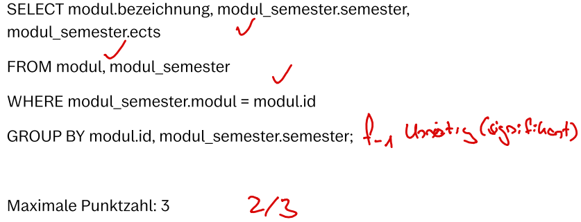
<h5>Bewertung:</h5>
Punkte = 2

<h4><b>Distanzbasierte Bewertung: 2,1 / 3</b></h4>
<h5>Musterlösung:</h5>
Difficulty: 14
<h5>Studentische Antwort:</h5>
<strong>Total Distance: 4</strong>

SELECT bezeichnung, semester, ects FROM modul, modul_semester WHERE (modul = id) GROUP BY id, semester;

&gt;&gt;&gt; <strong>Cost 0</strong>: Move expression from the where-clause to the join-condition of an INNER JOIN.

SELECT bezeichnung, semester, ects FROM modul INNER JOIN modul_semester ON (modul = id) GROUP BY id, semester;

&gt;&gt;&gt; <strong>Cost 0</strong>: Swap arguments of commutative binary-expression in a from-element join-condition.

SELECT bezeichnung, semester, ects FROM modul INNER JOIN modul_semester ON (id = modul) GROUP BY id, semester;

&gt;&gt;&gt; <strong>Cost 2</strong>: Remove (excess) element in group-by-clause.

SELECT bezeichnung, semester, ects FROM modul INNER JOIN modul_semester ON (id = modul) GROUP BY semester;

&gt;&gt;&gt; <strong>Cost 2 </strong>: Remove (excess) element in group-by-clause.

SELECT bezeichnung, semester, ects FROM modul INNER JOIN modul_semester ON (id = modul);

<h5>Bewertung:</h5>
Punkte = (14 - 4) / 14 * 3 = 2,1428571428

<h4><b>Ergebnisbasierte Bewertung: 3 / 3</b></h4>
<h5>Musterlösung:</h5>
<table>
    <thead>
        <tr>
            <th>Bepunktungsmetrik </th>
            <th>Erwarteter Wert </th>
            <th>Maximale Punkte </th>
        </tr>
    </thead>
    <tbody>
        <tr>
            <td>Anzahl der Tupel </td>
            <td>26 </td>
            <td>1 </td>
        </tr>
        <tr>
            <td>Namen der Attribute </td>
            <td>["bezeichnung", "semester", "ects"] </td>
            <td>1 </td>
        </tr>
        <tr>
            <td>Funktionale Abhängigkeiten </td>
            <td>["{\"determinateAtt.\": [\"bezeichnung\", \"semester\"], \"dependentAtt.\": [\"ects\"]}"]</td>
            <td>1 </td>
        </tr>
    </tbody>
</table>

<h5>Studentische Antwort:</h5>
<table>
    <thead>
        <tr>
            <th>Bepunktungsmetrik </th>
            <th>Erwarteter Wert </th>
            <th>Punkte </th>
        </tr>
    </thead>
    <tbody>
        <tr>
            <td>Anzahl der Tupel </td>
            <td>26 </td>
            <td>1 </td>
        </tr>
        <tr>
            <td>Namen der Attribute </td>
            <td>["bezeichnung", "semester", "ects"] </td>
            <td>1 </td>
        </tr>
        <tr>
            <td>Funktionale Abhängigkeiten </td>
            <td>["{\"determinateAtt.\": [\"bezeichnung\", \"semester\"], \"dependentAtt.\": [\"ects\"]}"]</td>
            <td>1 </td>
        </tr>
    </tbody>
</table>

<h5>Bewertung:</h5>
Punkte = 1 + 1 + 1 = 3

<h4>Fairness:</h4> Geben Sie an, wie <b>fair</b> ​Sie die jeweilige Bewertung finden
  
<b>Achtung:</b> Die Bewertungen hier befinden sich möglicherweise in einer andereren Reihenfolge als weiter oben auf der Seite!
<b>Hinweis:</b> Es ist möglich, mehrere Bewertungen gleich einzustufen.
  
<table>
<thead>
  <tr>
    <th></th>
    <th>Fair</th>
    <th>Mittel</th>
    <th>Unfair</th>
  </tr>
</thead>
<tbody>
  <tr>
    <td>Ergebnisbasierte Bewertung</td>
    <td>o</td>
    <td>o</td>
    <td>o</td>
  </tr>
  <tr>
    <td>Distanzbasierte Bewertung</td>
    <td>o</td>
    <td>o</td>
    <td>o</td>
  </tr>
  <tr>
    <td>Manuelle Bewertung</td>
    <td>o</td>
    <td>o</td>
    <td>o</td>
  </tr>
</tbody>
</table>

<h4>Nachvollziehbarkeit:</h4> Geben Sie an, wie <b>nachvollziehbar</b> ​Sie die jeweilige Bewertung finden
  
<b>Achtung:</b> Die Bewertungen hier befinden sich möglicherweise in einer andereren Reihenfolge als weiter oben auf der Seite!
<b>Hinweis:</b> Es ist möglich, mehrere Bewertungen gleich einzustufen.
  
<table>
<thead>
  <tr>
    <th></th>
    <th>Gut nachvoll- ziehbar</th>
    <th>Mittel</th>
    <th>Schlecht nachvoll- ziehbar</th>
  </tr>
</thead>
<tbody>
  <tr>
    <td>Ergebnisbasierte Bewertung</td>
    <td>o</td>
    <td>o</td>
    <td>o</td>
  </tr>
  <tr>
    <td>Distanzbasierte Bewertung</td>
    <td>o</td>
    <td>o</td>
    <td>o</td>
  </tr>
  <tr>
    <td>Manuelle Bewertung</td>
    <td>o</td>
    <td>o</td>
    <td>o</td>
  </tr>
</tbody>
</table>
    </td>
    <td width="50%">
<h3>Scenario 1-3</h3>
<h4>Task 1</h4>
This database is modeled after the standard curriculum of the Bachelor's program in Computer Science. It reflects the status as of the winter semester 2019/20 and comprises four relations:
  
<ol><li>themengebiet ( _id_, bezeichnung )</li>
<li>modul ( _id_, bezeichnung, gop, themengebiet [themengebiet] )</li>
<li>semester ( _nummer_ )</li>
<li>modul_semester ( _modul [modul], semester [semester]_, ects )</li></ol>

Provide the name of each module, the corresponding semester, and ECTS credits.

The maximum score is 3.
<h4>Sample Solution</h4>
<code>SELECT m.bezeichnung, ms.semester, ms.ects
FROM modul m
JOIN modul_semester ms ON m.id = ms.modul;</code>
<h4>Student Response 3</h4>
<code>SELECT modul.bezeichnung, modul_semester.semester, modul_semester.ects 
FROM modul, modul_semester 
WHERE modul_semester.modul = modul.id 
GROUP BY modul.id, modul_semester.semester;</code>

<h4><b>Manual Grading: 2 / 3</b></h4>
<h5>Sample Solution:</h5>

<h5>Student Reponse:</h5>

<h5>Grading:</h5>
Points = 2

<h4><b>Distance-Based Grading: 2,1 / 3</b></h4>
<h5>Sample Solution:</h5>
Difficulty: 14
<h5>Student Reponse:</h5>
<strong>Total Distance: 4</strong>

SELECT bezeichnung, semester, ects FROM modul, modul_semester WHERE (modul = id) GROUP BY id, semester;

&gt;&gt;&gt; <strong>Cost 0</strong>: Move expression from the where-clause to the join-condition of an INNER JOIN.

SELECT bezeichnung, semester, ects FROM modul INNER JOIN modul_semester ON (modul = id) GROUP BY id, semester;

&gt;&gt;&gt; <strong>Cost 0</strong>: Swap arguments of commutative binary-expression in a from-element join-condition.

SELECT bezeichnung, semester, ects FROM modul INNER JOIN modul_semester ON (id = modul) GROUP BY id, semester;

&gt;&gt;&gt; <strong>Cost 2</strong>: Remove (excess) element in group-by-clause.

SELECT bezeichnung, semester, ects FROM modul INNER JOIN modul_semester ON (id = modul) GROUP BY semester;

&gt;&gt;&gt; <strong>Cost 2 </strong>: Remove (excess) element in group-by-clause.

SELECT bezeichnung, semester, ects FROM modul INNER JOIN modul_semester ON (id = modul);

<h5>Grading:</h5>
Points = (14 - 4) / 14 * 3 = 2,1428571428

<h4><b>Result-Based Grading: 3 / 3</b></h4>
<h5>Sample Solution:</h5>
<table>
    <thead>
        <tr>
            <th>Scoring Metric</th>
            <th>Expected Value</th>
            <th>Maximum Points</th>
        </tr>
    </thead>
    <tbody>
        <tr>
            <td>Number of Tuples</td>
            <td>26</td>
            <td>1</td>
        </tr>
        <tr>
            <td>Attribute Names</td>
            <td>["bezeichnung", "semester", "ects"] </td>
            <td>1 </td>
        </tr>
        <tr>
            <td>Functional Dependencies</td>
            <td>["{\"determinateAtt.\": [\"bezeichnung\", \"semester\"], \"dependentAtt.\": [\"ects\"]}"]</td>
            <td>1 </td>
        </tr>
    </tbody>
</table>
<h5>Student Reponse:</h5>
<table>
    <thead>
        <tr>
            <th>Scoring Metric</th>
            <th>Expected Value</th>
            <th>Points</th>
        </tr>
    </thead>
    <tbody>
        <tr>
            <td>Number of Tuples</td>
            <td>26</td>
            <td>1</td>
        </tr>
        <tr>
            <td>Attribute Names</td>
            <td>["bezeichnung", "semester", "ects"] </td>
            <td>1 </td>
        </tr>
        <tr>
            <td>Functional Dependencies</td>
            <td>["{\"determinateAtt.\": [\"bezeichnung\", \"semester\"], \"dependentAtt.\": [\"ects\"]}"]</td>
            <td>1 </td>
        </tr>
    </tbody>
</table>
<h5>Grading:</h5>
Points = 1 + 1 + 1 = 3

<h4>Fairness:</h4> Indicate how <b>fair</b> you find each grading.
  
<b>Attention:</b> The gradings here may be in a different order than those found earlier on the page. 
<b>Note:</b> It is possible to rate multiple gradings as being equally fair.
  
<table>
<thead>
  <tr>
    <th></th>
    <th>Fair</th>
    <th>Moderate</th>
    <th>Unfair</th>
  </tr>
</thead>
<tbody>
  <tr>
    <td>Result-Based Grading</td>
    <td>o</td>
    <td>o</td>
    <td>o</td>
  </tr>
  <tr>
    <td>Distance-Based Grading</td>
    <td>o</td>
    <td>o</td>
    <td>o</td>
  </tr>
  <tr>
    <td>Manual Grading</td>
    <td>o</td>
    <td>o</td>
    <td>o</td>
  </tr>
</tbody>
</table>

<h4>Comprehensibility:</h4> Indicate how <b>comprehensible</b> you find each grading.
  
<b>Attention:</b> The gradings here may be in a different order than those found earlier on the page. 
<b>Note:</b> It is possible to rate multiple gradings as being equally comprehensible.
  
<table>
<thead>
  <tr>
    <th></th>
    <th>Easy to comprehend</th>
    <th>Moderate</th>
    <th>Difficult to comprehend</th>
  </tr>
</thead>
<tbody>
  <tr>
    <td>Result-Based Grading</td>
    <td>o</td>
    <td>o</td>
    <td>o</td>
  </tr>
  <tr>
    <td>Distance-Based Grading</td>
    <td>o</td>
    <td>o</td>
    <td>o</td>
  </tr>
  <tr>
    <td>Manual Grading</td>
    <td>o</td>
    <td>o</td>
    <td>o</td>
  </tr>
</tbody>
</table>
    </td>
  </tr>
</table>

### Results

The survey results for this scenario are as follows:

| ID | DATE     | Fairness Result-Based | Fairness Distance-Based | Fairness Manual | Comprehensibility Result-Based | Comprehensibility Distance-Based | Comprehensibility Manual |
| -- | -------- | --------------- | --------------------- | --------------------- | ---------------------- | --------------------- | --------------------- |
| 1   | 12.07.23 | \-2                    | \-2                   | \-2                   | \-2                    | \-2                   | \-2                   |
| 2   | 13.07.23 | \-2                    | \-2                   | \-2                   | \-2                    | \-2                   | \-2                   |
| 3   | 17.07.23 | \-2                    | \-2                   | \-2                   | \-2                    | \-2                   | \-2                   |
| 4   | 21.07.23 | \-2                    | \-2                   | \-2                   | \-2                    | \-2                   | \-2                   |
| 5   | 24.07.23 | \-2                    | \-2                   | \-2                   | \-2                    | \-2                   | \-2                   |
| 6   | 24.07.23 | \-2                    | \-2                   | \-2                   | \-2                    | \-2                   | \-2                   |
| 7   | 26.07.23 | \-2                    | \-2                   | \-2                   | \-2                    | \-2                   | \-2                   |
| 8   | 02.08.23 | \-2                    | \-2                   | \-2                   | \-2                    | \-2                   | \-2                   |
| 9   | 02.08.23 | \-2                    | \-2                   | \-2                   | \-2                    | \-2                   | \-2                   |
| 10  | 04.08.23 | 2                      | 2                     | 2                     | 1                      | 2                     | 1                     |
| 11  | 04.08.23 | \-2                    | \-2                   | \-2                   | \-2                    | \-2                   | \-2                   |
| 12  | 07.08.23 | \-2                    | \-2                   | \-2                   | \-2                    | \-2                   | \-2                   |
| 13  | 07.08.23 | \-2                    | \-2                   | \-2                   | \-2                    | \-2                   | \-2                   |
| 14  | 07.08.23 | 1                      | 2                     | 1                     | 1                      | 2                     | 1                     |
| 15  | 07.08.23 | 3                      | 1                     | 1                     | 2                      | 1                     | 1                     |
| 16  | 07.08.23 | \-2                    | \-2                   | \-2                   | \-2                    | \-2                   | \-2                   |
| 17  | 07.08.23 | \-2                    | \-2                   | \-2                   | \-2                    | \-2                   | \-2                   |
| 18  | 07.08.23 | 1                      | 2                     | 2                     | 1                      | 3                     | 1                     |
| 19  | 08.08.23 | 2                      | 1                     | 1                     | 1                      | 1                     | 1                     |
| 20  | 08.08.23 | 3                      | 2                     | 2                     | 3                      | 1                     | 1                     |
| 21  | 08.08.23 | 2                      | 1                     | 1                     | 3                      | 1                     | 1                     |
| 22  | 09.08.23 | 3                      | 1                     | 1                     | 3                      | 2                     | 1                     |
| 23  | 18.08.23 | 1                      | 1                     | 2                     | 3                      | 1                     | 2                     |
| 24  | 15.08.23 | 2                      | 1                     | 1                     | 2                      | 1                     | 1                     |
| 25  | 17.08.23 | 3                      | 1                     | 1                     | 3                      | 1                     | 1                     |
| 26  | 18.08.23 | \-2                    | \-2                   | \-2                   | \-2                    | \-2                   | \-2                   |
| 27  | 23.08.23 | 3                      | 1                     | 1                     | 2                      | 1                     | 1                     |
| 28  | 28.08.23 | 2                      | 2                     | 2                     | 1                      | 1                     | 1                     |
| 29  | 29.08.23 | \-2                    | \-2                   | \-2                   | \-2                    | \-2                   | \-2                   |
| 30  | 29.08.23 | 1                      | 1                     | 1                     | 1                      | 2                     | 1                     |
| 31  | 31.08.23 | \-2                    | \-2                   | \-2                   | \-2                    | \-2                   | \-2                   |
| 32  | 01.09.23 | 3                      | 1                     | 1                     | 3                      | 1                     | 1                     |
| 33  | 01.09.23 | 2                      | 1                     | 1                     | 2                      | 2                     | 1                     |
| 34  | 01.09.23 | \-2                    | \-2                   | \-2                   | \-2                    | \-2                   | \-2                   |
| 35  | 04.09.23 | \-2                    | \-2                   | \-2                   | \-2                    | \-2                   | \-2                   |

#### Legend:
- "1" represents the selection of the best option
- "2" indicates the selection of the moderate option
- "3" signifies the selection of the worst option
- "-1"/"-2" stand for "no response" or "not seen"

## Page 6 

<table>
  <tr>
    <th width="50%">German (original)</th>
    <th width="50%">English (translated)</th>
  </tr>
  <tr>
    <td width="50%">
<h3>Szenario 2-1</h3>
<h4>Aufgabenstellung 2</h4>
Diese Datenbank ist an den Musterstudienplan im Informatik Bachelorstudiengang angelehnt. Sie ist auf dem Stand von Wintersemester 2019/20 und besteht aus vier Relationen:
  
<ol><li>themengebiet ( _id_, bezeichnung )</li>
<li>modul ( _id_, bezeichnung, gop, themengebiet [themengebiet] )</li>
<li>semester ( _nummer_ )</li>
<li>modul_semester ( _modul [modul], semester [semester]_, ects )</li></ol>

Geben Sie die Nummer derjenigen Semester als semester an, in denen mehr als 3 verschiedene Themengebiete behandelt werden.

Die Maximale Punktzahl beträgt 4.

<h4>Musterlösung</h4>
<code>SELECT ms.semester
FROM modul m
JOIN modul_semester ms ON (ms.modul = m.id)
GROUP BY ms.semester
HAVING COUNT(DISTINCT m.themengebiet) > 3;</code>

<h4>Studentische Antwort 1</h4>
<code>select ms.semester as semester 
from modul_semester ms 
join modul m on m.id = ms.modul 
group by ms.semester 
having count(m.themengebiet) > 3;</code>

<h4><b>Manuelle Bewertung: 3,5 / 4</b></h4>
<h5>Musterlösung:</h5>

<h5>Studentische Antwort:</h5>
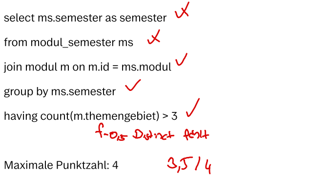
<h5>Bewertung:</h5>
Punkte = 3,5

<h4><b>Distanzbasierte Bewertung: 3,5/4</b></h4>
<h5>Musterlösung:</h5>
Difficulty: 16
<h5>Studentische Antwort:</h5>
<strong>Total Distance: 2</strong>

SELECT semester AS semester FROM modul_semester INNER JOIN modul ON (id = modul) GROUP BY semester HAVING (COUNT(themengebiet) &gt; 3);

&gt;&gt;&gt; <strong>Cost 0</strong>: Swap elements in the from-clause.

SELECT semester AS semester FROM modul INNER JOIN modul_semester ON (id = modul) GROUP BY semester HAVING (COUNT(themengebiet) &gt; 3);

&gt;&gt;&gt; <strong>Cost 0</strong>: Swap arguments of commutative binary-expression in a from-element join-condition.

SELECT semester AS semester FROM modul INNER JOIN modul_semester ON (modul = id) GROUP BY semester HAVING (COUNT(themengebiet) &gt; 3);

&gt;&gt;&gt; <strong>Cost 0</strong>: Unset (redundant) explicit alias on a select-element.

SELECT semester FROM modul INNER JOIN modul_semester ON (modul = id) GROUP BY semester HAVING (COUNT(themengebiet) &gt; 3);

&gt;&gt;&gt; <strong>Cost 2</strong>: Set (missing) distinct-declaration on an aggregation function in the having-clause.

SELECT semester FROM modul INNER JOIN modul_semester ON (modul = id) GROUP BY semester HAVING (COUNT(DISTINCT themengebiet) &gt; 3);

<h5>Bewertung:</h5>
Punkte = (16 - 2) / 16 * 4 = 3,5

<h4><b>Ergebnisbasierte Bewertung: 1 / 4</b></h4>
<h5>Musterlösung:</h5>
<table>
    <thead>
        <tr>
            <th>Bepunktungsmetrik </th>
            <th>Erwarteter Wert </th>
            <th>Maximale Punkte </th>
        </tr>
    </thead>
    <tbody>
        <tr>
            <td>Anzahl der Tupel </td>
            <td>3 </td>
            <td>3 </td>
        </tr>
        <tr>
            <td>Namen der Attribute </td>
            <td>["semester"] </td>
            <td>1 </td>
        </tr>
    </tbody>
</table>

<h5>Studentische Antwort:</h5>
<table>
    <thead>
        <tr>
            <th>Bepunktungsmetrik </th>
            <th>Erwarteter Wert </th>
            <th>Punkte </th>
        </tr>
    </thead>
    <tbody>
        <tr>
            <td>Anzahl der Tupel </td>
            <td>5 </td>
            <td>0 </td>
        </tr>
        <tr>
            <td>Namen der Attribute </td>
            <td>["semester"] </td>
            <td>1 </td>
        </tr>
    </tbody>
</table>

<h5>Bewertung:</h5>
Punkte = 0 + 1 = 1

<h4>Fairness:</h4> Geben Sie an, wie <b>fair</b> ​Sie die jeweilige Bewertung finden
  
<b>Achtung:</b> Die Bewertungen hier befinden sich möglicherweise in einer andereren Reihenfolge als weiter oben auf der Seite!
<b>Hinweis:</b> Es ist möglich, mehrere Bewertungen gleich einzustufen.
  
<table>
<thead>
  <tr>
    <th></th>
    <th>Fair</th>
    <th>Mittel</th>
    <th>Unfair</th>
  </tr>
</thead>
<tbody>
  <tr>
    <td>Ergebnisbasierte Bewertung</td>
    <td>o</td>
    <td>o</td>
    <td>o</td>
  </tr>
  <tr>
    <td>Distanzbasierte Bewertung</td>
    <td>o</td>
    <td>o</td>
    <td>o</td>
  </tr>
  <tr>
    <td>Manuelle Bewertung</td>
    <td>o</td>
    <td>o</td>
    <td>o</td>
  </tr>
</tbody>
</table>

<h4>Nachvollziehbarkeit:</h4> Geben Sie an, wie <b>nachvollziehbar</b> ​Sie die jeweilige Bewertung finden
  
<b>Achtung:</b> Die Bewertungen hier befinden sich möglicherweise in einer andereren Reihenfolge als weiter oben auf der Seite!
<b>Hinweis:</b> Es ist möglich, mehrere Bewertungen gleich einzustufen.
  
<table>
<thead>
  <tr>
    <th></th>
    <th>Gut nachvoll- ziehbar</th>
    <th>Mittel</th>
    <th>Schlecht nachvoll- ziehbar</th>
  </tr>
</thead>
<tbody>
  <tr>
    <td>Ergebnisbasierte Bewertung</td>
    <td>o</td>
    <td>o</td>
    <td>o</td>
  </tr>
  <tr>
    <td>Distanzbasierte Bewertung</td>
    <td>o</td>
    <td>o</td>
    <td>o</td>
  </tr>
  <tr>
    <td>Manuelle Bewertung</td>
    <td>o</td>
    <td>o</td>
    <td>o</td>
  </tr>
</tbody>
</table>
    </td>
    <td width="50%">
<h3>Scenario 2-1</h3>
<h4>Task 2</h4>
This database is modeled after the standard curriculum of the Bachelor's program in Computer Science. It reflects the status as of the winter semester 2019/20 and comprises four relations:
  
<ol><li>themengebiet ( _id_, bezeichnung )</li>
<li>modul ( _id_, bezeichnung, gop, themengebiet [themengebiet] )</li>
<li>semester ( _nummer_ )</li>
<li>modul_semester ( _modul [modul], semester [semester]_, ects )</li></ol>

Indicate the number of those semesters as semester in which more than three different subject areas are covered.

The maximum score is 4.
<h4>Sample Solution</h4>
<code>SELECT ms.semester
FROM modul m
JOIN modul_semester ms ON (ms.modul = m.id)
GROUP BY ms.semester
HAVING COUNT(DISTINCT m.themengebiet) > 3;</code>

<h4>Student Response 1</h4>
<code>select ms.semester as semester 
from modul_semester ms 
join modul m on m.id = ms.modul 
group by ms.semester 
having count(m.themengebiet) > 3;</code>

<h4><b>Manual Grading: 3,5 / 4</b></h4>
<h5>Sample Solution:</h5>

<h5>Student Reponse:</h5>

<h5>Grading:</h5>
Points = 3,5

<h4><b>Distance-Based Grading: 3,5 / 4</b></h4>
<h5>Sample Solution:</h5>
Difficulty: 16
<h5>Student Reponse:</h5>
<strong>Total Distance: 2</strong>

SELECT semester AS semester FROM modul_semester INNER JOIN modul ON (id = modul) GROUP BY semester HAVING (COUNT(themengebiet) &gt; 3);

&gt;&gt;&gt; <strong>Cost 0</strong>: Swap elements in the from-clause.

SELECT semester AS semester FROM modul INNER JOIN modul_semester ON (id = modul) GROUP BY semester HAVING (COUNT(themengebiet) &gt; 3);

&gt;&gt;&gt; <strong>Cost 0</strong>: Swap arguments of commutative binary-expression in a from-element join-condition.

SELECT semester AS semester FROM modul INNER JOIN modul_semester ON (modul = id) GROUP BY semester HAVING (COUNT(themengebiet) &gt; 3);

&gt;&gt;&gt; <strong>Cost 0</strong>: Unset (redundant) explicit alias on a select-element.

SELECT semester FROM modul INNER JOIN modul_semester ON (modul = id) GROUP BY semester HAVING (COUNT(themengebiet) &gt; 3);

&gt;&gt;&gt; <strong>Cost 2</strong>: Set (missing) distinct-declaration on an aggregation function in the having-clause.

SELECT semester FROM modul INNER JOIN modul_semester ON (modul = id) GROUP BY semester HAVING (COUNT(DISTINCT themengebiet) &gt; 3);

<h5>Grading:</h5>
Points = (16 - 2) / 16 * 4 = 3,5

<h4><b>Result-Based Grading: 1 / 4</b></h4>
<h5>Sample Solution:</h5>
<table>
    <thead>
        <tr>
            <th>Scoring Metric</th>
            <th>Expected Value</th>
            <th>Maximum Points</th>
        </tr>
    </thead>
    <tbody>
        <tr>
            <td>Number of Tuples</td>
            <td>3</td>
            <td>3</td>
        </tr>
        <tr>
            <td>Attribute Names</td>
            <td>["semester"] </td>
            <td>1 </td>
        </tr>
    </tbody>
</table>
<h5>Student Reponse:</h5>
<table>
    <thead>
        <tr>
            <th>Scoring Metric</th>
            <th>Expected Value</th>
            <th>Points</th>
        </tr>
    </thead>
    <tbody>
        <tr>
            <td>Number of Tuples</td>
            <td>5</td>
            <td>0</td>
        </tr>
        <tr>
            <td>Attribute Names</td>
            <td>["semester"] </td>
            <td>1 </td>
        </tr>
    </tbody>
</table>
<h5>Grading:</h5>
Points = 0 + 1 = 1

<h4>Fairness:</h4> Indicate how <b>fair</b> you find each grading.
  
<b>Attention:</b> The gradings here may be in a different order than those found earlier on the page. 
<b>Note:</b> It is possible to rate multiple gradings as being equally fair.
  
<table>
<thead>
  <tr>
    <th></th>
    <th>Fair</th>
    <th>Moderate</th>
    <th>Unfair</th>
  </tr>
</thead>
<tbody>
  <tr>
    <td>Result-Based Grading</td>
    <td>o</td>
    <td>o</td>
    <td>o</td>
  </tr>
  <tr>
    <td>Distance-Based Grading</td>
    <td>o</td>
    <td>o</td>
    <td>o</td>
  </tr>
  <tr>
    <td>Manual Grading</td>
    <td>o</td>
    <td>o</td>
    <td>o</td>
  </tr>
</tbody>
</table>

<h4>Comprehensibility:</h4> Indicate how <b>comprehensible</b> you find each grading.
  
<b>Attention:</b> The gradings here may be in a different order than those found earlier on the page. 
<b>Note:</b> It is possible to rate multiple gradings as being equally comprehensible.
  
<table>
<thead>
  <tr>
    <th></th>
    <th>Easy to comprehend</th>
    <th>Moderate</th>
    <th>Difficult to comprehend</th>
  </tr>
</thead>
<tbody>
  <tr>
    <td>Result-Based Grading</td>
    <td>o</td>
    <td>o</td>
    <td>o</td>
  </tr>
  <tr>
    <td>Distance-Based Grading</td>
    <td>o</td>
    <td>o</td>
    <td>o</td>
  </tr>
  <tr>
    <td>Manual Grading</td>
    <td>o</td>
    <td>o</td>
    <td>o</td>
  </tr>
</tbody>
</table>
    </td>
  </tr>
</table>

### Results

The survey results for this scenario are as follows:

| ID | DATE     | Fairness Result-Based | Fairness Distance-Based | Fairness Manual | Comprehensibility Result-Based | Comprehensibility Distance-Based | Comprehensibility Manual |
| -- | -------- | --------------- | --------------------- | --------------------- | ---------------------- | --------------------- | --------------------- |
| 1   | 12.07.23 | \-2                    | \-2                   | \-2                   | \-2                    | \-2                   | \-2                   |
| 2   | 13.07.23 | \-2                    | \-2                   | \-2                   | \-2                    | \-2                   | \-2                   |
| 3   | 17.07.23 | \-2                    | \-2                   | \-2                   | \-2                    | \-2                   | \-2                   |
| 4   | 21.07.23 | \-2                    | \-2                   | \-2                   | \-2                    | \-2                   | \-2                   |
| 5   | 24.07.23 | \-2                    | \-2                   | \-2                   | \-2                    | \-2                   | \-2                   |
| 6   | 24.07.23 | \-2                    | \-2                   | \-2                   | \-2                    | \-2                   | \-2                   |
| 7   | 26.07.23 | \-2                    | \-2                   | \-2                   | \-2                    | \-2                   | \-2                   |
| 8   | 02.08.23 | \-2                    | \-2                   | \-2                   | \-2                    | \-2                   | \-2                   |
| 9   | 02.08.23 | \-2                    | \-2                   | \-2                   | \-2                    | \-2                   | \-2                   |
| 10  | 04.08.23 | 3                      | 1                     | 1                     | 2                      | 2                     | 1                     |
| 11  | 04.08.23 | \-2                    | \-2                   | \-2                   | \-2                    | \-2                   | \-2                   |
| 12  | 07.08.23 | \-2                    | \-2                   | \-2                   | \-2                    | \-2                   | \-2                   |
| 13  | 07.08.23 | \-2                    | \-2                   | \-2                   | \-2                    | \-2                   | \-2                   |
| 14  | 07.08.23 | 1                      | 3                     | 1                     | 1                      | 1                     | 1                     |
| 15  | 07.08.23 | 3                      | 1                     | 1                     | 1                      | 1                     | 1                     |
| 16  | 07.08.23 | \-2                    | \-2                   | \-2                   | \-2                    | \-2                   | \-2                   |
| 17  | 07.08.23 | \-2                    | \-2                   | \-2                   | \-2                    | \-2                   | \-2                   |
| 18  | 07.08.23 | 3                      | 1                     | 1                     | 1                      | 3                     | 1                     |
| 19  | 08.08.23 | 3                      | 1                     | 1                     | 1                      | 1                     | 1                     |
| 20  | 08.08.23 | 3                      | 1                     | 1                     | 2                      | 1                     | 1                     |
| 21  | 08.08.23 | 3                      | 1                     | 1                     | 2                      | 2                     | 1                     |
| 22  | 09.08.23 | 3                      | 1                     | 1                     | 3                      | 1                     | 1                     |
| 23  | 18.08.23 | 3                      | 1                     | 1                     | 3                      | 1                     | 1                     |
| 24  | 15.08.23 | \-1                    | \-1                   | \-1                   | \-1                    | \-1                   | \-1                   |
| 25  | 17.08.23 | 3                      | 1                     | 1                     | 3                      | 1                     | 1                     |
| 26  | 18.08.23 | \-2                    | \-2                   | \-2                   | \-2                    | \-2                   | \-2                   |
| 27  | 23.08.23 | 3                      | 1                     | 1                     | 3                      | 1                     | 1                     |
| 28  | 28.08.23 | 3                      | 1                     | 1                     | 2                      | 1                     | 1                     |
| 29  | 29.08.23 | \-2                    | \-2                   | \-2                   | \-2                    | \-2                   | \-2                   |
| 30  | 29.08.23 | 3                      | 1                     | 1                     | 1                      | 1                     | 1                     |
| 31  | 31.08.23 | \-2                    | \-2                   | \-2                   | \-2                    | \-2                   | \-2                   |
| 32  | 01.09.23 | 3                      | 1                     | 1                     | 3                      | 1                     | 1                     |
| 33  | 01.09.23 | 3                      | 1                     | 1                     | 3                      | 2                     | 1                     |
| 34  | 01.09.23 | \-2                    | \-2                   | \-2                   | \-2                    | \-2                   | \-2                   |
| 35  | 04.09.23 | \-2                    | \-2                   | \-2                   | \-2                    | \-2                   | \-2                   |

#### Legend:
- "1" represents the selection of the best option
- "2" indicates the selection of the moderate option
- "3" signifies the selection of the worst option
- "-1"/"-2" stand for "no response" or "not seen"

## Page 7 

<table>
  <tr>
    <th width="50%">German (original)</th>
    <th width="50%">English (translated)</th>
  </tr>
  <tr>
    <td width="50%">
<h3>Szenario 2-2</h3>
<h4>Aufgabenstellung 2</h4>
Diese Datenbank ist an den Musterstudienplan im Informatik Bachelorstudiengang angelehnt. Sie ist auf dem Stand von Wintersemester 2019/20 und besteht aus vier Relationen:
  
<ol><li>themengebiet ( _id_, bezeichnung )</li>
<li>modul ( _id_, bezeichnung, gop, themengebiet [themengebiet] )</li>
<li>semester ( _nummer_ )</li>
<li>modul_semester ( _modul [modul], semester [semester]_, ects )</li></ol>

Geben Sie die Nummer derjenigen Semester als semester an, in denen mehr als 3 verschiedene Themengebiete behandelt werden.

Die Maximale Punktzahl beträgt 4.

<h4>Musterlösung</h4>
<code>SELECT ms.semester
FROM modul m
JOIN modul_semester ms ON (ms.modul = m.id)
GROUP BY ms.semester
HAVING COUNT(DISTINCT m.themengebiet) > 3;</code>

<h4>Studentische Antwort 2</h4>
<code>select ms.semester as semester, 
count(m.themengebiet) as themengebiete 
from modul_semester ms 
join modul m on ms.modul = m.id 
group by ms.semester 
having count(m.themengebiet) > 3;</code>

<h4><b>Manuelle Bewertung: 3 / 4</b></h4>
<h5>Musterlösung:</h5>
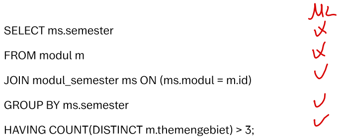
<h5>Studentische Antwort:</h5>
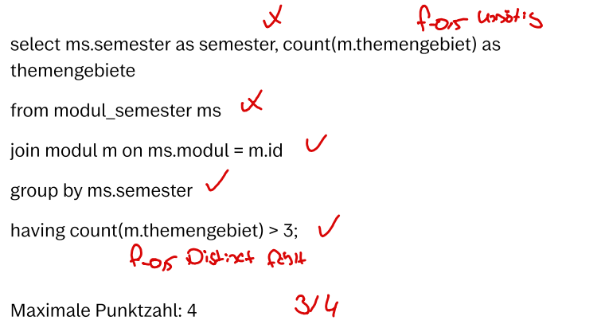
<h5>Bewertung:</h5>
Punkte = 3

<h4><b>Distanzbasierte Bewertung: 3,25/4</b></h4>
<h5>Musterlösung:</h5>
Difficulty: 16
<h5>Studentische Antwort:</h5>
<strong>Total Distance: 3</strong>

SELECT semester AS semester, COUNT(themengebiet) AS themengebiete FROM modul_semester INNER JOIN modul ON (modul = id) GROUP BY semester HAVING (COUNT(themengebiet) &gt; 3);

&gt;&gt;&gt; <strong>Cost 0</strong>: Swap elements in the from-clause.

SELECT semester AS semester, COUNT(themengebiet) AS themengebiete FROM modul INNER JOIN modul_semester ON (modul = id) GROUP BY semester HAVING (COUNT(themengebiet) &gt; 3);

&gt;&gt;&gt; <strong>Cost 0</strong>: Unset (redundant) explicit alias on a select-element.

SELECT semester, COUNT(themengebiet) AS themengebiete FROM modul INNER JOIN modul_semester ON (modul = id) GROUP BY semester HAVING (COUNT(themengebiet) &gt; 3);

&gt;&gt;&gt; <strong>Cost 2</strong>: Set (missing) distinct-declaration on an aggregation function in the having-clause.

SELECT semester, COUNT(themengebiet) AS themengebiete FROM modul INNER JOIN modul_semester ON (modul = id) GROUP BY semester HAVING (COUNT(DISTINCT themengebiet) &gt; 3);

&gt;&gt;&gt; <strong>Cost 1</strong>: Remove (excess) element in select-clause.

SELECT semester FROM modul INNER JOIN modul_semester ON (modul = id) GROUP BY semester HAVING (COUNT(DISTINCT themengebiet) &gt; 3);

<h5>Bewertung:</h5>
Punkte = (16 - 3) / 16 * 4 = 3,25

<h4><b>Ergebnisbasierte Bewertung: 0,5 / 4</b></h4>
<h5>Musterlösung:</h5>
<table>
    <thead>
        <tr>
            <th>Bepunktungsmetrik </th>
            <th>Erwarteter Wert </th>
            <th>Maximale Punkte </th>
        </tr>
    </thead>
    <tbody>
        <tr>
            <td>Anzahl der Tupel </td>
            <td>3 </td>
            <td>3 </td>
        </tr>
        <tr>
            <td>Namen der Attribute </td>
            <td>["semester"] </td>
            <td>1 </td>
        </tr>
    </tbody>
</table>

<h5>Studentische Antwort:</h5>
<table>
    <thead>
        <tr>
            <th>Bepunktungsmetrik </th>
            <th>Erwarteter Wert </th>
            <th>Punkte </th>
        </tr>
    </thead>
    <tbody>
        <tr>
            <td>Anzahl der Tupel </td>
            <td>5 </td>
            <td>0 </td>
        </tr>
        <tr>
            <td>Namen der Attribute </td>
            <td>["semester", "themengebiete"] </td>
            <td>0,5 </td>
        </tr>
    </tbody>
</table>

<h5>Bewertung:</h5>
Punkte = 0 + 0,5 = 0,5

<h4>Fairness:</h4> Geben Sie an, wie <b>fair</b> ​Sie die jeweilige Bewertung finden
  
<b>Achtung:</b> Die Bewertungen hier befinden sich möglicherweise in einer andereren Reihenfolge als weiter oben auf der Seite!
<b>Hinweis:</b> Es ist möglich, mehrere Bewertungen gleich einzustufen.
  
<table>
<thead>
  <tr>
    <th></th>
    <th>Fair</th>
    <th>Mittel</th>
    <th>Unfair</th>
  </tr>
</thead>
<tbody>
  <tr>
    <td>Ergebnisbasierte Bewertung</td>
    <td>o</td>
    <td>o</td>
    <td>o</td>
  </tr>
  <tr>
    <td>Distanzbasierte Bewertung</td>
    <td>o</td>
    <td>o</td>
    <td>o</td>
  </tr>
  <tr>
    <td>Manuelle Bewertung</td>
    <td>o</td>
    <td>o</td>
    <td>o</td>
  </tr>
</tbody>
</table>

<h4>Nachvollziehbarkeit:</h4> Geben Sie an, wie <b>nachvollziehbar</b> ​Sie die jeweilige Bewertung finden
  
<b>Achtung:</b> Die Bewertungen hier befinden sich möglicherweise in einer andereren Reihenfolge als weiter oben auf der Seite!
<b>Hinweis:</b> Es ist möglich, mehrere Bewertungen gleich einzustufen.
  
<table>
<thead>
  <tr>
    <th></th>
    <th>Gut nachvoll- ziehbar</th>
    <th>Mittel</th>
    <th>Schlecht nachvoll- ziehbar</th>
  </tr>
</thead>
<tbody>
  <tr>
    <td>Ergebnisbasierte Bewertung</td>
    <td>o</td>
    <td>o</td>
    <td>o</td>
  </tr>
  <tr>
    <td>Distanzbasierte Bewertung</td>
    <td>o</td>
    <td>o</td>
    <td>o</td>
  </tr>
  <tr>
    <td>Manuelle Bewertung</td>
    <td>o</td>
    <td>o</td>
    <td>o</td>
  </tr>
</tbody>
</table>
    </td>
    <td width="50%">
<h3>Scenario 2-2</h3>
<h4>Task 2</h4>
This database is modeled after the standard curriculum of the Bachelor's program in Computer Science. It reflects the status as of the winter semester 2019/20 and comprises four relations:
  
<ol><li>themengebiet ( _id_, bezeichnung )</li>
<li>modul ( _id_, bezeichnung, gop, themengebiet [themengebiet] )</li>
<li>semester ( _nummer_ )</li>
<li>modul_semester ( _modul [modul], semester [semester]_, ects )</li></ol>

Indicate the number of those semesters as semester in which more than three different subject areas are covered.

The maximum score is 4.
<h4>Sample Solution</h4>
<code>SELECT ms.semester
FROM modul m
JOIN modul_semester ms ON (ms.modul = m.id)
GROUP BY ms.semester
HAVING COUNT(DISTINCT m.themengebiet) > 3;</code>

<h4>Student Response 2</h4>
<code>select ms.semester as semester, 
count(m.themengebiet) as themengebiete 
from modul_semester ms 
join modul m on ms.modul = m.id 
group by ms.semester 
having count(m.themengebiet) > 3;</code>

<h4><b>Manual Grading: 3 / 4</b></h4>
<h5>Sample Solution:</h5>

<h5>Student Reponse:</h5>

<h5>Grading:</h5>
Points = 3

<h4><b>Distance-Based Grading: 3,25 / 4</b></h4>
<h5>Sample Solution:</h5>
Difficulty: 16
<h5>Student Reponse:</h5>
<strong>Total Distance: 3</strong>

SELECT semester AS semester, COUNT(themengebiet) AS themengebiete FROM modul_semester INNER JOIN modul ON (modul = id) GROUP BY semester HAVING (COUNT(themengebiet) &gt; 3);

&gt;&gt;&gt; <strong>Cost 0</strong>: Swap elements in the from-clause.

SELECT semester AS semester, COUNT(themengebiet) AS themengebiete FROM modul INNER JOIN modul_semester ON (modul = id) GROUP BY semester HAVING (COUNT(themengebiet) &gt; 3);

&gt;&gt;&gt; <strong>Cost 0</strong>: Unset (redundant) explicit alias on a select-element.

SELECT semester, COUNT(themengebiet) AS themengebiete FROM modul INNER JOIN modul_semester ON (modul = id) GROUP BY semester HAVING (COUNT(themengebiet) &gt; 3);

&gt;&gt;&gt; <strong>Cost 2</strong>: Set (missing) distinct-declaration on an aggregation function in the having-clause.

SELECT semester, COUNT(themengebiet) AS themengebiete FROM modul INNER JOIN modul_semester ON (modul = id) GROUP BY semester HAVING (COUNT(DISTINCT themengebiet) &gt; 3);

&gt;&gt;&gt; <strong>Cost 1</strong>: Remove (excess) element in select-clause.

SELECT semester FROM modul INNER JOIN modul_semester ON (modul = id) GROUP BY semester HAVING (COUNT(DISTINCT themengebiet) &gt; 3);

<h5>Grading:</h5>
Points = (16 - 3) / 16 * 4 = 3,25

<h4><b>Result-Based Grading: 0,5 / 4</b></h4>
<h5>Sample Solution:</h5>
<table>
    <thead>
        <tr>
            <th>Scoring Metric</th>
            <th>Expected Value</th>
            <th>Maximum Points</th>
        </tr>
    </thead>
    <tbody>
        <tr>
            <td>Number of Tuples</td>
            <td>3</td>
            <td>3</td>
        </tr>
        <tr>
            <td>Attribute Names</td>
            <td>["semester"] </td>
            <td>1 </td>
        </tr>
    </tbody>
</table>
<h5>Student Reponse:</h5>
<table>
    <thead>
        <tr>
            <th>Scoring Metric</th>
            <th>Expected Value</th>
            <th>Points</th>
        </tr>
    </thead>
    <tbody>
        <tr>
            <td>Number of Tuples</td>
            <td>5</td>
            <td>0</td>
        </tr>
        <tr>
            <td>Attribute Names</td>
            <td>["semester","themengebiete"] </td>
            <td>0,5 </td>
        </tr>
    </tbody>
</table>
<h5>Grading:</h5>
Points = 0 + 0,5 = 0,5

<h4>Fairness:</h4> Indicate how <b>fair</b> you find each grading.
  
<b>Attention:</b> The gradings here may be in a different order than those found earlier on the page. 
<b>Note:</b> It is possible to rate multiple gradings as being equally fair.
  
<table>
<thead>
  <tr>
    <th></th>
    <th>Fair</th>
    <th>Moderate</th>
    <th>Unfair</th>
  </tr>
</thead>
<tbody>
  <tr>
    <td>Result-Based Grading</td>
    <td>o</td>
    <td>o</td>
    <td>o</td>
  </tr>
  <tr>
    <td>Distance-Based Grading</td>
    <td>o</td>
    <td>o</td>
    <td>o</td>
  </tr>
  <tr>
    <td>Manual Grading</td>
    <td>o</td>
    <td>o</td>
    <td>o</td>
  </tr>
</tbody>
</table>

<h4>Comprehensibility:</h4> Indicate how <b>comprehensible</b> you find each grading.
  
<b>Attention:</b> The gradings here may be in a different order than those found earlier on the page. 
<b>Note:</b> It is possible to rate multiple gradings as being equally comprehensible.
  
<table>
<thead>
  <tr>
    <th></th>
    <th>Easy to comprehend</th>
    <th>Moderate</th>
    <th>Difficult to comprehend</th>
  </tr>
</thead>
<tbody>
  <tr>
    <td>Result-Based Grading</td>
    <td>o</td>
    <td>o</td>
    <td>o</td>
  </tr>
  <tr>
    <td>Distance-Based Grading</td>
    <td>o</td>
    <td>o</td>
    <td>o</td>
  </tr>
  <tr>
    <td>Manual Grading</td>
    <td>o</td>
    <td>o</td>
    <td>o</td>
  </tr>
</tbody>
</table>
    </td>
  </tr>
</table>

### Results

The survey results for this scenario are as follows:

| ID | DATE     | Fairness Result-Based | Fairness Distance-Based | Fairness Manual | Comprehensibility Result-Based | Comprehensibility Distance-Based | Comprehensibility Manual |
| -- | -------- | --------------- | --------------------- | --------------------- | ---------------------- | --------------------- | --------------------- |
| 1   | 12.07.23 | \-2                    | \-2                   | \-2                   | \-2                    | \-2                   | \-2                   |
| 2   | 13.07.23 | \-2                    | \-2                   | \-2                   | \-2                    | \-2                   | \-2                   |
| 3   | 17.07.23 | \-2                    | \-2                   | \-2                   | \-2                    | \-2                   | \-2                   |
| 4   | 21.07.23 | \-2                    | \-2                   | \-2                   | \-2                    | \-2                   | \-2                   |
| 5   | 24.07.23 | \-2                    | \-2                   | \-2                   | \-2                    | \-2                   | \-2                   |
| 6   | 24.07.23 | \-2                    | \-2                   | \-2                   | \-2                    | \-2                   | \-2                   |
| 7   | 26.07.23 | \-2                    | \-2                   | \-2                   | \-2                    | \-2                   | \-2                   |
| 8   | 02.08.23 | \-2                    | \-2                   | \-2                   | \-2                    | \-2                   | \-2                   |
| 9   | 02.08.23 | \-2                    | \-2                   | \-2                   | \-2                    | \-2                   | \-2                   |
| 10  | 04.08.23 | 3                      | 1                     | 1                     | 1                      | 2                     | 3                     |
| 11  | 04.08.23 | \-2                    | \-2                   | \-2                   | \-2                    | \-2                   | \-2                   |
| 12  | 07.08.23 | \-2                    | \-2                   | \-2                   | \-2                    | \-2                   | \-2                   |
| 13  | 07.08.23 | \-2                    | \-2                   | \-2                   | \-2                    | \-2                   | \-2                   |
| 14  | 07.08.23 | 3                      | 1                     | 1                     | 1                      | 1                     | 1                     |
| 15  | 07.08.23 | 3                      | 1                     | 1                     | 1                      | 1                     | 1                     |
| 16  | 07.08.23 | \-2                    | \-2                   | \-2                   | \-2                    | \-2                   | \-2                   |
| 17  | 07.08.23 | \-2                    | \-2                   | \-2                   | \-2                    | \-2                   | \-2                   |
| 18  | 07.08.23 | 3                      | 1                     | 1                     | 2                      | 2                     | 2                     |
| 19  | 08.08.23 | 3                      | 2                     | 1                     | 1                      | 1                     | 1                     |
| 20  | 08.08.23 | 3                      | 2                     | 2                     | 2                      | 1                     | 1                     |
| 21  | 08.08.23 | 3                      | 1                     | 1                     | 3                      | 1                     | 1                     |
| 22  | 09.08.23 | 3                      | 2                     | 1                     | 3                      | 2                     | 1                     |
| 23  | 18.08.23 | 3                      | 1                     | 2                     | 3                      | 1                     | 1                     |
| 24  | 15.08.23 | \-2                    | \-2                   | \-2                   | \-2                    | \-2                   | \-2                   |
| 25  | 17.08.23 | 3                      | 1                     | 2                     | 3                      | 1                     | 1                     |
| 26  | 18.08.23 | \-2                    | \-2                   | \-2                   | \-2                    | \-2                   | \-2                   |
| 27  | 23.08.23 | 3                      | 1                     | 1                     | 3                      | 1                     | 1                     |
| 28  | 28.08.23 | 3                      | 1                     | 1                     | 1                      | 1                     | 2                     |
| 29  | 29.08.23 | \-2                    | \-2                   | \-2                   | \-2                    | \-2                   | \-2                   |
| 30  | 29.08.23 | 3                      | 1                     | 1                     | 1                      | 1                     | 1                     |
| 31  | 31.08.23 | \-2                    | \-2                   | \-2                   | \-2                    | \-2                   | \-2                   |
| 32  | 01.09.23 | 3                      | 1                     | 1                     | 3                      | 1                     | 1                     |
| 33  | 01.09.23 | 3                      | 1                     | 1                     | 3                      | 2                     | 1                     |
| 34  | 01.09.23 | \-2                    | \-2                   | \-2                   | \-2                    | \-2                   | \-2                   |
| 35  | 04.09.23 | \-2                    | \-2                   | \-2                   | \-2                    | \-2                   | \-2                   |

#### Legend:
- "1" represents the selection of the best option
- "2" indicates the selection of the moderate option
- "3" signifies the selection of the worst option
- "-1"/"-2" stand for "no response" or "not seen"

## Page 8 

<table>
  <tr>
    <th width="50%">German (original)</th>
    <th width="50%">English (translated)</th>
  </tr>
  <tr>
    <td width="50%">
<h3>Szenario 2-3</h3>
<h4>Aufgabenstellung 2</h4>
Diese Datenbank ist an den Musterstudienplan im Informatik Bachelorstudiengang angelehnt. Sie ist auf dem Stand von Wintersemester 2019/20 und besteht aus vier Relationen:
  
<ol><li>themengebiet ( _id_, bezeichnung )</li>
<li>modul ( _id_, bezeichnung, gop, themengebiet [themengebiet] )</li>
<li>semester ( _nummer_ )</li>
<li>modul_semester ( _modul [modul], semester [semester]_, ects )</li></ol>

Geben Sie die Nummer derjenigen Semester als semester an, in denen mehr als 3 verschiedene Themengebiete behandelt werden.

Die Maximale Punktzahl beträgt 4.

<h4>Musterlösung</h4>
<code>SELECT ms.semester
FROM modul m
JOIN modul_semester ms ON (ms.modul = m.id)
GROUP BY ms.semester
HAVING COUNT(DISTINCT m.themengebiet) > 3;</code>

<h4>Studentische Antwort 3</h4>
<code>select ms.semester AS semester 
from modul_semester ms 
join modul m on ms.modul = m.id 
group by ms.semester 
having COUNT(distinct m.themengebiet) >= 3;</code>

<h4><b>Manuelle Bewertung: 3,5 / 4</b></h4>
<h5>Musterlösung:</h5>

<h5>Studentische Antwort:</h5>
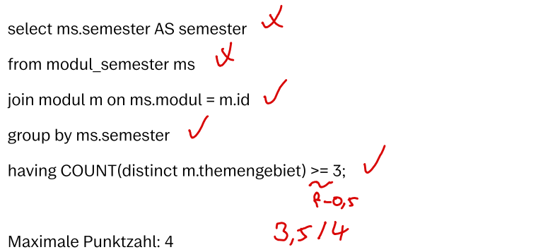
<h5>Bewertung:</h5>
Punkte = 3,5

<h4><b>Distanzbasierte Bewertung: 3,75/4</b></h4>
<h5>Musterlösung:</h5>
Difficulty: 16
<h5>Studentische Antwort:</h5>
<strong>Total Distance: 1</strong>

SELECT semester AS semester FROM modul_semester INNER JOIN modul ON (modul = id) GROUP BY semester HAVING (COUNT(DISTINCT themengebiet) &gt;= 3);

&gt;&gt;&gt; <strong>Cost 0</strong>: Swap elements in the from-clause.

SELECT semester AS semester FROM modul INNER JOIN modul_semester ON (modul = id) GROUP BY semester HAVING (COUNT(DISTINCT themengebiet) &gt;= 3);

&gt;&gt;&gt; <strong>Cost 0</strong>: Unset (redundant) explicit alias on a select-element.

SELECT semester FROM modul INNER JOIN modul_semester ON (modul = id) GROUP BY semester HAVING (COUNT(DISTINCT themengebiet) &gt;= 3);

&gt;&gt;&gt; <strong>Cost 1</strong>: Change (incorrect) binary-expression operator in the having-clause.

SELECT semester FROM modul INNER JOIN modul_semester ON (modul = id) GROUP BY semester HAVING (COUNT(DISTINCT themengebiet) &gt; 3);

<h5>Bewertung:</h5>
Punkte = (16 - 1) / 16 * 4 = 3,75

<h4><b>Ergebnisbasierte Bewertung: 1 / 4</b></h4>
<h5>Musterlösung:</h5>
<table>
    <thead>
        <tr>
            <th>Bepunktungsmetrik </th>
            <th>Erwarteter Wert </th>
            <th>Maximale Punkte </th>
        </tr>
    </thead>
    <tbody>
        <tr>
            <td>Anzahl der Tupel </td>
            <td>3 </td>
            <td>3 </td>
        </tr>
        <tr>
            <td>Namen der Attribute </td>
            <td>["semester"] </td>
            <td>1 </td>
        </tr>
    </tbody>
</table>

<h5>Studentische Antwort:</h5>
<table>
    <thead>
        <tr>
            <th>Bepunktungsmetrik </th>
            <th>Erwarteter Wert </th>
            <th>Punkte </th>
        </tr>
    </thead>
    <tbody>
        <tr>
            <td>Anzahl der Tupel </td>
            <td>5 </td>
            <td>0 </td>
        </tr>
        <tr>
            <td>Namen der Attribute </td>
            <td>["semester"] </td>
            <td>1 </td>
        </tr>
    </tbody>
</table>

<h5>Bewertung:</h5>
Punkte = 0 + 1 = 1

<h4>Fairness:</h4> Geben Sie an, wie <b>fair</b> ​Sie die jeweilige Bewertung finden
  
<b>Achtung:</b> Die Bewertungen hier befinden sich möglicherweise in einer andereren Reihenfolge als weiter oben auf der Seite!
<b>Hinweis:</b> Es ist möglich, mehrere Bewertungen gleich einzustufen.
  
<table>
<thead>
  <tr>
    <th></th>
    <th>Fair</th>
    <th>Mittel</th>
    <th>Unfair</th>
  </tr>
</thead>
<tbody>
  <tr>
    <td>Ergebnisbasierte Bewertung</td>
    <td>o</td>
    <td>o</td>
    <td>o</td>
  </tr>
  <tr>
    <td>Distanzbasierte Bewertung</td>
    <td>o</td>
    <td>o</td>
    <td>o</td>
  </tr>
  <tr>
    <td>Manuelle Bewertung</td>
    <td>o</td>
    <td>o</td>
    <td>o</td>
  </tr>
</tbody>
</table>

<h4>Nachvollziehbarkeit:</h4> Geben Sie an, wie <b>nachvollziehbar</b> ​Sie die jeweilige Bewertung finden
  
<b>Achtung:</b> Die Bewertungen hier befinden sich möglicherweise in einer andereren Reihenfolge als weiter oben auf der Seite!
<b>Hinweis:</b> Es ist möglich, mehrere Bewertungen gleich einzustufen.
  
<table>
<thead>
  <tr>
    <th></th>
    <th>Gut nachvoll- ziehbar</th>
    <th>Mittel</th>
    <th>Schlecht nachvoll- ziehbar</th>
  </tr>
</thead>
<tbody>
  <tr>
    <td>Ergebnisbasierte Bewertung</td>
    <td>o</td>
    <td>o</td>
    <td>o</td>
  </tr>
  <tr>
    <td>Distanzbasierte Bewertung</td>
    <td>o</td>
    <td>o</td>
    <td>o</td>
  </tr>
  <tr>
    <td>Manuelle Bewertung</td>
    <td>o</td>
    <td>o</td>
    <td>o</td>
  </tr>
</tbody>
</table>
    </td>
    <td width="50%">
<h3>Scenario 2-3</h3>
<h4>Task 2</h4>
This database is modeled after the standard curriculum of the Bachelor's program in Computer Science. It reflects the status as of the winter semester 2019/20 and comprises four relations:
  
<ol><li>themengebiet ( _id_, bezeichnung )</li>
<li>modul ( _id_, bezeichnung, gop, themengebiet [themengebiet] )</li>
<li>semester ( _nummer_ )</li>
<li>modul_semester ( _modul [modul], semester [semester]_, ects )</li></ol>

Indicate the number of those semesters as semester in which more than three different subject areas are covered.

The maximum score is 4.
<h4>Sample Solution</h4>
<code>SELECT ms.semester
FROM modul m
JOIN modul_semester ms ON (ms.modul = m.id)
GROUP BY ms.semester
HAVING COUNT(DISTINCT m.themengebiet) > 3;</code>

<h4>Student Response 3</h4>
<code>select ms.semester AS semester 
from modul_semester ms 
join modul m on ms.modul = m.id 
group by ms.semester 
having COUNT(distinct m.themengebiet) >= 3;</code>

<h4><b>Manual Grading: 3,5 / 4</b></h4>
<h5>Sample Solution:</h5>

<h5>Student Reponse:</h5>

<h5>Grading:</h5>
Points = 3,5

<h4><b>Distance-Based Grading: 3,75 / 4</b></h4>
<h5>Sample Solution:</h5>
Difficulty: 16
<h5>Student Reponse:</h5>
<strong>Total Distance: 1</strong>

SELECT semester AS semester FROM modul_semester INNER JOIN modul ON (modul = id) GROUP BY semester HAVING (COUNT(DISTINCT themengebiet) &gt;= 3);

&gt;&gt;&gt; <strong>Cost 0</strong>: Swap elements in the from-clause.

SELECT semester AS semester FROM modul INNER JOIN modul_semester ON (modul = id) GROUP BY semester HAVING (COUNT(DISTINCT themengebiet) &gt;= 3);

&gt;&gt;&gt; <strong>Cost 0</strong>: Unset (redundant) explicit alias on a select-element.

SELECT semester FROM modul INNER JOIN modul_semester ON (modul = id) GROUP BY semester HAVING (COUNT(DISTINCT themengebiet) &gt;= 3);

&gt;&gt;&gt; <strong>Cost 1</strong>: Change (incorrect) binary-expression operator in the having-clause.

SELECT semester FROM modul INNER JOIN modul_semester ON (modul = id) GROUP BY semester HAVING (COUNT(DISTINCT themengebiet) &gt; 3);

<h5>Grading:</h5>
Points = (16 - 1) / 16 * 4 = 3,75

<h4><b>Result-Based Grading: 1 / 4</b></h4>
<h5>Sample Solution:</h5>
<table>
    <thead>
        <tr>
            <th>Scoring Metric</th>
            <th>Expected Value</th>
            <th>Maximum Points</th>
        </tr>
    </thead>
    <tbody>
        <tr>
            <td>Number of Tuples</td>
            <td>3</td>
            <td>3</td>
        </tr>
        <tr>
            <td>Attribute Names</td>
            <td>["semester"] </td>
            <td>1 </td>
        </tr>
    </tbody>
</table>
<h5>Student Reponse:</h5>
<table>
    <thead>
        <tr>
            <th>Scoring Metric</th>
            <th>Expected Value</th>
            <th>Points</th>
        </tr>
    </thead>
    <tbody>
        <tr>
            <td>Number of Tuples</td>
            <td>5</td>
            <td>0</td>
        </tr>
        <tr>
            <td>Attribute Names</td>
            <td>["semester"] </td>
            <td>1 </td>
        </tr>
    </tbody>
</table>
<h5>Grading:</h5>
Points = 0 + 1 = 1

<h4>Fairness:</h4> Indicate how <b>fair</b> you find each grading.
  
<b>Attention:</b> The gradings here may be in a different order than those found earlier on the page. 
<b>Note:</b> It is possible to rate multiple gradings as being equally fair.
  
<table>
<thead>
  <tr>
    <th></th>
    <th>Fair</th>
    <th>Moderate</th>
    <th>Unfair</th>
  </tr>
</thead>
<tbody>
  <tr>
    <td>Result-Based Grading</td>
    <td>o</td>
    <td>o</td>
    <td>o</td>
  </tr>
  <tr>
    <td>Distance-Based Grading</td>
    <td>o</td>
    <td>o</td>
    <td>o</td>
  </tr>
  <tr>
    <td>Manual Grading</td>
    <td>o</td>
    <td>o</td>
    <td>o</td>
  </tr>
</tbody>
</table>

<h4>Comprehensibility:</h4> Indicate how <b>comprehensible</b> you find each grading.
  
<b>Attention:</b> The gradings here may be in a different order than those found earlier on the page. 
<b>Note:</b> It is possible to rate multiple gradings as being equally comprehensible.
  
<table>
<thead>
  <tr>
    <th></th>
    <th>Easy to comprehend</th>
    <th>Moderate</th>
    <th>Difficult to comprehend</th>
  </tr>
</thead>
<tbody>
  <tr>
    <td>Result-Based Grading</td>
    <td>o</td>
    <td>o</td>
    <td>o</td>
  </tr>
  <tr>
    <td>Distance-Based Grading</td>
    <td>o</td>
    <td>o</td>
    <td>o</td>
  </tr>
  <tr>
    <td>Manual Grading</td>
    <td>o</td>
    <td>o</td>
    <td>o</td>
  </tr>
</tbody>
</table>
    </td>
  </tr>
</table>

### Results

The survey results for this scenario are as follows:

| ID | DATE     | Fairness Result-Based | Fairness Distance-Based | Fairness Manual | Comprehensibility Result-Based | Comprehensibility Distance-Based | Comprehensibility Manual |
| -- | -------- | --------------- | --------------------- | --------------------- | ---------------------- | --------------------- | --------------------- |
| 1   | 12.07.23 | \-2                    | \-2                   | \-2                   | \-2                    | \-2                   | \-2                   |
| 2   | 13.07.23 | \-2                    | \-2                   | \-2                   | \-2                    | \-2                   | \-2                   |
| 3   | 17.07.23 | \-2                    | \-2                   | \-2                   | \-2                    | \-2                   | \-2                   |
| 4   | 21.07.23 | \-2                    | \-2                   | \-2                   | \-2                    | \-2                   | \-2                   |
| 5   | 24.07.23 | \-2                    | \-2                   | \-2                   | \-2                    | \-2                   | \-2                   |
| 6   | 24.07.23 | \-2                    | \-2                   | \-2                   | \-2                    | \-2                   | \-2                   |
| 7   | 26.07.23 | \-2                    | \-2                   | \-2                   | \-2                    | \-2                   | \-2                   |
| 8   | 02.08.23 | \-2                    | \-2                   | \-2                   | \-2                    | \-2                   | \-2                   |
| 9   | 02.08.23 | \-2                    | \-2                   | \-2                   | \-2                    | \-2                   | \-2                   |
| 10  | 04.08.23 | 3                      | 1                     | 1                     | 3                      | 1                     | 1                     |
| 11  | 04.08.23 | \-2                    | \-2                   | \-2                   | \-2                    | \-2                   | \-2                   |
| 12  | 07.08.23 | \-2                    | \-2                   | \-2                   | \-2                    | \-2                   | \-2                   |
| 13  | 07.08.23 | \-2                    | \-2                   | \-2                   | \-2                    | \-2                   | \-2                   |
| 14  | 07.08.23 | 3                      | 2                     | 1                     | 1                      | 1                     | 2                     |
| 15  | 07.08.23 | 3                      | 1                     | 1                     | 1                      | 1                     | 1                     |
| 16  | 07.08.23 | \-2                    | \-2                   | \-2                   | \-2                    | \-2                   | \-2                   |
| 17  | 07.08.23 | \-2                    | \-2                   | \-2                   | \-2                    | \-2                   | \-2                   |
| 18  | 07.08.23 | 3                      | 1                     | 1                     | 2                      | 3                     | 1                     |
| 19  | 08.08.23 | 3                      | 1                     | 1                     | 1                      | 1                     | 1                     |
| 20  | 08.08.23 | 3                      | 1                     | 1                     | 1                      | 1                     | 1                     |
| 21  | 08.08.23 | 3                      | 1                     | 1                     | 3                      | 1                     | 1                     |
| 22  | 09.08.23 | 3                      | 1                     | 1                     | 3                      | 1                     | 2                     |
| 23  | 18.08.23 | 3                      | 1                     | 2                     | 3                      | 1                     | 1                     |
| 24  | 15.08.23 | \-2                    | \-2                   | \-2                   | \-2                    | \-2                   | \-2                   |
| 25  | 17.08.23 | 3                      | 1                     | 1                     | 3                      | 1                     | 1                     |
| 26  | 18.08.23 | \-2                    | \-2                   | \-2                   | \-2                    | \-2                   | \-2                   |
| 27  | 23.08.23 | 3                      | 1                     | 1                     | 3                      | 1                     | 1                     |
| 28  | 28.08.23 | 3                      | 1                     | 1                     | 1                      | 1                     | 1                     |
| 29  | 29.08.23 | \-2                    | \-2                   | \-2                   | \-2                    | \-2                   | \-2                   |
| 30  | 29.08.23 | 3                      | 1                     | 1                     | 1                      | 1                     | 1                     |
| 31  | 31.08.23 | \-2                    | \-2                   | \-2                   | \-2                    | \-2                   | \-2                   |
| 32  | 01.09.23 | 3                      | 1                     | 1                     | 3                      | 1                     | 1                     |
| 33  | 01.09.23 | 3                      | 1                     | 1                     | 3                      | 3                     | 1                     |
| 34  | 01.09.23 | \-2                    | \-2                   | \-2                   | \-2                    | \-2                   | \-2                   |
| 35  | 04.09.23 | \-2                    | \-2                   | \-2                   | \-2                    | \-2                   | \-2                   |

#### Legend:
- "1" represents the selection of the best option
- "2" indicates the selection of the moderate option
- "3" signifies the selection of the worst option
- "-1"/"-2" stand for "no response" or "not seen"

## Page 9 

<table>
  <tr>
    <th width="50%">German (original)</th>
    <th width="50%">English (translated)</th>
  </tr>
  <tr>
    <td width="50%">
<h3>Szenario 3-1</h3>
<h4>Aufgabenstellung 3</h4>
Diese Datenbank ist an den Musterstudienplan im Informatik Bachelorstudiengang angelehnt. Sie ist auf dem Stand von Wintersemester 2019/20 und besteht aus vier Relationen:
  
<ol><li>themengebiet ( _id_, bezeichnung )</li>
<li>modul ( _id_, bezeichnung, gop, themengebiet [themengebiet] )</li>
<li>semester ( _nummer_ )</li>
<li>modul_semester ( _modul [modul], semester [semester]_, ects )</li></ol>

Geben Sie für jedes Modul dessen Bezeichnung an, und wie viele ECTS man in diesem insgesamt sammelt. Die zweite Information soll ects heißen.

Die Maximale Punktzahl beträgt 4.

<h4>Musterlösung</h4>
<code>SELECT m.bezeichnung, SUM(ms.ects) AS ects
FROM modul m
JOIN modul_semester ms ON (ms.modul = m.id)
GROUP BY m.id, m.bezeichnung;</code>

<h4>Studentische Antwort 1</h4>
<code>select bezeichnung, count (ects) as ects 
from modul m 
join modul_semester ms on m.id = ms.modul 
group by id;</code>

<h4><b>Manuelle Bewertung: 3 / 4</b></h4>
<h5>Musterlösung:</h5>
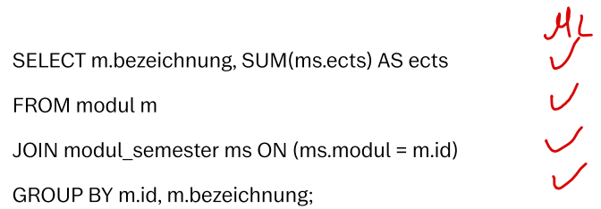
<h5>Studentische Antwort:</h5>
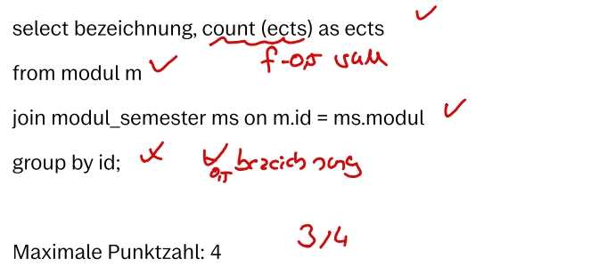
<h5>Bewertung:</h5>
Punkte = 3

<h4><b>Distanzbasierte Bewertung: 3,3/4</b></h4>
<h5>Musterlösung:</h5>
Difficulty: 17
<h5>Studentische Antwort:</h5>
<strong>Total Distance: 3</strong>

SELECT bezeichnung, COUNT(ects) AS ects FROM modul INNER JOIN modul_semester ON (id = modul) GROUP BY id;

&gt;&gt;&gt; <strong>Cost 0</strong>: Swap arguments of commutative binary-expression in a from-element join-condition.

SELECT bezeichnung, COUNT(ects) AS ects FROM modul INNER JOIN modul_semester ON (modul = id) GROUP BY id;

&gt;&gt;&gt; <strong>Cost 1</strong>: Change (incorrect) aggregation-function aggregation in a select-element expression.

SELECT bezeichnung, SUM(ects) AS ects FROM modul INNER JOIN modul_semester ON (modul = id) GROUP BY id;

&gt;&gt;&gt; <strong>Cost 1</strong>: Add (missing) element in group-by-clause.

SELECT bezeichnung, SUM(ects) AS ects FROM modul INNER JOIN modul_semester ON (modul = id) GROUP BY id, &nbsp; &nbsp;;

&gt;&gt;&gt; <strong>Cost 1</strong>: Add (missing) column reference to a group-by expression.

SELECT bezeichnung, SUM(ects) AS ects FROM modul INNER JOIN modul_semester ON (modul = id) GROUP BY id, bezeichnung;

<h5>Bewertung:</h5>
Punkte = (17 - 3) / 17 * 4 = 3,2941176471

<h4><b>Ergebnisbasierte Bewertung: 4 / 4</b></h4>
<h5>Musterlösung:</h5>
<table>
    <thead>
        <tr>
            <th>Bepunktungsmetrik </th>
            <th>Erwarteter Wert </th>
            <th>Maximale Punkte </th>
        </tr>
    </thead>
    <tbody>
        <tr>
            <td>Anzahl der Tupel </td>
            <td>23</td>
            <td>2</td>
        </tr>
        <tr>
            <td>Namen der Attribute </td>
            <td>["bezeichnung", "ects"] </td>
            <td>1 </td>
        </tr>
        <tr>
            <td>Funktionale Abhängigkeiten </td>
            <td>["{\"determinateAtt.\": [\"bezeichnung\"], \"dependentAtt.\": [\"ects\"]}"]</td>
            <td>1 </td>
        </tr>
    </tbody>
</table>

<h5>Studentische Antwort:</h5>
<table>
    <thead>
        <tr>
            <th>Bepunktungsmetrik </th>
            <th>Erwarteter Wert </th>
            <th>Punkte </th>
        </tr>
    </thead>
    <tbody>
        <tr>
            <td>Anzahl der Tupel </td>
            <td>23</td>
            <td>2</td>
        </tr>
        <tr>
            <td>Namen der Attribute </td>
            <td>["bezeichnung", "ects"] </td>
            <td>1 </td>
        </tr>
        <tr>
            <td>Funktionale Abhängigkeiten </td>
            <td>["{\"determinateAtt.\": [\"bezeichnung\"], \"dependentAtt.\": [\"ects\"]}"]</td>
            <td>1 </td>
        </tr>
    </tbody>
</table>

<h5>Bewertung:</h5>
Punkte = 2 + 1 + 1 = 4

<h4>Fairness:</h4> Geben Sie an, wie <b>fair</b> ​Sie die jeweilige Bewertung finden
  
<b>Achtung:</b> Die Bewertungen hier befinden sich möglicherweise in einer andereren Reihenfolge als weiter oben auf der Seite!
<b>Hinweis:</b> Es ist möglich, mehrere Bewertungen gleich einzustufen.
  
<table>
<thead>
  <tr>
    <th></th>
    <th>Fair</th>
    <th>Mittel</th>
    <th>Unfair</th>
  </tr>
</thead>
<tbody>
  <tr>
    <td>Ergebnisbasierte Bewertung</td>
    <td>o</td>
    <td>o</td>
    <td>o</td>
  </tr>
  <tr>
    <td>Distanzbasierte Bewertung</td>
    <td>o</td>
    <td>o</td>
    <td>o</td>
  </tr>
  <tr>
    <td>Manuelle Bewertung</td>
    <td>o</td>
    <td>o</td>
    <td>o</td>
  </tr>
</tbody>
</table>

<h4>Nachvollziehbarkeit:</h4> Geben Sie an, wie <b>nachvollziehbar</b> ​Sie die jeweilige Bewertung finden
  
<b>Achtung:</b> Die Bewertungen hier befinden sich möglicherweise in einer andereren Reihenfolge als weiter oben auf der Seite!
<b>Hinweis:</b> Es ist möglich, mehrere Bewertungen gleich einzustufen.
  
<table>
<thead>
  <tr>
    <th></th>
    <th>Gut nachvoll- ziehbar</th>
    <th>Mittel</th>
    <th>Schlecht nachvoll- ziehbar</th>
  </tr>
</thead>
<tbody>
  <tr>
    <td>Ergebnisbasierte Bewertung</td>
    <td>o</td>
    <td>o</td>
    <td>o</td>
  </tr>
  <tr>
    <td>Distanzbasierte Bewertung</td>
    <td>o</td>
    <td>o</td>
    <td>o</td>
  </tr>
  <tr>
    <td>Manuelle Bewertung</td>
    <td>o</td>
    <td>o</td>
    <td>o</td>
  </tr>
</tbody>
</table>
    </td>
    <td width="50%">
<h3>Scenario 3-1</h3>
<h4>Task 3</h4>
This database is modeled after the standard curriculum of the Bachelor's program in Computer Science. It reflects the status as of the winter semester 2019/20 and comprises four relations:
  
<ol><li>themengebiet ( _id_, bezeichnung )</li>
<li>modul ( _id_, bezeichnung, gop, themengebiet [themengebiet] )</li>
<li>semester ( _nummer_ )</li>
<li>modul_semester ( _modul [modul], semester [semester]_, ects )</li></ol>

For each module, specify its name and the total number of ECTS credits accumulated. The second piece of information should be named "ects".

The maximum score is 4.
<h4>Sample Solution</h4>
<code>SELECT m.bezeichnung, SUM(ms.ects) AS ects
FROM modul m
JOIN modul_semester ms ON (ms.modul = m.id)
GROUP BY m.id, m.bezeichnung;</code>

<h4>Student Response 1</h4>
<code>select bezeichnung, count (ects) as ects 
from modul m 
join modul_semester ms on m.id = ms.modul 
group by id;</code>

<h4><b>Manual Grading: 3 / 4</b></h4>
<h5>Sample Solution:</h5>

<h5>Student Reponse:</h5>

<h5>Grading:</h5>
Points = 3

<h4><b>Distance-Based Grading: 3,3 / 4</b></h4>
<h5>Sample Solution:</h5>
Difficulty: 17
<h5>Student Reponse:</h5>
<strong>Total Distance: 3</strong>

SELECT bezeichnung, COUNT(ects) AS ects FROM modul INNER JOIN modul_semester ON (id = modul) GROUP BY id;

&gt;&gt;&gt; <strong>Cost 0</strong>: Swap arguments of commutative binary-expression in a from-element join-condition.

SELECT bezeichnung, COUNT(ects) AS ects FROM modul INNER JOIN modul_semester ON (modul = id) GROUP BY id;

&gt;&gt;&gt; <strong>Cost 1</strong>: Change (incorrect) aggregation-function aggregation in a select-element expression.

SELECT bezeichnung, SUM(ects) AS ects FROM modul INNER JOIN modul_semester ON (modul = id) GROUP BY id;

&gt;&gt;&gt; <strong>Cost 1</strong>: Add (missing) element in group-by-clause.

SELECT bezeichnung, SUM(ects) AS ects FROM modul INNER JOIN modul_semester ON (modul = id) GROUP BY id, &nbsp; &nbsp;;

&gt;&gt;&gt; <strong>Cost 1</strong>: Add (missing) column reference to a group-by expression.

SELECT bezeichnung, SUM(ects) AS ects FROM modul INNER JOIN modul_semester ON (modul = id) GROUP BY id, bezeichnung;

<h5>Grading:</h5>
Points = (17 - 3) / 17 * 4 = 3,2941176471

<h4><b>Result-Based Grading: 4 / 4</b></h4>
<h5>Sample Solution:</h5>
<table>
    <thead>
        <tr>
            <th>Scoring Metric</th>
            <th>Expected Value</th>
            <th>Maximum Points</th>
        </tr>
    </thead>
    <tbody>
        <tr>
            <td>Number of Tuples</td>
            <td>23</td>
            <td>2</td>
        </tr>
        <tr>
            <td>Attribute Names</td>
            <td>["bezeichnung", "ects"] </td>
            <td>1 </td>
        </tr>
        <tr>
            <td>Functional Dependencies</td>
            <td>["{\"determinateAtt.\": [\"bezeichnung\"], \"dependentAtt.\": [\"ects\"]}"]</td>
            <td>1 </td>
        </tr>
    </tbody>
</table>
<h5>Student Reponse:</h5>
<table>
    <thead>
        <tr>
            <th>Scoring Metric</th>
            <th>Expected Value</th>
            <th>Points</th>
        </tr>
    </thead>
    <tbody>
        <tr>
            <td>Number of Tuples</td>
            <td>23</td>
            <td>2</td>
        </tr>
        <tr>
            <td>Attribute Names</td>
            <td>["bezeichnung", "ects"] </td>
            <td>1 </td>
        </tr>
        <tr>
            <td>Functional Dependencies</td>
            <td>["{\"determinateAtt.\": [\"bezeichnung\"], \"dependentAtt.\": [\"ects\"]}"]</td>
            <td>1 </td>
        </tr>
    </tbody>
</table>
<h5>Grading:</h5>
Points = 2 + 1 + 1 = 4

<h4>Fairness:</h4> Indicate how <b>fair</b> you find each grading.
  
<b>Attention:</b> The gradings here may be in a different order than those found earlier on the page. 
<b>Note:</b> It is possible to rate multiple gradings as being equally fair.
  
<table>
<thead>
  <tr>
    <th></th>
    <th>Fair</th>
    <th>Moderate</th>
    <th>Unfair</th>
  </tr>
</thead>
<tbody>
  <tr>
    <td>Result-Based Grading</td>
    <td>o</td>
    <td>o</td>
    <td>o</td>
  </tr>
  <tr>
    <td>Distance-Based Grading</td>
    <td>o</td>
    <td>o</td>
    <td>o</td>
  </tr>
  <tr>
    <td>Manual Grading</td>
    <td>o</td>
    <td>o</td>
    <td>o</td>
  </tr>
</tbody>
</table>

<h4>Comprehensibility:</h4> Indicate how <b>comprehensible</b> you find each grading.
  
<b>Attention:</b> The gradings here may be in a different order than those found earlier on the page. 
<b>Note:</b> It is possible to rate multiple gradings as being equally comprehensible.
  
<table>
<thead>
  <tr>
    <th></th>
    <th>Easy to comprehend</th>
    <th>Moderate</th>
    <th>Difficult to comprehend</th>
  </tr>
</thead>
<tbody>
  <tr>
    <td>Result-Based Grading</td>
    <td>o</td>
    <td>o</td>
    <td>o</td>
  </tr>
  <tr>
    <td>Distance-Based Grading</td>
    <td>o</td>
    <td>o</td>
    <td>o</td>
  </tr>
  <tr>
    <td>Manual Grading</td>
    <td>o</td>
    <td>o</td>
    <td>o</td>
  </tr>
</tbody>
</table>
    </td>
  </tr>
</table>

### Results

The survey results for this scenario are as follows:

| ID | DATE     | Fairness Result-Based | Fairness Distance-Based | Fairness Manual | Comprehensibility Result-Based | Comprehensibility Distance-Based | Comprehensibility Manual |
| -- | -------- | --------------- | --------------------- | --------------------- | ---------------------- | --------------------- | --------------------- |
| 1   | 12.07.23 | \-2                    | \-2                   | \-2                   | \-2                    | \-2                   | \-2                   |
| 2   | 13.07.23 | \-2                    | \-2                   | \-2                   | \-2                    | \-2                   | \-2                   |
| 3   | 17.07.23 | \-2                    | \-2                   | \-2                   | \-2                    | \-2                   | \-2                   |
| 4   | 21.07.23 | \-2                    | \-2                   | \-2                   | \-2                    | \-2                   | \-2                   |
| 5   | 24.07.23 | \-2                    | \-2                   | \-2                   | \-2                    | \-2                   | \-2                   |
| 6   | 24.07.23 | \-2                    | \-2                   | \-2                   | \-2                    | \-2                   | \-2                   |
| 7   | 26.07.23 | \-2                    | \-2                   | \-2                   | \-2                    | \-2                   | \-2                   |
| 8   | 02.08.23 | \-2                    | \-2                   | \-2                   | \-2                    | \-2                   | \-2                   |
| 9   | 02.08.23 | \-2                    | \-2                   | \-2                   | \-2                    | \-2                   | \-2                   |
| 10  | 04.08.23 | 3                      | 1                     | 2                     | 3                      | 2                     | 1                     |
| 11  | 04.08.23 | \-2                    | \-2                   | \-2                   | \-2                    | \-2                   | \-2                   |
| 12  | 07.08.23 | \-2                    | \-2                   | \-2                   | \-2                    | \-2                   | \-2                   |
| 13  | 07.08.23 | \-2                    | \-2                   | \-2                   | \-2                    | \-2                   | \-2                   |
| 14  | 07.08.23 | 3                      | 3                     | 2                     | 1                      | 1                     | 2                     |
| 15  | 07.08.23 | 3                      | 1                     | 2                     | 2                      | 1                     | 1                     |
| 16  | 07.08.23 | \-2                    | \-2                   | \-2                   | \-2                    | \-2                   | \-2                   |
| 17  | 07.08.23 | \-2                    | \-2                   | \-2                   | \-2                    | \-2                   | \-2                   |
| 18  | 07.08.23 | \-1                    | \-1                   | \-1                   | \-1                    | \-1                   | \-1                   |
| 19  | 08.08.23 | 3                      | 2                     | 1                     | 1                      | 1                     | 1                     |
| 20  | 08.08.23 | 3                      | 2                     | 2                     | 2                      | 1                     | 1                     |
| 21  | 08.08.23 | 3                      | 1                     | 1                     | 2                      | 1                     | 1                     |
| 22  | 09.08.23 | 3                      | 2                     | 1                     | 3                      | 1                     | 1                     |
| 23  | 18.08.23 | 2                      | 1                     | 1                     | 3                      | 2                     | 1                     |
| 24  | 15.08.23 | \-2                    | \-2                   | \-2                   | \-2                    | \-2                   | \-2                   |
| 25  | 17.08.23 | 3                      | 1                     | 1                     | 3                      | 2                     | 1                     |
| 26  | 18.08.23 | \-2                    | \-2                   | \-2                   | \-2                    | \-2                   | \-2                   |
| 27  | 23.08.23 | 2                      | 1                     | 1                     | 2                      | 1                     | 1                     |
| 28  | 28.08.23 | 2                      | 1                     | 1                     | 1                      | 1                     | 2                     |
| 29  | 29.08.23 | \-2                    | \-2                   | \-2                   | \-2                    | \-2                   | \-2                   |
| 30  | 29.08.23 | 2                      | 1                     | 1                     | 1                      | 1                     | 1                     |
| 31  | 31.08.23 | \-2                    | \-2                   | \-2                   | \-2                    | \-2                   | \-2                   |
| 32  | 01.09.23 | 3                      | 1                     | 1                     | 3                      | 1                     | 1                     |
| 33  | 01.09.23 | 3                      | 1                     | 1                     | 3                      | 2                     | 1                     |
| 34  | 01.09.23 | \-2                    | \-2                   | \-2                   | \-2                    | \-2                   | \-2                   |
| 35  | 04.09.23 | \-2                    | \-2                   | \-2                   | \-2                    | \-2                   | \-2                   |

#### Legend:
- "1" represents the selection of the best option
- "2" indicates the selection of the moderate option
- "3" signifies the selection of the worst option
- "-1"/"-2" stand for "no response" or "not seen"

## Page 10 

<table>
  <tr>
    <th width="50%">German (original)</th>
    <th width="50%">English (translated)</th>
  </tr>
  <tr>
    <td width="50%">
<h3>Szenario 3-2</h3>
<h4>Aufgabenstellung 3</h4>
Diese Datenbank ist an den Musterstudienplan im Informatik Bachelorstudiengang angelehnt. Sie ist auf dem Stand von Wintersemester 2019/20 und besteht aus vier Relationen:
  
<ol><li>themengebiet ( _id_, bezeichnung )</li>
<li>modul ( _id_, bezeichnung, gop, themengebiet [themengebiet] )</li>
<li>semester ( _nummer_ )</li>
<li>modul_semester ( _modul [modul], semester [semester]_, ects )</li></ol>

Geben Sie für jedes Modul dessen Bezeichnung an, und wie viele ECTS man in diesem insgesamt sammelt. Die zweite Information soll ects heißen.

Die Maximale Punktzahl beträgt 4.

<h4>Musterlösung</h4>
<code>SELECT m.bezeichnung, SUM(ms.ects) AS ects
FROM modul m
JOIN modul_semester ms ON (ms.modul = m.id)
GROUP BY m.id, m.bezeichnung;</code>

<h4>Studentische Antwort 2</h4>
<code>SELECT modul.bezeichnung, SUM(modul_semester.ects) AS ects 
FROM modul 
JOIN modul_semester ON modul.id = modul_semester.modul 
GROUP BY modul.bezeichnung;</code>

<h4><b>Manuelle Bewertung: 4 / 4</b></h4>
<h5>Musterlösung:</h5>

<h5>Studentische Antwort:</h5>
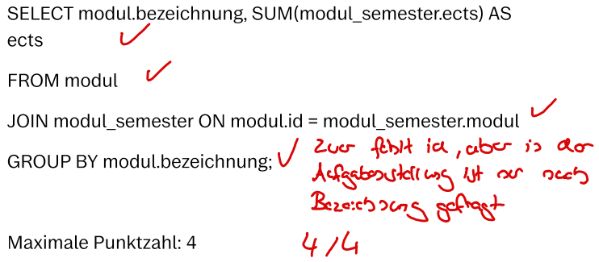
<h5>Bewertung:</h5>
Punkte = 4

<h4><b>Distanzbasierte Bewertung: 3,5 / 4</b></h4>
<h5>Musterlösung:</h5>
Difficulty: 17
<h5>Studentische Antwort:</h5>
<strong>Total Distance: 2</strong>

SELECT bezeichnung, SUM(ects) AS ects FROM modul INNER JOIN modul_semester ON (id = modul) GROUP BY bezeichnung;

&gt;&gt;&gt; <strong>Cost 0</strong>: Swap arguments of commutative binary-expression in a from-element join-condition.

SELECT bezeichnung, SUM(ects) AS ects FROM modul INNER JOIN modul_semester ON (modul = id) GROUP BY bezeichnung;

&gt;&gt;&gt; <strong>Cost 1</strong>: Add (missing) element in group-by-clause.

SELECT bezeichnung, SUM(ects) AS ects FROM modul INNER JOIN modul_semester ON (modul = id) GROUP BY &nbsp; &nbsp;, bezeichnung;

&gt;&gt;&gt; <strong>Cost 1</strong>: Add (missing) column reference to a group-by expression.

SELECT bezeichnung, SUM(ects) AS ects FROM modul INNER JOIN modul_semester ON (modul = id) GROUP BY id, bezeichnung;

<h5>Bewertung:</h5>
Punkte = (17 - 2) / 17 * 4 = 3,5294117647

<h4><b>Ergebnisbasierte Bewertung: 4 / 4</b></h4>
<h5>Musterlösung:</h5>
<table>
    <thead>
        <tr>
            <th>Bepunktungsmetrik </th>
            <th>Erwarteter Wert </th>
            <th>Maximale Punkte </th>
        </tr>
    </thead>
    <tbody>
        <tr>
            <td>Anzahl der Tupel </td>
            <td>23</td>
            <td>2</td>
        </tr>
        <tr>
            <td>Namen der Attribute </td>
            <td>["bezeichnung", "ects"] </td>
            <td>1 </td>
        </tr>
        <tr>
            <td>Funktionale Abhängigkeiten </td>
            <td>["{\"determinateAtt.\": [\"bezeichnung\"], \"dependentAtt.\": [\"ects\"]}"]</td>
            <td>1 </td>
        </tr>
    </tbody>
</table>

<h5>Studentische Antwort:</h5>
<table>
    <thead>
        <tr>
            <th>Bepunktungsmetrik </th>
            <th>Erwarteter Wert </th>
            <th>Punkte </th>
        </tr>
    </thead>
    <tbody>
        <tr>
            <td>Anzahl der Tupel </td>
            <td>23</td>
            <td>2</td>
        </tr>
        <tr>
            <td>Namen der Attribute </td>
            <td>["bezeichnung", "ects"] </td>
            <td>1 </td>
        </tr>
        <tr>
            <td>Funktionale Abhängigkeiten </td>
            <td>["{\"determinateAtt.\": [\"bezeichnung\"], \"dependentAtt.\": [\"ects\"]}"]</td>
            <td>1 </td>
        </tr>
    </tbody>
</table>

<h5>Bewertung:</h5>
Punkte = 2 + 1 + 1 = 4

<h4>Fairness:</h4> Geben Sie an, wie <b>fair</b> ​Sie die jeweilige Bewertung finden
  
<b>Achtung:</b> Die Bewertungen hier befinden sich möglicherweise in einer andereren Reihenfolge als weiter oben auf der Seite!
<b>Hinweis:</b> Es ist möglich, mehrere Bewertungen gleich einzustufen.
  
<table>
<thead>
  <tr>
    <th></th>
    <th>Fair</th>
    <th>Mittel</th>
    <th>Unfair</th>
  </tr>
</thead>
<tbody>
  <tr>
    <td>Ergebnisbasierte Bewertung</td>
    <td>o</td>
    <td>o</td>
    <td>o</td>
  </tr>
  <tr>
    <td>Distanzbasierte Bewertung</td>
    <td>o</td>
    <td>o</td>
    <td>o</td>
  </tr>
  <tr>
    <td>Manuelle Bewertung</td>
    <td>o</td>
    <td>o</td>
    <td>o</td>
  </tr>
</tbody>
</table>

<h4>Nachvollziehbarkeit:</h4> Geben Sie an, wie <b>nachvollziehbar</b> ​Sie die jeweilige Bewertung finden
  
<b>Achtung:</b> Die Bewertungen hier befinden sich möglicherweise in einer andereren Reihenfolge als weiter oben auf der Seite!
<b>Hinweis:</b> Es ist möglich, mehrere Bewertungen gleich einzustufen.
  
<table>
<thead>
  <tr>
    <th></th>
    <th>Gut nachvoll- ziehbar</th>
    <th>Mittel</th>
    <th>Schlecht nachvoll- ziehbar</th>
  </tr>
</thead>
<tbody>
  <tr>
    <td>Ergebnisbasierte Bewertung</td>
    <td>o</td>
    <td>o</td>
    <td>o</td>
  </tr>
  <tr>
    <td>Distanzbasierte Bewertung</td>
    <td>o</td>
    <td>o</td>
    <td>o</td>
  </tr>
  <tr>
    <td>Manuelle Bewertung</td>
    <td>o</td>
    <td>o</td>
    <td>o</td>
  </tr>
</tbody>
</table>
    </td>
    <td width="50%">
<h3>Scenario 3-2</h3>
<h4>Task 3</h4>
This database is modeled after the standard curriculum of the Bachelor's program in Computer Science. It reflects the status as of the winter semester 2019/20 and comprises four relations:
  
<ol><li>themengebiet ( _id_, bezeichnung )</li>
<li>modul ( _id_, bezeichnung, gop, themengebiet [themengebiet] )</li>
<li>semester ( _nummer_ )</li>
<li>modul_semester ( _modul [modul], semester [semester]_, ects )</li></ol>

For each module, specify its name and the total number of ECTS credits accumulated. The second piece of information should be named "ects".

The maximum score is 4.
<h4>Sample Solution</h4>
<code>SELECT m.bezeichnung, SUM(ms.ects) AS ects
FROM modul m
JOIN modul_semester ms ON (ms.modul = m.id)
GROUP BY m.id, m.bezeichnung;</code>

<h4>Student Response 2</h4>
<code>SELECT modul.bezeichnung, SUM(modul_semester.ects) AS ects 
FROM modul 
JOIN modul_semester ON modul.id = modul_semester.modul 
GROUP BY modul.bezeichnung;</code>

<h4><b>Manual Grading: 4 / 4</b></h4>
<h5>Sample Solution:</h5>

<h5>Student Reponse:</h5>

<h5>Grading:</h5>
Points = 4

<h4><b>Distance-Based Grading: 3,5 / 4</b></h4>
<h5>Sample Solution:</h5>
Difficulty: 17
<h5>Student Reponse:</h5>
<strong>Total Distance: 2</strong>

SELECT bezeichnung, SUM(ects) AS ects FROM modul INNER JOIN modul_semester ON (id = modul) GROUP BY bezeichnung;

&gt;&gt;&gt; <strong>Cost 0</strong>: Swap arguments of commutative binary-expression in a from-element join-condition.

SELECT bezeichnung, SUM(ects) AS ects FROM modul INNER JOIN modul_semester ON (modul = id) GROUP BY bezeichnung;

&gt;&gt;&gt; <strong>Cost 1</strong>: Add (missing) element in group-by-clause.

SELECT bezeichnung, SUM(ects) AS ects FROM modul INNER JOIN modul_semester ON (modul = id) GROUP BY &nbsp; &nbsp;, bezeichnung;

&gt;&gt;&gt; <strong>Cost 1</strong>: Add (missing) column reference to a group-by expression.

SELECT bezeichnung, SUM(ects) AS ects FROM modul INNER JOIN modul_semester ON (modul = id) GROUP BY id, bezeichnung;

<h5>Grading:</h5>
Points = (17 - 2) / 17 * 4 = 3,5294117647

<h4><b>Result-Based Grading: 4 / 4</b></h4>
<h5>Sample Solution:</h5>
<table>
    <thead>
        <tr>
            <th>Scoring Metric</th>
            <th>Expected Value</th>
            <th>Maximum Points</th>
        </tr>
    </thead>
    <tbody>
        <tr>
            <td>Number of Tuples</td>
            <td>23</td>
            <td>2</td>
        </tr>
        <tr>
            <td>Attribute Names</td>
            <td>["bezeichnung", "ects"] </td>
            <td>1 </td>
        </tr>
        <tr>
            <td>Functional Dependencies</td>
            <td>["{\"determinateAtt.\": [\"bezeichnung\"], \"dependentAtt.\": [\"ects\"]}"]</td>
            <td>1 </td>
        </tr>
    </tbody>
</table>
<h5>Student Reponse:</h5>
<table>
    <thead>
        <tr>
            <th>Scoring Metric</th>
            <th>Expected Value</th>
            <th>Points</th>
        </tr>
    </thead>
    <tbody>
        <tr>
            <td>Number of Tuples</td>
            <td>23</td>
            <td>2</td>
        </tr>
        <tr>
            <td>Attribute Names</td>
            <td>["bezeichnung", "ects"] </td>
            <td>1 </td>
        </tr>
        <tr>
            <td>Functional Dependencies</td>
            <td>["{\"determinateAtt.\": [\"bezeichnung\"], \"dependentAtt.\": [\"ects\"]}"]</td>
            <td>1 </td>
        </tr>
    </tbody>
</table>
<h5>Grading:</h5>
Points = 2 + 1 + 1 = 4

<h4>Fairness:</h4> Indicate how <b>fair</b> you find each grading.
  
<b>Attention:</b> The gradings here may be in a different order than those found earlier on the page. 
<b>Note:</b> It is possible to rate multiple gradings as being equally fair.
  
<table>
<thead>
  <tr>
    <th></th>
    <th>Fair</th>
    <th>Moderate</th>
    <th>Unfair</th>
  </tr>
</thead>
<tbody>
  <tr>
    <td>Result-Based Grading</td>
    <td>o</td>
    <td>o</td>
    <td>o</td>
  </tr>
  <tr>
    <td>Distance-Based Grading</td>
    <td>o</td>
    <td>o</td>
    <td>o</td>
  </tr>
  <tr>
    <td>Manual Grading</td>
    <td>o</td>
    <td>o</td>
    <td>o</td>
  </tr>
</tbody>
</table>

<h4>Comprehensibility:</h4> Indicate how <b>comprehensible</b> you find each grading.
  
<b>Attention:</b> The gradings here may be in a different order than those found earlier on the page. 
<b>Note:</b> It is possible to rate multiple gradings as being equally comprehensible.
  
<table>
<thead>
  <tr>
    <th></th>
    <th>Easy to comprehend</th>
    <th>Moderate</th>
    <th>Difficult to comprehend</th>
  </tr>
</thead>
<tbody>
  <tr>
    <td>Result-Based Grading</td>
    <td>o</td>
    <td>o</td>
    <td>o</td>
  </tr>
  <tr>
    <td>Distance-Based Grading</td>
    <td>o</td>
    <td>o</td>
    <td>o</td>
  </tr>
  <tr>
    <td>Manual Grading</td>
    <td>o</td>
    <td>o</td>
    <td>o</td>
  </tr>
</tbody>
</table>
    </td>
  </tr>
</table>

### Results

The survey results for this scenario are as follows:

| ID | DATE     | Fairness Result-Based | Fairness Distance-Based | Fairness Manual | Comprehensibility Result-Based | Comprehensibility Distance-Based | Comprehensibility Manual |
| -- | -------- | --------------- | --------------------- | --------------------- | ---------------------- | --------------------- | --------------------- |
| 1   | 12.07.23 | \-2                    | \-2                   | \-2                   | \-2                    | \-2                   | \-2                   |
| 2   | 13.07.23 | \-2                    | \-2                   | \-2                   | \-2                    | \-2                   | \-2                   |
| 3   | 17.07.23 | \-2                    | \-2                   | \-2                   | \-2                    | \-2                   | \-2                   |
| 4   | 21.07.23 | \-2                    | \-2                   | \-2                   | \-2                    | \-2                   | \-2                   |
| 5   | 24.07.23 | \-2                    | \-2                   | \-2                   | \-2                    | \-2                   | \-2                   |
| 6   | 24.07.23 | \-2                    | \-2                   | \-2                   | \-2                    | \-2                   | \-2                   |
| 7   | 26.07.23 | \-2                    | \-2                   | \-2                   | \-2                    | \-2                   | \-2                   |
| 8   | 02.08.23 | \-2                    | \-2                   | \-2                   | \-2                    | \-2                   | \-2                   |
| 9   | 02.08.23 | \-2                    | \-2                   | \-2                   | \-2                    | \-2                   | \-2                   |
| 10  | 04.08.23 | 1                      | 2                     | 1                     | 3                      | 3                     | 1                     |
| 11  | 04.08.23 | \-2                    | \-2                   | \-2                   | \-2                    | \-2                   | \-2                   |
| 12  | 07.08.23 | \-2                    | \-2                   | \-2                   | \-2                    | \-2                   | \-2                   |
| 13  | 07.08.23 | \-2                    | \-2                   | \-2                   | \-2                    | \-2                   | \-2                   |
| 14  | 07.08.23 | 1                      | 2                     | 1                     | 1                      | 1                     | 1                     |
| 15  | 07.08.23 | 1                      | 2                     | 1                     | 2                      | 1                     | 1                     |
| 16  | 07.08.23 | \-2                    | \-2                   | \-2                   | \-2                    | \-2                   | \-2                   |
| 17  | 07.08.23 | \-2                    | \-2                   | \-2                   | \-2                    | \-2                   | \-2                   |
| 18  | 07.08.23 | \-2                    | \-2                   | \-2                   | \-2                    | \-2                   | \-2                   |
| 19  | 08.08.23 | 1                      | 1                     | 1                     | 1                      | 1                     | 1                     |
| 20  | 08.08.23 | 2                      | 1                     | 2                     | 1                      | 1                     | 1                     |
| 21  | 08.08.23 | 2                      | 1                     | 2                     | 2                      | 1                     | 3                     |
| 22  | 09.08.23 | 1                      | 2                     | 1                     | 1                      | 1                     | 1                     |
| 23  | 18.08.23 | 1                      | 1                     | 1                     | 2                      | 1                     | 1                     |
| 24  | 15.08.23 | \-2                    | \-2                   | \-2                   | \-2                    | \-2                   | \-2                   |
| 25  | 17.08.23 | 3                      | 1                     | 2                     | 3                      | 1                     | 1                     |
| 26  | 18.08.23 | \-2                    | \-2                   | \-2                   | \-2                    | \-2                   | \-2                   |
| 27  | 23.08.23 | 1                      | 3                     | 1                     | 1                      | 1                     | 1                     |
| 28  | 28.08.23 | 1                      | 1                     | 1                     | 1                      | 1                     | 1                     |
| 29  | 29.08.23 | \-2                    | \-2                   | \-2                   | \-2                    | \-2                   | \-2                   |
| 30  | 29.08.23 | 1                      | 2                     | 1                     | 1                      | 1                     | 1                     |
| 31  | 31.08.23 | \-2                    | \-2                   | \-2                   | \-2                    | \-2                   | \-2                   |
| 32  | 01.09.23 | 3                      | 1                     | 2                     | 2                      | 2                     | 1                     |
| 33  | 01.09.23 | 1                      | 2                     | 1                     | 1                      | 2                     | 1                     |
| 34  | 01.09.23 | \-2                    | \-2                   | \-2                   | \-2                    | \-2                   | \-2                   |
| 35  | 04.09.23 | \-2                    | \-2                   | \-2                   | \-2                    | \-2                   | \-2                   |

#### Legend:
- "1" represents the selection of the best option
- "2" indicates the selection of the moderate option
- "3" signifies the selection of the worst option
- "-1"/"-2" stand for "no response" or "not seen"

## Page 11 

<table>
  <tr>
    <th width="50%">German (original)</th>
    <th width="50%">English (translated)</th>
  </tr>
  <tr>
    <td width="50%">
<h3>Szenario 3-3</h3>
<h4>Aufgabenstellung 3</h4>
Diese Datenbank ist an den Musterstudienplan im Informatik Bachelorstudiengang angelehnt. Sie ist auf dem Stand von Wintersemester 2019/20 und besteht aus vier Relationen:
  
<ol><li>themengebiet ( _id_, bezeichnung )</li>
<li>modul ( _id_, bezeichnung, gop, themengebiet [themengebiet] )</li>
<li>semester ( _nummer_ )</li>
<li>modul_semester ( _modul [modul], semester [semester]_, ects )</li></ol>

Geben Sie für jedes Modul dessen Bezeichnung an, und wie viele ECTS man in diesem insgesamt sammelt. Die zweite Information soll ects heißen.

Die Maximale Punktzahl beträgt 4.

<h4>Musterlösung</h4>
<code>SELECT m.bezeichnung, SUM(ms.ects) AS ects
FROM modul m
JOIN modul_semester ms ON (ms.modul = m.id)
GROUP BY m.id, m.bezeichnung;</code>

<h4>Studentische Antwort 3</h4>
<code>select bezeichnung, sum(ects) as ects 
from modul, modul_semester 
group by bezeichnung 
order by bezeichnung desc;</code>

<h4><b>Manuelle Bewertung: 2,5 / 4</b></h4>
<h5>Musterlösung:</h5>

<h5>Studentische Antwort:</h5>
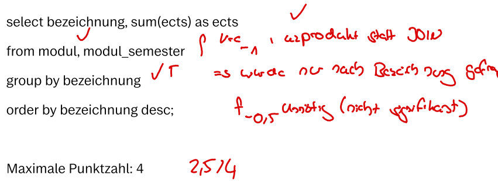
<h5>Bewertung:</h5>
Punkte = 2,5

<h4><b>Distanzbasierte Bewertung: 2,4 / 4</b></h4>
<h5>Musterlösung:</h5>
Difficulty: 17
<h5>Studentische Antwort:</h5>
<strong>Total Distance: 7</strong>

SELECT bezeichnung, SUM(ects) AS ects FROM modul, modul_semester GROUP BY bezeichnung ORDER BY bezeichnung DESC;

&gt;&gt;&gt; <strong>Cost 1</strong>: Remove (excess) element in order-by-clause.

SELECT bezeichnung, SUM(ects) AS ects FROM modul, modul_semester GROUP BY bezeichnung;

&gt;&gt;&gt; <strong>Cost 1</strong>: Add (missing) element in group-by-clause.

SELECT bezeichnung, SUM(ects) AS ects FROM modul, modul_semester GROUP BY &nbsp; &nbsp;, bezeichnung;

&gt;&gt;&gt; <strong>Cost 1</strong>: Add (missing) column reference to a group-by expression.

SELECT bezeichnung, SUM(ects) AS ects FROM modul, modul_semester GROUP BY id, bezeichnung;

&gt;&gt;&gt; <strong>Cost 1</strong>: Set complex join-type on a from-element (change cross join to a complex join).

SELECT bezeichnung, SUM(ects) AS ects FROM modul INNER JOIN modul_semester GROUP BY id, bezeichnung;

&gt;&gt;&gt; <strong>Cost 1</strong>: Add (missing) binary-expression to a from-element join-condition.

SELECT bezeichnung, SUM(ects) AS ects FROM modul INNER JOIN modul_semester ON ( &nbsp; &nbsp;= &nbsp; &nbsp;) GROUP BY id, bezeichnung;

&gt;&gt;&gt; <strong>Cost 1</strong>: Add (missing) column-reference to a from-element join-condition.

SELECT bezeichnung, SUM(ects) AS ects FROM modul INNER JOIN modul_semester ON (modul = &nbsp; &nbsp;) GROUP BY id, bezeichnung;

&gt;&gt;&gt; <strong>Cost 1</strong>: Add (missing) column-reference to a from-element join-condition.

SELECT bezeichnung, SUM(ects) AS ects FROM modul INNER JOIN modul_semester ON (modul = id) GROUP BY id, bezeichnung;

<h5>Bewertung:</h5>
Punkte = (17 - 7) / 17 * 4 = 2,3529411764

<h4><b>Ergebnisbasierte Bewertung: 4 / 4</b></h4>
<h5>Musterlösung:</h5>
<table>
    <thead>
        <tr>
            <th>Bepunktungsmetrik </th>
            <th>Erwarteter Wert </th>
            <th>Maximale Punkte </th>
        </tr>
    </thead>
    <tbody>
        <tr>
            <td>Anzahl der Tupel </td>
            <td>23</td>
            <td>2</td>
        </tr>
        <tr>
            <td>Namen der Attribute </td>
            <td>["bezeichnung", "ects"] </td>
            <td>1 </td>
        </tr>
        <tr>
            <td>Funktionale Abhängigkeiten </td>
            <td>["{\"determinateAtt.\": [\"bezeichnung\"], \"dependentAtt.\": [\"ects\"]}"]</td>
            <td>1 </td>
        </tr>
    </tbody>
</table>

<h5>Studentische Antwort:</h5>
<table>
    <thead>
        <tr>
            <th>Bepunktungsmetrik </th>
            <th>Erwarteter Wert </th>
            <th>Punkte </th>
        </tr>
    </thead>
    <tbody>
        <tr>
            <td>Anzahl der Tupel </td>
            <td>23</td>
            <td>2</td>
        </tr>
        <tr>
            <td>Namen der Attribute </td>
            <td>["bezeichnung", "ects"] </td>
            <td>1 </td>
        </tr>
        <tr>
            <td>Funktionale Abhängigkeiten </td>
            <td>["{\"determinateAtt.\": [\"bezeichnung\"], \"dependentAtt.\": [\"ects\"]}"]</td>
            <td>1 </td>
        </tr>
    </tbody>
</table>

<h5>Bewertung:</h5>
Punkte = 2 + 1 + 1 = 4

<h4>Fairness:</h4> Geben Sie an, wie <b>fair</b> ​Sie die jeweilige Bewertung finden
  
<b>Achtung:</b> Die Bewertungen hier befinden sich möglicherweise in einer andereren Reihenfolge als weiter oben auf der Seite!
<b>Hinweis:</b> Es ist möglich, mehrere Bewertungen gleich einzustufen.
  
<table>
<thead>
  <tr>
    <th></th>
    <th>Fair</th>
    <th>Mittel</th>
    <th>Unfair</th>
  </tr>
</thead>
<tbody>
  <tr>
    <td>Ergebnisbasierte Bewertung</td>
    <td>o</td>
    <td>o</td>
    <td>o</td>
  </tr>
  <tr>
    <td>Distanzbasierte Bewertung</td>
    <td>o</td>
    <td>o</td>
    <td>o</td>
  </tr>
  <tr>
    <td>Manuelle Bewertung</td>
    <td>o</td>
    <td>o</td>
    <td>o</td>
  </tr>
</tbody>
</table>

<h4>Nachvollziehbarkeit:</h4> Geben Sie an, wie <b>nachvollziehbar</b> ​Sie die jeweilige Bewertung finden
  
<b>Achtung:</b> Die Bewertungen hier befinden sich möglicherweise in einer andereren Reihenfolge als weiter oben auf der Seite!
<b>Hinweis:</b> Es ist möglich, mehrere Bewertungen gleich einzustufen.
  
<table>
<thead>
  <tr>
    <th></th>
    <th>Gut nachvoll- ziehbar</th>
    <th>Mittel</th>
    <th>Schlecht nachvoll- ziehbar</th>
  </tr>
</thead>
<tbody>
  <tr>
    <td>Ergebnisbasierte Bewertung</td>
    <td>o</td>
    <td>o</td>
    <td>o</td>
  </tr>
  <tr>
    <td>Distanzbasierte Bewertung</td>
    <td>o</td>
    <td>o</td>
    <td>o</td>
  </tr>
  <tr>
    <td>Manuelle Bewertung</td>
    <td>o</td>
    <td>o</td>
    <td>o</td>
  </tr>
</tbody>
</table>
    </td>
    <td width="50%">
<h3>Scenario 3-3</h3>
<h4>Task 3</h4>
This database is modeled after the standard curriculum of the Bachelor's program in Computer Science. It reflects the status as of the winter semester 2019/20 and comprises four relations:
  
<ol><li>themengebiet ( _id_, bezeichnung )</li>
<li>modul ( _id_, bezeichnung, gop, themengebiet [themengebiet] )</li>
<li>semester ( _nummer_ )</li>
<li>modul_semester ( _modul [modul], semester [semester]_, ects )</li></ol>

For each module, specify its name and the total number of ECTS credits accumulated. The second piece of information should be named "ects".

The maximum score is 4.
<h4>Sample Solution</h4>
<code>SELECT m.bezeichnung, SUM(ms.ects) AS ects
FROM modul m
JOIN modul_semester ms ON (ms.modul = m.id)
GROUP BY m.id, m.bezeichnung;</code>

<h4>Student Response 3</h4>
<code>select bezeichnung, sum(ects) as ects 
from modul, modul_semester 
group by bezeichnung 
order by bezeichnung desc;</code>

<h4><b>Manual Grading: 2,5 / 4</b></h4>
<h5>Sample Solution:</h5>

<h5>Student Reponse:</h5>

<h5>Grading:</h5>
Points = 2,5

<h4><b>Distance-Based Grading: 2,4 / 4</b></h4>
<h5>Sample Solution:</h5>
Difficulty: 17
<h5>Student Reponse:</h5>
<strong>Total Distance: 7</strong>

SELECT bezeichnung, SUM(ects) AS ects FROM modul, modul_semester GROUP BY bezeichnung ORDER BY bezeichnung DESC;

&gt;&gt;&gt; <strong>Cost 1</strong>: Remove (excess) element in order-by-clause.

SELECT bezeichnung, SUM(ects) AS ects FROM modul, modul_semester GROUP BY bezeichnung;

&gt;&gt;&gt; <strong>Cost 1</strong>: Add (missing) element in group-by-clause.

SELECT bezeichnung, SUM(ects) AS ects FROM modul, modul_semester GROUP BY &nbsp; &nbsp;, bezeichnung;

&gt;&gt;&gt; <strong>Cost 1</strong>: Add (missing) column reference to a group-by expression.

SELECT bezeichnung, SUM(ects) AS ects FROM modul, modul_semester GROUP BY id, bezeichnung;

&gt;&gt;&gt; <strong>Cost 1</strong>: Set complex join-type on a from-element (change cross join to a complex join).

SELECT bezeichnung, SUM(ects) AS ects FROM modul INNER JOIN modul_semester GROUP BY id, bezeichnung;

&gt;&gt;&gt; <strong>Cost 1</strong>: Add (missing) binary-expression to a from-element join-condition.

SELECT bezeichnung, SUM(ects) AS ects FROM modul INNER JOIN modul_semester ON ( &nbsp; &nbsp;= &nbsp; &nbsp;) GROUP BY id, bezeichnung;

&gt;&gt;&gt; <strong>Cost 1</strong>: Add (missing) column-reference to a from-element join-condition.

SELECT bezeichnung, SUM(ects) AS ects FROM modul INNER JOIN modul_semester ON (modul = &nbsp; &nbsp;) GROUP BY id, bezeichnung;

&gt;&gt;&gt; <strong>Cost 1</strong>: Add (missing) column-reference to a from-element join-condition.

SELECT bezeichnung, SUM(ects) AS ects FROM modul INNER JOIN modul_semester ON (modul = id) GROUP BY id, bezeichnung;

<h5>Grading:</h5>
Points = (17 - 7) / 17 * 4 = 2,3529411764

<h4><b>Result-Based Grading: 4 / 4</b></h4>
<h5>Sample Solution:</h5>
<table>
    <thead>
        <tr>
            <th>Scoring Metric</th>
            <th>Expected Value</th>
            <th>Maximum Points</th>
        </tr>
    </thead>
    <tbody>
        <tr>
            <td>Number of Tuples</td>
            <td>23</td>
            <td>2</td>
        </tr>
        <tr>
            <td>Attribute Names</td>
            <td>["bezeichnung", "ects"] </td>
            <td>1 </td>
        </tr>
        <tr>
            <td>Functional Dependencies</td>
            <td>["{\"determinateAtt.\": [\"bezeichnung\"], \"dependentAtt.\": [\"ects\"]}"]</td>
            <td>1 </td>
        </tr>
    </tbody>
</table>
<h5>Student Reponse:</h5>
<table>
    <thead>
        <tr>
            <th>Scoring Metric</th>
            <th>Expected Value</th>
            <th>Points</th>
        </tr>
    </thead>
    <tbody>
        <tr>
            <td>Number of Tuples</td>
            <td>23</td>
            <td>2</td>
        </tr>
        <tr>
            <td>Attribute Names</td>
            <td>["bezeichnung", "ects"] </td>
            <td>1 </td>
        </tr>
        <tr>
            <td>Functional Dependencies</td>
            <td>["{\"determinateAtt.\": [\"bezeichnung\"], \"dependentAtt.\": [\"ects\"]}"]</td>
            <td>1 </td>
        </tr>
    </tbody>
</table>
<h5>Grading:</h5>
Points = 2 + 1 + 1 = 4

<h4>Fairness:</h4> Indicate how <b>fair</b> you find each grading.
  
<b>Attention:</b> The gradings here may be in a different order than those found earlier on the page. 
<b>Note:</b> It is possible to rate multiple gradings as being equally fair.
  
<table>
<thead>
  <tr>
    <th></th>
    <th>Fair</th>
    <th>Moderate</th>
    <th>Unfair</th>
  </tr>
</thead>
<tbody>
  <tr>
    <td>Result-Based Grading</td>
    <td>o</td>
    <td>o</td>
    <td>o</td>
  </tr>
  <tr>
    <td>Distance-Based Grading</td>
    <td>o</td>
    <td>o</td>
    <td>o</td>
  </tr>
  <tr>
    <td>Manual Grading</td>
    <td>o</td>
    <td>o</td>
    <td>o</td>
  </tr>
</tbody>
</table>

<h4>Comprehensibility:</h4> Indicate how <b>comprehensible</b> you find each grading.
  
<b>Attention:</b> The gradings here may be in a different order than those found earlier on the page. 
<b>Note:</b> It is possible to rate multiple gradings as being equally comprehensible.
  
<table>
<thead>
  <tr>
    <th></th>
    <th>Easy to comprehend</th>
    <th>Moderate</th>
    <th>Difficult to comprehend</th>
  </tr>
</thead>
<tbody>
  <tr>
    <td>Result-Based Grading</td>
    <td>o</td>
    <td>o</td>
    <td>o</td>
  </tr>
  <tr>
    <td>Distance-Based Grading</td>
    <td>o</td>
    <td>o</td>
    <td>o</td>
  </tr>
  <tr>
    <td>Manual Grading</td>
    <td>o</td>
    <td>o</td>
    <td>o</td>
  </tr>
</tbody>
</table>
    </td>
  </tr>
</table>

### Results

The survey results for this scenario are as follows:

| ID | DATE     | Fairness Result-Based | Fairness Distance-Based | Fairness Manual | Comprehensibility Result-Based | Comprehensibility Distance-Based | Comprehensibility Manual |
| -- | -------- | --------------- | --------------------- | --------------------- | ---------------------- | --------------------- | --------------------- |
| 1   | 12.07.23 | \-2                    | \-2                   | \-2                   | \-2                    | \-2                   | \-2                   |
| 2   | 13.07.23 | \-2                    | \-2                   | \-2                   | \-2                    | \-2                   | \-2                   |
| 3   | 17.07.23 | \-2                    | \-2                   | \-2                   | \-2                    | \-2                   | \-2                   |
| 4   | 21.07.23 | \-2                    | \-2                   | \-2                   | \-2                    | \-2                   | \-2                   |
| 5   | 24.07.23 | \-2                    | \-2                   | \-2                   | \-2                    | \-2                   | \-2                   |
| 6   | 24.07.23 | \-2                    | \-2                   | \-2                   | \-2                    | \-2                   | \-2                   |
| 7   | 26.07.23 | \-2                    | \-2                   | \-2                   | \-2                    | \-2                   | \-2                   |
| 8   | 02.08.23 | \-2                    | \-2                   | \-2                   | \-2                    | \-2                   | \-2                   |
| 9   | 02.08.23 | \-2                    | \-2                   | \-2                   | \-2                    | \-2                   | \-2                   |
| 10  | 04.08.23 | 2                      | 3                     | 3                     | 3                      | 2                     | 2                     |
| 11  | 04.08.23 | \-2                    | \-2                   | \-2                   | \-2                    | \-2                   | \-2                   |
| 12  | 07.08.23 | \-2                    | \-2                   | \-2                   | \-2                    | \-2                   | \-2                   |
| 13  | 07.08.23 | \-2                    | \-2                   | \-2                   | \-2                    | \-2                   | \-2                   |
| 14  | 07.08.23 | 2                      | 1                     | 1                     | 2                      | 1                     | 1                     |
| 15  | 07.08.23 | 3                      | 1                     | 1                     | 2                      | 1                     | 1                     |
| 16  | 07.08.23 | \-2                    | \-2                   | \-2                   | \-2                    | \-2                   | \-2                   |
| 17  | 07.08.23 | \-2                    | \-2                   | \-2                   | \-2                    | \-2                   | \-2                   |
| 18  | 07.08.23 | \-2                    | \-2                   | \-2                   | \-2                    | \-2                   | \-2                   |
| 19  | 08.08.23 | 3                      | 1                     | 1                     | 1                      | 1                     | 1                     |
| 20  | 08.08.23 | 3                      | 1                     | 1                     | 3                      | 1                     | 1                     |
| 21  | 08.08.23 | 2                      | 2                     | 1                     | 3                      | 1                     | 2                     |
| 22  | 09.08.23 | 3                      | 1                     | 1                     | 3                      | 1                     | 1                     |
| 23  | 18.08.23 | 1                      | 2                     | 2                     | 1                      | 2                     | 2                     |
| 24  | 15.08.23 | \-2                    | \-2                   | \-2                   | \-2                    | \-2                   | \-2                   |
| 25  | 17.08.23 | 3                      | 1                     | 1                     | 3                      | 1                     | 2                     |
| 26  | 18.08.23 | \-2                    | \-2                   | \-2                   | \-2                    | \-2                   | \-2                   |
| 27  | 23.08.23 | 3                      | 1                     | 1                     | 2                      | 2                     | 1                     |
| 28  | 28.08.23 | 3                      | 1                     | 1                     | 2                      | 1                     | 1                     |
| 29  | 29.08.23 | \-2                    | \-2                   | \-2                   | \-2                    | \-2                   | \-2                   |
| 30  | 29.08.23 | 3                      | 1                     | 1                     | 1                      | 1                     | 1                     |
| 31  | 31.08.23 | \-2                    | \-2                   | \-2                   | \-2                    | \-2                   | \-2                   |
| 32  | 01.09.23 | 3                      | 1                     | 1                     | 2                      | 1                     | 1                     |
| 33  | 01.09.23 | 3                      | 1                     | 1                     | 3                      | 1                     | 1                     |
| 34  | 01.09.23 | \-2                    | \-2                   | \-2                   | \-2                    | \-2                   | \-2                   |
| 35  | 04.09.23 | \-2                    | \-2                   | \-2                   | \-2                    | \-2                   | \-2                   |

#### Legend:
- "1" represents the selection of the best option
- "2" indicates the selection of the moderate option
- "3" signifies the selection of the worst option
- "-1"/"-2" stand for "no response" or "not seen"

## Page 12 

<table>
  <tr>
    <th width="50%">German (original)</th>
    <th width="50%">English (translated)</th>
  </tr>
  <tr>
    <td width="50%">
<h3>Szenario 3-4</h3>
<h4>Aufgabenstellung 3</h4>
Diese Datenbank ist an den Musterstudienplan im Informatik Bachelorstudiengang angelehnt. Sie ist auf dem Stand von Wintersemester 2019/20 und besteht aus vier Relationen:
  
<ol><li>themengebiet ( _id_, bezeichnung )</li>
<li>modul ( _id_, bezeichnung, gop, themengebiet [themengebiet] )</li>
<li>semester ( _nummer_ )</li>
<li>modul_semester ( _modul [modul], semester [semester]_, ects )</li></ol>

Geben Sie für jedes Modul dessen Bezeichnung an, und wie viele ECTS man in diesem insgesamt sammelt. Die zweite Information soll ects heißen.

Die Maximale Punktzahl beträgt 4.

<h4>Musterlösung</h4>
<code>SELECT m.bezeichnung, SUM(ms.ects) AS ects
FROM modul m
JOIN modul_semester ms ON (ms.modul = m.id)
GROUP BY m.id, m.bezeichnung;</code>

<h4>Studentische Antwort 4</h4>
<code>select bezeichnung, ects 
from modul 
join modul_semester on modul = id 
group by modul;</code>

<h4><b>Manuelle Bewertung: 2,5 / 4</b></h4>
<h5>Musterlösung:</h5>

<h5>Studentische Antwort:</h5>

<h5>Bewertung:</h5>
Punkte = 2,5

<h4><b>Distanzbasierte Bewertung: 3,1 / 4</b></h4>
<h5>Musterlösung:</h5>
Difficulty: 17
<h5>Studentische Antwort:</h5>
<strong>Total Distance: 4</strong>

SELECT bezeichnung, ects FROM modul INNER JOIN modul_semester ON (modul = id) GROUP BY modul;

&gt;&gt;&gt; <strong>Cost 0</strong>: Set (redundant) explicit alias on a select-element.

SELECT bezeichnung, ects AS ects FROM modul INNER JOIN modul_semester ON (modul = id) GROUP BY modul;

&gt;&gt;&gt; <strong>Cost 1</strong>: Change (incorrect) column-reference column in a group-by expression.

SELECT bezeichnung, ects AS ects FROM modul INNER JOIN modul_semester ON (modul = id) GROUP BY id;

&gt;&gt;&gt; <strong>Cost 1</strong>: Add (missing) element in group-by-clause.

SELECT bezeichnung, ects AS ects FROM modul INNER JOIN modul_semester ON (modul = id) GROUP BY id, &nbsp; &nbsp;;

&gt;&gt;&gt; <strong>Cost 1</strong>: Add (missing) column reference to a group-by expression.

SELECT bezeichnung, ects AS ects FROM modul INNER JOIN modul_semester ON (modul = id) GROUP BY id, bezeichnung;

&gt;&gt;&gt; <strong>Cost 1</strong>: Add (missing) aggregation-function to a select-element expression.

SELECT bezeichnung, SUM(ects) AS ects FROM modul INNER JOIN modul_semester ON (modul = id) GROUP BY id, bezeichnung;

<h5>Bewertung:</h5>
Punkte = (17 - 4) / 17 * 4 = 3,0588235294

<h4><b>Ergebnisbasierte Bewertung: 0 / 4</b></h4>
<h5>Musterlösung:</h5>
<table>
    <thead>
        <tr>
            <th>Bepunktungsmetrik </th>
            <th>Erwarteter Wert </th>
            <th>Maximale Punkte </th>
        </tr>
    </thead>
    <tbody>
        <tr>
            <td>Anzahl der Tupel </td>
            <td>23</td>
            <td>2</td>
        </tr>
        <tr>
            <td>Namen der Attribute </td>
            <td>["bezeichnung", "ects"] </td>
            <td>1 </td>
        </tr>
        <tr>
            <td>Funktionale Abhängigkeiten </td>
            <td>["{\"determinateAtt.\": [\"bezeichnung\"], \"dependentAtt.\": [\"ects\"]}"]</td>
            <td>1 </td>
        </tr>
    </tbody>
</table>

<h5>Studentische Antwort:</h5>
<table>
    <thead>
        <tr>
            <th>Bepunktungsmetrik </th>
            <th>Erwarteter Wert </th>
            <th>Punkte </th>
        </tr>
    </thead>
    <tbody>
        <tr>
            <td>Anzahl der Tupel </td>
            <td>false</td>
            <td>0</td>
        </tr>
        <tr>
            <td>Namen der Attribute </td>
            <td>false</td>
            <td>0 </td>
        </tr>
        <tr>
            <td>Funktionale Abhängigkeiten </td>
            <td>false</td>
            <td>0 </td>
        </tr>
    </tbody>
</table>

<h5>Bewertung:</h5>
Punkte = 0 + 0 + 0 = 0

<h4>Fairness:</h4> Geben Sie an, wie <b>fair</b> ​Sie die jeweilige Bewertung finden
  
<b>Achtung:</b> Die Bewertungen hier befinden sich möglicherweise in einer andereren Reihenfolge als weiter oben auf der Seite!
<b>Hinweis:</b> Es ist möglich, mehrere Bewertungen gleich einzustufen.
  
<table>
<thead>
  <tr>
    <th></th>
    <th>Fair</th>
    <th>Mittel</th>
    <th>Unfair</th>
  </tr>
</thead>
<tbody>
  <tr>
    <td>Ergebnisbasierte Bewertung</td>
    <td>o</td>
    <td>o</td>
    <td>o</td>
  </tr>
  <tr>
    <td>Distanzbasierte Bewertung</td>
    <td>o</td>
    <td>o</td>
    <td>o</td>
  </tr>
  <tr>
    <td>Manuelle Bewertung</td>
    <td>o</td>
    <td>o</td>
    <td>o</td>
  </tr>
</tbody>
</table>

<h4>Nachvollziehbarkeit:</h4> Geben Sie an, wie <b>nachvollziehbar</b> ​Sie die jeweilige Bewertung finden
  
<b>Achtung:</b> Die Bewertungen hier befinden sich möglicherweise in einer andereren Reihenfolge als weiter oben auf der Seite!
<b>Hinweis:</b> Es ist möglich, mehrere Bewertungen gleich einzustufen.
  
<table>
<thead>
  <tr>
    <th></th>
    <th>Gut nachvoll- ziehbar</th>
    <th>Mittel</th>
    <th>Schlecht nachvoll- ziehbar</th>
  </tr>
</thead>
<tbody>
  <tr>
    <td>Ergebnisbasierte Bewertung</td>
    <td>o</td>
    <td>o</td>
    <td>o</td>
  </tr>
  <tr>
    <td>Distanzbasierte Bewertung</td>
    <td>o</td>
    <td>o</td>
    <td>o</td>
  </tr>
  <tr>
    <td>Manuelle Bewertung</td>
    <td>o</td>
    <td>o</td>
    <td>o</td>
  </tr>
</tbody>
</table>
    </td>
    <td width="50%">
<h3>Scenario 3-4</h3>
<h4>Task 3</h4>
This database is modeled after the standard curriculum of the Bachelor's program in Computer Science. It reflects the status as of the winter semester 2019/20 and comprises four relations:
  
<ol><li>themengebiet ( _id_, bezeichnung )</li>
<li>modul ( _id_, bezeichnung, gop, themengebiet [themengebiet] )</li>
<li>semester ( _nummer_ )</li>
<li>modul_semester ( _modul [modul], semester [semester]_, ects )</li></ol>

For each module, specify its name and the total number of ECTS credits accumulated. The second piece of information should be named "ects".

The maximum score is 4.
<h4>Sample Solution</h4>
<code>SELECT m.bezeichnung, SUM(ms.ects) AS ects
FROM modul m
JOIN modul_semester ms ON (ms.modul = m.id)
GROUP BY m.id, m.bezeichnung;</code>

<h4>Student Response 4</h4>
<code>select bezeichnung, ects 
from modul 
join modul_semester on modul = id 
group by modul;</code>

<h4><b>Manual Grading: 2,5 / 4</b></h4>
<h5>Sample Solution:</h5>

<h5>Student Reponse:</h5>

<h5>Grading:</h5>
Points = 2,5

<h4><b>Distance-Based Grading: 3,1 / 4</b></h4>
<h5>Sample Solution:</h5>
Difficulty: 17
<h5>Student Reponse:</h5>
<strong>Total Distance: 4</strong>

SELECT bezeichnung, ects FROM modul INNER JOIN modul_semester ON (modul = id) GROUP BY modul;

&gt;&gt;&gt; <strong>Cost 0</strong>: Set (redundant) explicit alias on a select-element.

SELECT bezeichnung, ects AS ects FROM modul INNER JOIN modul_semester ON (modul = id) GROUP BY modul;

&gt;&gt;&gt; <strong>Cost 1</strong>: Change (incorrect) column-reference column in a group-by expression.

SELECT bezeichnung, ects AS ects FROM modul INNER JOIN modul_semester ON (modul = id) GROUP BY id;

&gt;&gt;&gt; <strong>Cost 1</strong>: Add (missing) element in group-by-clause.

SELECT bezeichnung, ects AS ects FROM modul INNER JOIN modul_semester ON (modul = id) GROUP BY id, &nbsp; &nbsp;;

&gt;&gt;&gt; <strong>Cost 1</strong>: Add (missing) column reference to a group-by expression.

SELECT bezeichnung, ects AS ects FROM modul INNER JOIN modul_semester ON (modul = id) GROUP BY id, bezeichnung;

&gt;&gt;&gt; <strong>Cost 1</strong>: Add (missing) aggregation-function to a select-element expression.

SELECT bezeichnung, SUM(ects) AS ects FROM modul INNER JOIN modul_semester ON (modul = id) GROUP BY id, bezeichnung;

<h5>Grading:</h5>
Points = (17 - 4) / 17 * 4 = 3,0588235294

<h4><b>Result-Based Grading: 0 / 4</b></h4>
<h5>Sample Solution:</h5>
<table>
    <thead>
        <tr>
            <th>Scoring Metric</th>
            <th>Expected Value</th>
            <th>Maximum Points</th>
        </tr>
    </thead>
    <tbody>
        <tr>
            <td>Number of Tuples</td>
            <td>23</td>
            <td>2</td>
        </tr>
        <tr>
            <td>Attribute Names</td>
            <td>["bezeichnung", "ects"] </td>
            <td>1 </td>
        </tr>
        <tr>
            <td>Functional Dependencies</td>
            <td>["{\"determinateAtt.\": [\"bezeichnung\"], \"dependentAtt.\": [\"ects\"]}"]</td>
            <td>1 </td>
        </tr>
    </tbody>
</table>
<h5>Student Reponse:</h5>
<table>
    <thead>
        <tr>
            <th>Scoring Metric</th>
            <th>Expected Value</th>
            <th>Points</th>
        </tr>
    </thead>
    <tbody>
        <tr>
            <td>Number of Tuples</td>
            <td>false</td>
            <td>0</td>
        </tr>
        <tr>
            <td>Attribute Names</td>
            <td>false</td>
            <td>0 </td>
        </tr>
        <tr>
            <td>Functional Dependencies</td>
            <td>false</td>
            <td>0 </td>
        </tr>
    </tbody>
</table>
<h5>Grading:</h5>
Points = 0 + 0 + 0 = 0

<h4>Fairness:</h4> Indicate how <b>fair</b> you find each grading.
  
<b>Attention:</b> The gradings here may be in a different order than those found earlier on the page. 
<b>Note:</b> It is possible to rate multiple gradings as being equally fair.
  
<table>
<thead>
  <tr>
    <th></th>
    <th>Fair</th>
    <th>Moderate</th>
    <th>Unfair</th>
  </tr>
</thead>
<tbody>
  <tr>
    <td>Result-Based Grading</td>
    <td>o</td>
    <td>o</td>
    <td>o</td>
  </tr>
  <tr>
    <td>Distance-Based Grading</td>
    <td>o</td>
    <td>o</td>
    <td>o</td>
  </tr>
  <tr>
    <td>Manual Grading</td>
    <td>o</td>
    <td>o</td>
    <td>o</td>
  </tr>
</tbody>
</table>

<h4>Comprehensibility:</h4> Indicate how <b>comprehensible</b> you find each grading.
  
<b>Attention:</b> The gradings here may be in a different order than those found earlier on the page. 
<b>Note:</b> It is possible to rate multiple gradings as being equally comprehensible.
  
<table>
<thead>
  <tr>
    <th></th>
    <th>Easy to comprehend</th>
    <th>Moderate</th>
    <th>Difficult to comprehend</th>
  </tr>
</thead>
<tbody>
  <tr>
    <td>Result-Based Grading</td>
    <td>o</td>
    <td>o</td>
    <td>o</td>
  </tr>
  <tr>
    <td>Distance-Based Grading</td>
    <td>o</td>
    <td>o</td>
    <td>o</td>
  </tr>
  <tr>
    <td>Manual Grading</td>
    <td>o</td>
    <td>o</td>
    <td>o</td>
  </tr>
</tbody>
</table>
    </td>
  </tr>
</table>

### Results

The survey results for this scenario are as follows:

| ID | DATE     | Fairness Result-Based | Fairness Distance-Based | Fairness Manual | Comprehensibility Result-Based | Comprehensibility Distance-Based | Comprehensibility Manual |
| -- | -------- | --------------- | --------------------- | --------------------- | ---------------------- | --------------------- | --------------------- |
| 1   | 12.07.23 | \-2                    | \-2                   | \-2                   | \-2                    | \-2                   | \-2                   |
| 2   | 13.07.23 | \-2                    | \-2                   | \-2                   | \-2                    | \-2                   | \-2                   |
| 3   | 17.07.23 | \-2                    | \-2                   | \-2                   | \-2                    | \-2                   | \-2                   |
| 4   | 21.07.23 | \-2                    | \-2                   | \-2                   | \-2                    | \-2                   | \-2                   |
| 5   | 24.07.23 | \-2                    | \-2                   | \-2                   | \-2                    | \-2                   | \-2                   |
| 6   | 24.07.23 | \-2                    | \-2                   | \-2                   | \-2                    | \-2                   | \-2                   |
| 7   | 26.07.23 | \-2                    | \-2                   | \-2                   | \-2                    | \-2                   | \-2                   |
| 8   | 02.08.23 | \-2                    | \-2                   | \-2                   | \-2                    | \-2                   | \-2                   |
| 9   | 02.08.23 | \-2                    | \-2                   | \-2                   | \-2                    | \-2                   | \-2                   |
| 10  | 04.08.23 | 3                      | 1                     | 2                     | 3                      | 2                     | 3                     |
| 11  | 04.08.23 | \-2                    | \-2                   | \-2                   | \-2                    | \-2                   | \-2                   |
| 12  | 07.08.23 | \-2                    | \-2                   | \-2                   | \-2                    | \-2                   | \-2                   |
| 13  | 07.08.23 | \-2                    | \-2                   | \-2                   | \-2                    | \-2                   | \-2                   |
| 14  | 07.08.23 | 1                      | 3                     | 3                     | 1                      | 1                     | 3                     |
| 15  | 07.08.23 | 3                      | 1                     | 2                     | 2                      | 1                     | 1                     |
| 16  | 07.08.23 | \-2                    | \-2                   | \-2                   | \-2                    | \-2                   | \-2                   |
| 17  | 07.08.23 | \-2                    | \-2                   | \-2                   | \-2                    | \-2                   | \-2                   |
| 18  | 07.08.23 | \-2                    | \-2                   | \-2                   | \-2                    | \-2                   | \-2                   |
| 19  | 08.08.23 | 3                      | 2                     | 1                     | 1                      | 1                     | 1                     |
| 20  | 08.08.23 | 3                      | 2                     | 2                     | 2                      | 1                     | 1                     |
| 21  | 08.08.23 | 3                      | 2                     | 1                     | 3                      | 2                     | 1                     |
| 22  | 09.08.23 | 3                      | 2                     | 1                     | 1                      | 2                     | 1                     |
| 23  | 18.08.23 | 3                      | 1                     | 1                     | 3                      | 1                     | 1                     |
| 24  | 15.08.23 | \-2                    | \-2                   | \-2                   | \-2                    | \-2                   | \-2                   |
| 25  | 17.08.23 | 3                      | 1                     | 1                     | 3                      | 1                     | 2                     |
| 26  | 18.08.23 | \-2                    | \-2                   | \-2                   | \-2                    | \-2                   | \-2                   |
| 27  | 23.08.23 | 3                      | 1                     | 1                     | 3                      | 1                     | 2                     |
| 28  | 28.08.23 | 3                      | 2                     | 1                     | 1                      | 1                     | 1                     |
| 29  | 29.08.23 | \-2                    | \-2                   | \-2                   | \-2                    | \-2                   | \-2                   |
| 30  | 29.08.23 | 2                      | 2                     | 1                     | 1                      | 1                     | 1                     |
| 31  | 31.08.23 | \-2                    | \-2                   | \-2                   | \-2                    | \-2                   | \-2                   |
| 32  | 01.09.23 | 3                      | 1                     | 1                     | 3                      | 1                     | 1                     |
| 33  | 01.09.23 | 3                      | 2                     | 1                     | 2                      | 2                     | 2                     |
| 34  | 01.09.23 | \-2                    | \-2                   | \-2                   | \-2                    | \-2                   | \-2                   |
| 35  | 04.09.23 | \-2                    | \-2                   | \-2                   | \-2                    | \-2                   | \-2                   |

#### Legend:
- "1" represents the selection of the best option
- "2" indicates the selection of the moderate option
- "3" signifies the selection of the worst option
- "-1"/"-2" stand for "no response" or "not seen"

## Page 13 

<table>
  <tr>
    <th width="50%">German (original)</th>
    <th width="50%">English (translated)</th>
  </tr>
  <tr>
    <td width="50%">
<h3>Szenario 4-1</h3>
<h4>Aufgabenstellung 4</h4>
Diese Datenbank ist an den Musterstudienplan im Informatik Bachelorstudiengang angelehnt. Sie ist auf dem Stand von Wintersemester 2019/20 und besteht aus vier Relationen:
  
<ol><li>themengebiet ( _id_, bezeichnung )</li>
<li>modul ( _id_, bezeichnung, gop, themengebiet [themengebiet] )</li>
<li>semester ( _nummer_ )</li>
<li>modul_semester ( _modul [modul], semester [semester]_, ects )</li></ol>

Geben Sie an, wie viele ects alle GOP-fähigen Module (gekennzeichnet durch Attributwert ja) in Summe haben. Nennen Sie das Ergebnis summe.

Die Maximale Punktzahl beträgt 4.

<h4>Musterlösung</h4>
<code>SELECT SUM(ms.ects) AS summe
FROM modul m
JOIN modul_semester ms ON (ms.modul = m.id)
WHERE m.gop = "ja";</code>

<h4>Studentische Antwort 1</h4>
<code>Select DISTINCT Sum(ects) as summe 
From modul_semester, modul 
Where gop = 'ja';</code>

<h4><b>Manuelle Bewertung: 2,5 / 4</b></h4>
<h5>Musterlösung:</h5>
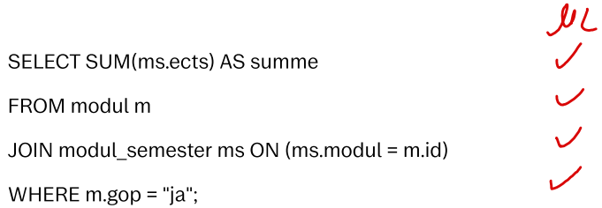
<h5>Studentische Antwort:</h5>
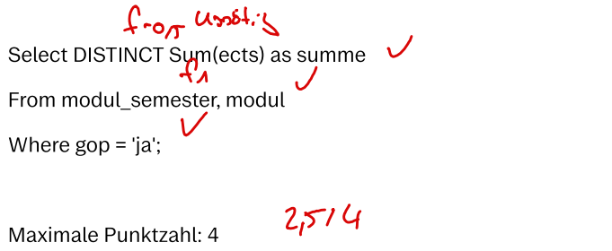
<h5>Bewertung:</h5>
Punkte = 2,5

<h4><b>Distanzbasierte Bewertung: 2,7 / 4</b></h4>
<h5>Musterlösung:</h5>
Difficulty: 18
<h5>Studentische Antwort:</h5>
<strong>Total Distance: 6</strong>

SELECT DISTINCT SUM(ects) AS summe FROM modul_semester, modul WHERE (gop = 'ja');

&gt;&gt;&gt; <strong>Cost 0</strong>: Swap elements in the from-clause.

SELECT DISTINCT SUM(ects) AS summe FROM modul, modul_semester WHERE (gop = 'ja');

&gt;&gt;&gt; <strong>Cost 1</strong>: Set complex join-type on a from-element (change cross join to a complex join).

SELECT DISTINCT SUM(ects) AS summe FROM modul INNER JOIN modul_semester WHERE (gop = 'ja');

&gt;&gt;&gt; <strong>Cost 1</strong>: Add (missing) binary-expression to a from-element join-condition.

SELECT DISTINCT SUM(ects) AS summe FROM modul INNER JOIN modul_semester ON ( &nbsp; &nbsp;= &nbsp; &nbsp;) WHERE (gop = 'ja');

&gt;&gt;&gt; <strong>Cost 1</strong>: Add (missing) column-reference to a from-element join-condition.

SELECT DISTINCT SUM(ects) AS summe FROM modul INNER JOIN modul_semester ON (modul = &nbsp; &nbsp;) WHERE (gop = 'ja');

&gt;&gt;&gt; <strong>Cost 1</strong>: Add (missing) column-reference to a from-element join-condition.

SELECT DISTINCT SUM(ects) AS summe FROM modul INNER JOIN modul_semester ON (modul = id) WHERE (gop = 'ja');

&gt;&gt;&gt; <strong>Cost 2</strong>: Unset (excess) distinct-declaration.

SELECT SUM(ects) AS summe FROM modul INNER JOIN modul_semester ON (modul = id) WHERE (gop = 'ja');

<h5>Bewertung:</h5>
Punkte = (18 - 6) / 18 * 4 = 2,6666666666

<h4><b>Ergebnisbasierte Bewertung: 4 / 4</b></h4>
<h5>Musterlösung:</h5>
<table>
    <thead>
        <tr>
            <th>Bepunktungsmetrik </th>
            <th>Erwarteter Wert </th>
            <th>Maximale Punkte </th>
        </tr>
    </thead>
    <tbody>
        <tr>
            <td>Anzahl der Tupel </td>
            <td>1</td>
            <td>2</td>
        </tr>
        <tr>
            <td>Namen der Attribute </td>
            <td>["summe"] </td>
            <td>2 </td>
        </tr>
    </tbody>
</table>

<h5>Studentische Antwort:</h5>
<table>
    <thead>
        <tr>
            <th>Bepunktungsmetrik </th>
            <th>Erwarteter Wert </th>
            <th>Punkte </th>
        </tr>
    </thead>
    <tbody>
        <tr>
            <td>Anzahl der Tupel </td>
            <td>1</td>
            <td>2</td>
        </tr>
        <tr>
            <td>Namen der Attribute </td>
            <td>["summe"]</td>
            <td>2 </td>
        </tr>
    </tbody>
</table>

<h5>Bewertung:</h5>
Punkte = 2 + 2 = 4

<h4>Fairness:</h4> Geben Sie an, wie <b>fair</b> ​Sie die jeweilige Bewertung finden
  
<b>Achtung:</b> Die Bewertungen hier befinden sich möglicherweise in einer andereren Reihenfolge als weiter oben auf der Seite!
<b>Hinweis:</b> Es ist möglich, mehrere Bewertungen gleich einzustufen.
  
<table>
<thead>
  <tr>
    <th></th>
    <th>Fair</th>
    <th>Mittel</th>
    <th>Unfair</th>
  </tr>
</thead>
<tbody>
  <tr>
    <td>Ergebnisbasierte Bewertung</td>
    <td>o</td>
    <td>o</td>
    <td>o</td>
  </tr>
  <tr>
    <td>Distanzbasierte Bewertung</td>
    <td>o</td>
    <td>o</td>
    <td>o</td>
  </tr>
  <tr>
    <td>Manuelle Bewertung</td>
    <td>o</td>
    <td>o</td>
    <td>o</td>
  </tr>
</tbody>
</table>

<h4>Nachvollziehbarkeit:</h4> Geben Sie an, wie <b>nachvollziehbar</b> ​Sie die jeweilige Bewertung finden
  
<b>Achtung:</b> Die Bewertungen hier befinden sich möglicherweise in einer andereren Reihenfolge als weiter oben auf der Seite!
<b>Hinweis:</b> Es ist möglich, mehrere Bewertungen gleich einzustufen.
  
<table>
<thead>
  <tr>
    <th></th>
    <th>Gut nachvoll- ziehbar</th>
    <th>Mittel</th>
    <th>Schlecht nachvoll- ziehbar</th>
  </tr>
</thead>
<tbody>
  <tr>
    <td>Ergebnisbasierte Bewertung</td>
    <td>o</td>
    <td>o</td>
    <td>o</td>
  </tr>
  <tr>
    <td>Distanzbasierte Bewertung</td>
    <td>o</td>
    <td>o</td>
    <td>o</td>
  </tr>
  <tr>
    <td>Manuelle Bewertung</td>
    <td>o</td>
    <td>o</td>
    <td>o</td>
  </tr>
</tbody>
</table>
    </td>
    <td width="50%">
<h3>Scenario 4-1</h3>
<h4>Task 4</h4>
This database is modeled after the standard curriculum of the Bachelor's program in Computer Science. It reflects the status as of the winter semester 2019/20 and comprises four relations:
  
<ol><li>themengebiet ( _id_, bezeichnung )</li>
<li>modul ( _id_, bezeichnung, gop, themengebiet [themengebiet] )</li>
<li>semester ( _nummer_ )</li>
<li>modul_semester ( _modul [modul], semester [semester]_, ects )</li></ol>

Indicate the total number of ECTS credits for all modules eligible for the General Orientation Test (GOP), identified by the attribute value "ja". Name the result "summe".

The maximum score is 4.
<h4>Sample Solution</h4>
<code>SELECT SUM(ms.ects) AS summe
FROM modul m
JOIN modul_semester ms ON (ms.modul = m.id)
WHERE m.gop = "ja";</code>

<h4>Student Response 1</h4>
<code>Select DISTINCT Sum(ects) as summe 
From modul_semester, modul 
Where gop = 'ja';</code>

<h4><b>Manual Grading: 2,5 / 4</b></h4>
<h5>Sample Solution:</h5>

<h5>Student Reponse:</h5>

<h5>Grading:</h5>
Points = 2,5

<h4><b>Distance-Based Grading: 2,7 / 4</b></h4>
<h5>Sample Solution:</h5>
Difficulty: 18
<h5>Student Reponse:</h5>
<strong>Total Distance: 6</strong>

SELECT DISTINCT SUM(ects) AS summe FROM modul_semester, modul WHERE (gop = 'ja');

&gt;&gt;&gt; <strong>Cost 0</strong>: Swap elements in the from-clause.

SELECT DISTINCT SUM(ects) AS summe FROM modul, modul_semester WHERE (gop = 'ja');

&gt;&gt;&gt; <strong>Cost 1</strong>: Set complex join-type on a from-element (change cross join to a complex join).

SELECT DISTINCT SUM(ects) AS summe FROM modul INNER JOIN modul_semester WHERE (gop = 'ja');

&gt;&gt;&gt; <strong>Cost 1</strong>: Add (missing) binary-expression to a from-element join-condition.

SELECT DISTINCT SUM(ects) AS summe FROM modul INNER JOIN modul_semester ON ( &nbsp; &nbsp;= &nbsp; &nbsp;) WHERE (gop = 'ja');

&gt;&gt;&gt; <strong>Cost 1</strong>: Add (missing) column-reference to a from-element join-condition.

SELECT DISTINCT SUM(ects) AS summe FROM modul INNER JOIN modul_semester ON (modul = &nbsp; &nbsp;) WHERE (gop = 'ja');

&gt;&gt;&gt; <strong>Cost 1</strong>: Add (missing) column-reference to a from-element join-condition.

SELECT DISTINCT SUM(ects) AS summe FROM modul INNER JOIN modul_semester ON (modul = id) WHERE (gop = 'ja');

&gt;&gt;&gt; <strong>Cost 2</strong>: Unset (excess) distinct-declaration.

SELECT SUM(ects) AS summe FROM modul INNER JOIN modul_semester ON (modul = id) WHERE (gop = 'ja');
<h5>Grading:</h5>
Points = (18 - 6) / 18 * 4 = 2,6666666666

<h4><b>Result-Based Grading: 4 / 4</b></h4>
<h5>Sample Solution:</h5>
<table>
    <thead>
        <tr>
            <th>Scoring Metric</th>
            <th>Expected Value</th>
            <th>Maximum Points</th>
        </tr>
    </thead>
    <tbody>
        <tr>
            <td>Number of Tuples</td>
            <td>1</td>
            <td>2</td>
        </tr>
        <tr>
            <td>Attribute Names</td>
            <td>["summe"] </td>
            <td>2 </td>
        </tr>
    </tbody>
</table>
<h5>Student Reponse:</h5>
<table>
    <thead>
        <tr>
            <th>Scoring Metric</th>
            <th>Expected Value</th>
            <th>Points</th>
        </tr>
    </thead>
    <tbody>
        <tr>
            <td>Number of Tuples</td>
            <td>1</td>
            <td>2</td>
        </tr>
        <tr>
            <td>Attribute Names</td>
            <td>["summe"]</td>
            <td>2 </td>
        </tr>
    </tbody>
</table>
<h5>Grading:</h5>
Points = 2 + 2 = 4

<h4>Fairness:</h4> Indicate how <b>fair</b> you find each grading.
  
<b>Attention:</b> The gradings here may be in a different order than those found earlier on the page. 
<b>Note:</b> It is possible to rate multiple gradings as being equally fair.
  
<table>
<thead>
  <tr>
    <th></th>
    <th>Fair</th>
    <th>Moderate</th>
    <th>Unfair</th>
  </tr>
</thead>
<tbody>
  <tr>
    <td>Result-Based Grading</td>
    <td>o</td>
    <td>o</td>
    <td>o</td>
  </tr>
  <tr>
    <td>Distance-Based Grading</td>
    <td>o</td>
    <td>o</td>
    <td>o</td>
  </tr>
  <tr>
    <td>Manual Grading</td>
    <td>o</td>
    <td>o</td>
    <td>o</td>
  </tr>
</tbody>
</table>

<h4>Comprehensibility:</h4> Indicate how <b>comprehensible</b> you find each grading.
  
<b>Attention:</b> The gradings here may be in a different order than those found earlier on the page. 
<b>Note:</b> It is possible to rate multiple gradings as being equally comprehensible.
  
<table>
<thead>
  <tr>
    <th></th>
    <th>Easy to comprehend</th>
    <th>Moderate</th>
    <th>Difficult to comprehend</th>
  </tr>
</thead>
<tbody>
  <tr>
    <td>Result-Based Grading</td>
    <td>o</td>
    <td>o</td>
    <td>o</td>
  </tr>
  <tr>
    <td>Distance-Based Grading</td>
    <td>o</td>
    <td>o</td>
    <td>o</td>
  </tr>
  <tr>
    <td>Manual Grading</td>
    <td>o</td>
    <td>o</td>
    <td>o</td>
  </tr>
</tbody>
</table>
    </td>
  </tr>
</table>

### Results

The survey results for this scenario are as follows:

| ID | DATE     | Fairness Result-Based | Fairness Distance-Based | Fairness Manual | Comprehensibility Result-Based | Comprehensibility Distance-Based | Comprehensibility Manual |
| -- | -------- | --------------- | --------------------- | --------------------- | ---------------------- | --------------------- | --------------------- |
| 1   | 12.07.23 | \-2                    | \-2                   | \-2                   | \-2                    | \-2                   | \-2                   |
| 2   | 13.07.23 | \-2                    | \-2                   | \-2                   | \-2                    | \-2                   | \-2                   |
| 3   | 17.07.23 | \-2                    | \-2                   | \-2                   | \-2                    | \-2                   | \-2                   |
| 4   | 21.07.23 | \-2                    | \-2                   | \-2                   | \-2                    | \-2                   | \-2                   |
| 5   | 24.07.23 | \-2                    | \-2                   | \-2                   | \-2                    | \-2                   | \-2                   |
| 6   | 24.07.23 | \-2                    | \-2                   | \-2                   | \-2                    | \-2                   | \-2                   |
| 7   | 26.07.23 | \-2                    | \-2                   | \-2                   | \-2                    | \-2                   | \-2                   |
| 8   | 02.08.23 | \-2                    | \-2                   | \-2                   | \-2                    | \-2                   | \-2                   |
| 9   | 02.08.23 | \-2                    | \-2                   | \-2                   | \-2                    | \-2                   | \-2                   |
| 10  | 04.08.23 | 3                      | 2                     | 2                     | 3                      | 2                     | 2                     |
| 11  | 04.08.23 | \-2                    | \-2                   | \-2                   | \-2                    | \-2                   | \-2                   |
| 12  | 07.08.23 | \-2                    | \-2                   | \-2                   | \-2                    | \-2                   | \-2                   |
| 13  | 07.08.23 | \-2                    | \-2                   | \-2                   | \-2                    | \-2                   | \-2                   |
| 14  | 07.08.23 | 3                      | 1                     | 1                     | 1                      | 1                     | 1                     |
| 15  | 07.08.23 | 3                      | 1                     | 1                     | 2                      | 1                     | 1                     |
| 16  | 07.08.23 | \-2                    | \-2                   | \-2                   | \-2                    | \-2                   | \-2                   |
| 17  | 07.08.23 | \-2                    | \-2                   | \-2                   | \-2                    | \-2                   | \-2                   |
| 18  | 07.08.23 | \-2                    | \-2                   | \-2                   | \-2                    | \-2                   | \-2                   |
| 19  | 08.08.23 | 3                      | 1                     | 1                     | 1                      | 1                     | 2                     |
| 20  | 08.08.23 | 3                      | 2                     | 2                     | 3                      | 1                     | 1                     |
| 21  | 08.08.23 | 3                      | 1                     | 1                     | 2                      | 1                     | 1                     |
| 22  | 09.08.23 | 3                      | 1                     | 2                     | 3                      | 1                     | 2                     |
| 23  | 18.08.23 | 1                      | 1                     | 1                     | 3                      | 1                     | 2                     |
| 24  | 15.08.23 | \-2                    | \-2                   | \-2                   | \-2                    | \-2                   | \-2                   |
| 25  | 17.08.23 | 3                      | 1                     | 1                     | 3                      | 1                     | 2                     |
| 26  | 18.08.23 | \-2                    | \-2                   | \-2                   | \-2                    | \-2                   | \-2                   |
| 27  | 23.08.23 | 3                      | 1                     | 1                     | 2                      | 1                     | 2                     |
| 28  | 28.08.23 | 2                      | 1                     | 1                     | 1                      | 1                     | 1                     |
| 29  | 29.08.23 | \-2                    | \-2                   | \-2                   | \-2                    | \-2                   | \-2                   |
| 30  | 29.08.23 | 3                      | 1                     | 1                     | 1                      | 1                     | 1                     |
| 31  | 31.08.23 | \-2                    | \-2                   | \-2                   | \-2                    | \-2                   | \-2                   |
| 32  | 01.09.23 | 3                      | 1                     | 1                     | 3                      | 1                     | 3                     |
| 33  | 01.09.23 | 3                      | 1                     | 1                     | 1                      | 3                     | 1                     |
| 34  | 01.09.23 | \-2                    | \-2                   | \-2                   | \-2                    | \-2                   | \-2                   |
| 35  | 04.09.23 | \-2                    | \-2                   | \-2                   | \-2                    | \-2                   | \-2                   |

#### Legend:
- "1" represents the selection of the best option
- "2" indicates the selection of the moderate option
- "3" signifies the selection of the worst option
- "-1"/"-2" stand for "no response" or "not seen"
